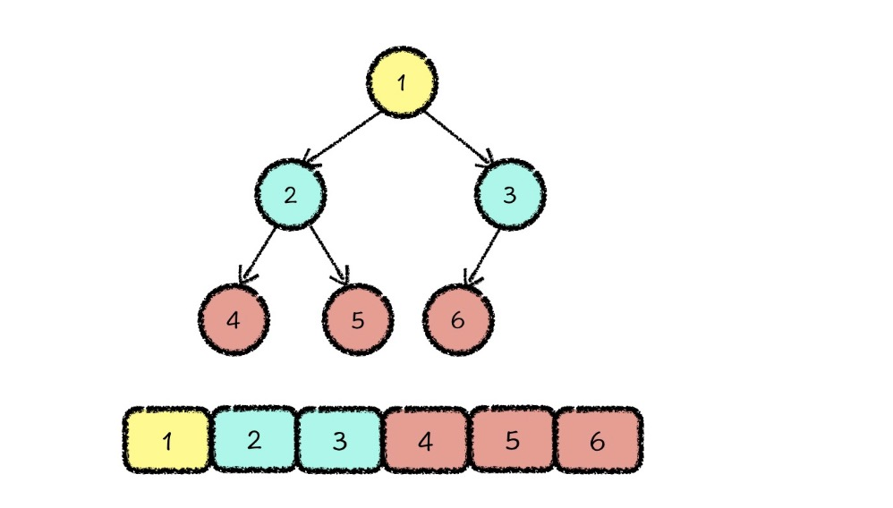
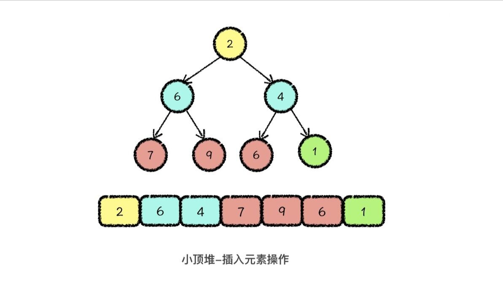
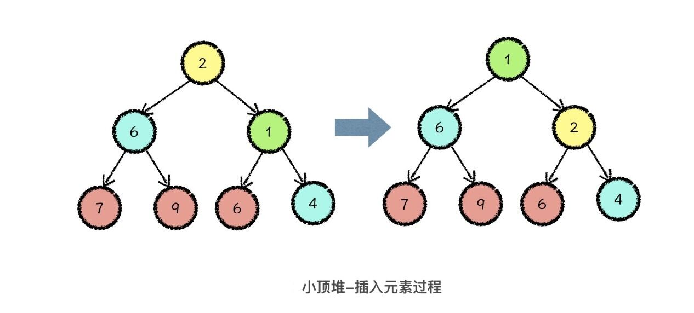
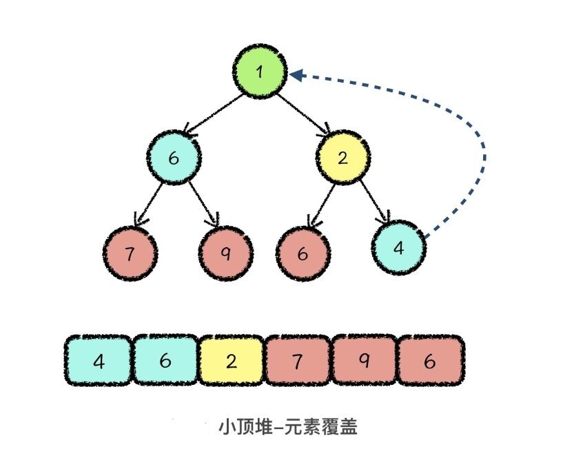
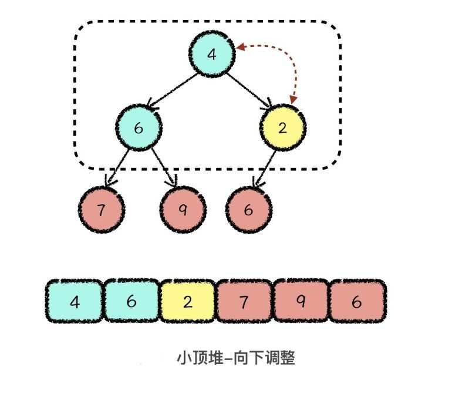

# Heap_Sort

## 完全二叉树

完全二叉树（Complete Binary Tree）:是由满二叉树去掉最后一层右侧的若干节点而形成的二叉树结构,**可以被存储在一片连续的数组空间中**。
```
                      1
                    /    \
                   2      3
                 /  \    / 
                4   5   6
```

对它的每个节点进行编号,采用从上到下、从左到右的顺序依次标上` 1 `到` 6 `。其中父节点编号与子节点编号之间的关系：如果父节点编号是`i`,其左孩子的编号就是` 2 * i`,右孩子的编号就是 `2 * i + 1`。

在一棵有`n`个节点的完全二叉树中,节点编号应该为`1 `到` n`。可以使用数组的`1`到`n`位对应于这`n`个节点。只要我们知道父节点编号,就可以通过计算得到子节点编号。这就意味着,即使我们将完全二叉树的所有数据,存储在一个连续的数组空间中,也不
会破坏其特殊的树形结构信息。也就是说,一棵完全二叉树可以对应到一段连续的数组空间,而根据数组空间的内容,我们也可以唯一地还原成一棵完全二叉树。

 

## 堆结构的定义
堆是一种特殊的完全二叉树,它可以分为两类,分别是大顶堆和小顶堆
- 小顶堆: 每个父节点的值都要小于其两个子节点的值
- 大顶堆: 每个父节点的值都要大于其两个子节点的值

堆这种结构支持的两种最基本的结构操作：**插入新元素**和**删除最值元素**  
堆的实际存储结构是数组,这个数组是一段从下标`1`开始的连续存储空间。  

## 堆的插入操作
假设我们想要在堆中放入一个新的元素`1`,那么我们可以将这个新的元素,放置到整个数组的最后一位。对应到完全二叉树的思维逻辑结构中,就是向树中的最后一层添加了一个新的叶节点。
 
这一步的操作叫做**元素放置**,这么做之后,数组的结构就不满足小顶堆的性质了。所以下一步,我们要调整数组的结构,让它依然满足堆的性质。  
由于堆的性质定义中,只规定了父节点与子节点之间的大小关系。只需要和其父节点进行比较。即**向上调整**：在当前元素值小于其父节点值的时候,交换子节点与父节点值的位置,就这样一直向上调整,直到当前节点大于父节点的值或者调整到了堆顶。
 
```c++
typedef struct Heap {
    int *data; // 存储数据的数组, 默认每个元素的类型都是整型
    int n;     // 现有元素数量
    int size;  // 最大容量
} Priority_Queue;

// 堆的向上调整操作
// index 指向当前需要向上调整的节点
// father 指向 index 的父节点

void up_update(Priority_Queue *q, int index) {
    int father, val;
    while (index != 1) {
        father = index / 2;
        if (q->data[father] <= q->data[index]) break;
        val = q->data[index];
        q->data[index] = q->data[father];
        q->data[father] = val;
        index = father;
    }
    return ;
}
```

## 堆的删除最值操作

堆的删除操作也叫做**删除最值元素**,对小顶堆进行删除操作就是删除最小的元素,其实就是删除数组中第一位的元素。  

为了保证删除最值元素以后,整个堆结构的存储还是从数组的第`1`位开始的,所以我们第一步要做的就是**元素覆盖**,也就是用堆的最后一位元素，覆盖掉堆顶元素
 
覆盖掉之后,需要进行适当的调整,即**向下调整**:从堆顶位置开始,每次从当前元素所在三元组中找到一个最小值,与当前元素交换。交换后,让当前位置的元素继续和下面两个元素比较,如果这个三元组中依然有最小值，那我们就继续向下调整,直到当前元素是三元组中的最小值为止
 

```c++
// 堆的向下调整操作
// index 指向当前需要向下调整的节点
// tmp   指向两个子节点中值较小的节点
// index * 2 <= q->n 说明当前节点还有子节点
void down_update(Priority_Queue *q, int index) {
    int tmp, val;
    while (index * 2 <= q->n) {
        tmp = index * 2;
        if (tmp + 1 <= q->n && q->data[tmp + 1] < q->data[tmp]) {
            tmp = tmp + 1;
        }
        if (q->data[index] <= q->data[tmp]) break;
        val = q->data[index];
        q->data[index] = q->data[tmp];
        q->data[tmp] = val;
        index = tmp;
    }
    return ;
}
```