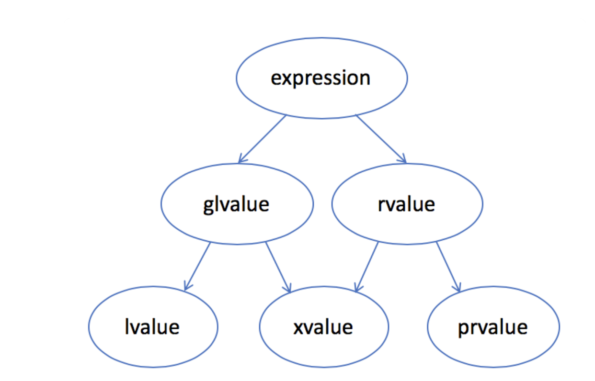

# 第四章 表达式

## 目录
* [基础](#基础)
	* [基础概念](#基础概念)
	* [左值和右值](#左值和右值)
	* [优先级和结合律](#优先级和结合律)
		- [括号无视优先级与结合律](#括号无视优先级与结合律)
	* [求值顺序](#求值顺序)
		- [求值顺序、优先级、结合律](#求值顺序、优先级、结合律)
* [算术运算符](#算术运算符)
* [逻辑和关系运算符](#逻辑和关系运算符)
	* [逻辑与和逻辑或运算符](#逻辑与和逻辑或运算符)
	* [关系运算符](#关系运算符)
	* [相等性测试与布尔字面值](#相等性测试与布尔字面值)
* [赋值运算符](#赋值运算符)
	* [赋值运算满足右结合律](#赋值运算满足右结合律)
	* [赋值运算优先级较低](#赋值运算优先级较低)
	* [切勿混淆相等运算符和赋值运算符](#切勿混淆相等运算符和赋值运算符)
	* [复合赋值运算符](#复合赋值运算符)
* [递增递减运算符](#递增递减运算符)
* [成员访问符](#成员访问符)
* [条件运算符(三目运算)](#条件运算符（三目运算)
* [位运算](#位运算)
	* [按位与运算（&）](#按位与运算（&）)
	* [按位或运算 （｜）](#按位或运算-（｜）)
	* [按位求反运算 （～）](#按位求反运算-（～）)
	* [按位异或运算（^）](#按位异或运算（^）)
	* [左移运算(<<)](#左移运算(<<))
	* [右移运算(>>)](#右移运算(>>))
* [sizeof运算符](#sizeof运算符)
* [逗号运算符](#逗号运算符)
* [类型转换](#类型转换)
	* [算术转换](#算术转换)
	* [其他隐式类型转](#其他隐式类型转)
	* [显示转换（cast)](#显示转换（cast)
	* [static_cast](#static_cast)
	* [const_cast](const_cast)
	* [dynamic_cast](#dynamic_cast)
	* [reinterpret_cast](#reinterpret_cast)
	* [旧式的强制类型转换](#旧式的强制类型转换)

## 基础

表达式由一个或多个**运算对象（`operand`）**组成，对表达式求值将得到一个**结果（`result`）**。字面值和变量是最简单的 **表达式（`expression`）**，其结果就是字面值和变量的值。把一个**运算符（`operator`）**和一个或多个运算对象组合起来可以生成较复杂的表达式。

### 基础概念

​	`C++`定义了 **一元运算符（`unary operator`）** 和 **二元运算符（`binary operator`）**。

作用于一个运算对象的运算符是二元运算符，如`取地址符( & )` 和` 解引用符( * )`；

作用于两个运算对象的运算符是二元运算符，如`相等运算符( == )` 和`乘法运算符( * )`。

除此之外，还有一个作用于三个运算对象的` 三元运算符（Ternary Operator）`。函数调用也是一种特殊的运算符，它对运算对象的数量没有限制。

一些符号既能作为一元运算符也能作为二元运算符。例如：`*`

**运算对象转换**

在表达式求值的过程中，运算对象常常由一种类型转换成另外一种类型。如：整数能转换成浮点数，浮点数也能转换成整数，但是指针不能转换成浮点数。而小整数类型（如 `bool`、`char`、`short` 等）通常会被 **提升（`promoted`）** 为较大的整数类型，主要是 `int`。

### 左值和右值

`C++`的表达式分为 **右值（`rvalue`）** 和 **左值（`lvalue`）**：

左值：一般说法，编译器为其单独分配了一块存储空间，可以取其地址的，可以放在赋值运算符左边

右值：指的是数据本身，不能取其自身地址的，右值只能赋值运算右边。



左值`lvalue`是有标识符、可以取地址的表达式，最常见的情况有：

- 变量、函数或数据成员的名字
- 返回左值引用的表达式，如 `++x`、`x = 1`、`cout << ' '`
- 字符串字面量如 `"hello world"`
- 在函数调用时，左值可以绑定到左值引用的参数，如 `T&`。一个常量只能绑定到常左值引用，如`const T&`。

纯右值`prvalue`是没有标识符、不可以取地址的表达式，一般也称之为“临时对象”。最常见的情况有：

- 返回非引用类型的表达式，如`x++`、`x + 1`、`make_shared(42)`
- 除字符串字面量之外的字面量，如 `42`、`true`

对求值结果，可以做一个简单的归纳：

- 当一个对象被用作右值的时候，用的是 **对象的值（内容）**；
- 当一个对象被用作左值的时候，用的是 **对象的身份（在内存中的位置）**。

需要右值的地方可以用左值来代替，但是不能把右值当成左值（也就是位置）使用。

- 赋值运算符需要一个非常量左值作为其左侧运算对象，得到的结果也仍然是一个左值；
- 取地址符作用于一个左值运算对象，返回指向该运算对象的指针，该指针是一个右值；
- 内置解引用运算符、下标运算符、迭代器解引用运算符、`string` 和 `vector` 的下标运算符都返回左值；
- 内置类型和迭代器的递增递减运算符作用于左值运算对象，其前置版本返回左值，后置版本返回右值。

### 优先级和结合律

**复合表达式（`compound expression`）** 指含有两个或多个运算符的表达式。运算符和运算对象合理地组合在一起，优先级与结合律决定了运算对象的组合方式，高优先级运算符先运行（乘法和除法，然后加法和减法），如果优先级相同，则其组合规则由结合律确定，从左向右顺序运行。

#### 括号无视优先级与结合律

表达式中括号括起来的部分被当成一个单元来求值，然后再与其他部分一起按照优先级组合。

举一个稍稍复杂的例子理解一下：

```cpp
6 + 3 * 4 / 2 + 2 = 14

<=> // 等价于

// 这条表达式中的括号符合默认的优先级和结合律
(( 6 + (( 3 * 4) / 2 )) + 2 ) = 14
```

### 求值顺序

对于那些没有指定执行顺序的运算符来说，如果表达式指向并修改了同一个对象，将会引发错误并产生未定义的行为。

```c++
int i = 0;
cout << i << " " << ++i << endl;  // undefined未定义的
```

#### 求值顺序、优先级、结合律

有`4`种运算符明确规定了运算对象的求值顺序：

- 逻辑与 ( `&&` ) 运算符
- 逻辑或 ( `||` ) 运算符
- 条件 ( `? :` ) 运算符
- 逗号 ( `,` ) 运算符

**小括号的利用 > 算术 > 关系 > 逻辑**

处理复合表达式时建议遵循以下两点是有益的：

- 不确定求值顺序时最好使用括号来强制让表达式的组合关系符合程序逻辑的要求；
- 如果表达式改变了某个运算对象的值，则在表达式的其他位置不要再使用这个运算对象。


## 算术运算符

一元运算符的优先级别最高，接下来时乘法和除法，优先级最低的是加法和减法

| 运算符 | 功能     | 用法        |
| ------ | -------- | ----------- |
| `+`      | 一元正号 | `+ expr`      |
| `-`      | 一元正号 | `- expr `     |
| `*`      | 乘法     | `expr * expr` |
| `/`      | 除法     | `expr / expr` |
| `%`     | 求余     | `expr % expr` |
| `+`      | 加法     | `expr + expr` |
| `-`      | 减法     | `expr - expr` |

上面的所有运算符都满足左结合律， 意味着当优先级相同时按照从左向右的顺序进行组合。

- 算术运算符能作用于任意算术类型以及任意能转换为算术类型的类型
- 算术运算符的运算对象和求值结果都是右值
- 在表达式求值之前，小整数类型的运算对象提升为较大的整数类型，所有运算对象最终会转换为同一类型
- 都能作用于指针。当一元正号运算符作用于一个指针或算术值时，将会返回运算对象值的一个副本
- 布尔值不应参与运算

```c++
int i = 1024;
int k = -i;				// k是-1024
bool b = true;
bool b2 = -b;			// b2为true
```

除法运算：

- 整数相除（ `/` ）结果还是整数，即直接弃除商的小数部分；
- **取余** 或 **取模** 运算符（ `%` ）计算整数相除的余数。
- 参与取余运算的对象必须是整数类型

```c++
int ival1 = 21/6;		// ival = 3, 结果进行了删节，余数被抛弃掉了
int ival2 = 21/7;		// ival = 3,没有余数，结果是整数值
int ival = 42;
double dval = 3.14;
ival % 12;				// ok: 结果为6
ival % dval;			// error : 运算对象是浮点类型
```

在除法运算中，`C++`语言的早期版本允许结果为负数的商向上或向下取整，`C++11`新标准则规定商一律向`0`取整（即直接去除小数部分）。

```c++
21 % 6; 		/* 结果是3  */ 			21 / 6; 		/* 结果是3  */
21 % 7; 		/* 结果是0  */ 			21 / 7; 		/* 给果是3  */
-21 % -8; 	    /* 结果是-5 */ 			-21 / -8; 	    /* 结果是2  */
21 % -5; 		/* 结果是1  */ 			21 / -5; 		/* 结果是-4 */
```


##  逻辑和关系运算符

- 关系运算符作用于算术类型和指针类型
- 逻辑运算符作用于任意能转换成布尔值的类型。
- 逻辑运算符和关系运算符的返回值都是布尔类型。
- 逻辑运算和关系运算的运算对象和求职结果都是右值

| 结合律 | 运算符 | 功能     | 用法           |
| ------ | ------ | -------- | -------------- |
| 右     | `！`     | 逻辑非   | `！expr`         |
| 左     | `<`      | 小于     | `expr < expr`    |
| 左     | `<=`     | 小于等于 | `expr <= expr`   |
| 左     | `>`      | 大于     | `expr > expr`    |
| 左     | `>=`     | 大于等于 | `expr >= expr`   |
| 左     | `==`     | 相等     | `expr == expr`   |
| 左     | `!=`     | 不等于   | `expr != expr`   |
| 左     | `&&`     | 逻辑与   | `expr &&expr`    |
| 左     | `\|\|`   | 逻辑非   | `expr \|\| expr` |

### 逻辑与和逻辑或运算符

**逻辑与**   
  运算符 `&&` 和 **逻辑或** 运算符 `||` 都是先计算左侧运算对象的值再计算右侧运算对象的值，当且仅当左侧运算对象无法确定表达式的结果时才会去计算右侧运算对象的值，这种策略称为 **短路求值（`short-circuit evaluation`）**。

- 对于逻辑与运算符来说，当且仅当左侧运算对象为真时才对右侧运算对象求值。
- 对于逻辑或运算符来说，当且仅当左侧运算对象为假时才对右侧运算对象求值。

```c++
// s 是对常量的引用;元素既没有被拷贝也不会被改变
for (const auto &s : text){	// 对于text 的每个元素
	cout << s; 				// 输出当前元素
	// 遇到空字符亭或者以句号结束的字符串进行换行
	if (s.empty() || s[s.size() - 1] == '.')
		cout << endl;
	else
		cout << " "; 		// 否则用空格隔开
}
```

`if` 语句的条件部分首先检查 `s` 是否是一个空 `string`，如果是，则不论右侧如何都换行；只有当 `string` 对象非空时才求第二个运算对象的值，即是否是以句号结束。


**逻辑非** 

运算符 `!` 将运算对象的值取反后返回。

```c++
// 输出vec的首元素(如果有的话)
if (!vec.empty())
		cout << vec[0];
```

当`empty`函数返回假时结果为真。

### 关系运算符

关系运算符比较运算对象的大小关系并返回布尔值，关系运算符都满足左结合律。

```c++
// error 这个条件居然拿i<j的布尔值结果和k比较
if ( i < j < k) 	// 若k大于1则为真
// 正确:当i小于j并且j小于k时条件为真
if (i < j && j < k)
{
	/* ... */
}
```

### 相等性测试与布尔字面值

测试一个算术对象或指针对象的真值，最直接的方法就是将其作为 `if` 语句的条件。

```c++
if (val)
{
	/* ... */
} // 如果val是任意的非0值，条件为真

if (!val)
{
	/* ... */
} // 如果val是0，条件为真

if (val == true)
{
	/* ... */
} // 只有当val等于true时条件才为真!

if (val == 1)
{
	/* ... */
} // 只有当val等于1时条件才为真!
```

> 进行比较运算时，除非比较的对象是布尔类型，否则不要使用布尔字面值 `true` 和 `false` 作为运算对象。

## 赋值运算符

- 赋值运算符 `=` 的左侧运算对象必须是一个 **可修改** 的 **左值**。

```c++
int i = 0, j = 0, k = 0;				// 初始化而非赋值
const int ci = i;						// 初始化而非赋值

1024 = k ;								// 错误:字面值是右值
i + j = k ;								// 错误:算术表达式是右值
ci = k;									// 错误:ci是常量(不可修改的)左值
```

- C++11新标准允许使用花括号括起来的初始值列表作为赋值语句的右侧运算对象。

```c++
k = (3.14);									  // 错误:窄化转换
vector<int> vi;     					      // 初始为空
vi = {0,1,2,3,4,5,6,7,8,9}; 				  // vi现在含有10个元素了，值从0到9
```

### 赋值运算满足右结合律

```c++
int ival, jval;
ival = jval = 0;   			 // 正确:都被赋值为0

int ival, *pval;			// ival的类型是int;pval是指向int的指针
ival = pval = 0;			// 错误: 不能把指针的值赋给int

string s1, s2;
s1 = s2 = "OK";			   // 字符串字面值"OK"转换成string对象
```

### 赋值运算优先级较低

因为赋值运算符的优先级低于关系运算符的优先级，所以在条件语句中，赋值部分通常应该加上括号。

```c++
// 这是一种形式烦琐、容易出错的写法
int i = get_value(); // 得到第一个值
while (i != 42)
{
	// 其他处理......
	i = get_value(); // 得到剩下的值
}

// 更好的写法:条件部分表达得更加清晰
int i;
while ((i = get_value()) != 42)
{
	// 其他处理......
}
```

### 切勿混淆相等运算符和赋值运算符

```c++
if (i = j)
if (i == j)
```

### 复合赋值运算符

复合赋值运算符包括 `+=`、`-=`、`*=`、`/=`、`%=`（算术运算符）；`<<=`、`>>=`、`&=`、`^=` 和 `|=`（位运算符）。任意一种复合运算都完全等价于 `a = a op b`。

```c++
int sum = 0;
// 计算从1到10（包含10在内)的和
for (int val = 1; i <= 10; ++val)
		sum += val;			// 等价于sum = sum + val
```


## 递增递减运算符

递增（ `++` ）和递减（ `--` ）运算符是为对象加`1`或减`1`的简洁书写形式。这两个运算符还可应用于迭代器，因为很多迭代器本身不支持算术运算。

递增和递减运算符分为前置版本和后置版本：

- 前置版本：首先将运算对象加`1`（或减`1`），然后将改变后的对象作为求值结果。
- 后置版本：也会将运算对象加`1`（或减`1`），但求值结果是运算对象改变前的值的副本。

```c++
int i = 0, j;
j = ++i;    // j = 1, i = 1: 前置版本得到递增之后的值
j = i++;    // j = 1, i = 2: 后置版本得到递增之前的值
```

除非必须，否则不应该使用递增或递减运算符的后置版本。因为后置版本需要将原始值存储下来以便于返回修改前的内容，如果我们不需要这个值，那么后置版本的操作就是一种浪费。

> 对于整数和指针类型来说，编译器可能对这种额外的工作进行一定的优化；但是对于相对复杂的迭代器类型，这种额外的工作就消耗巨大了。建议养成使用前置版本的习惯，这样不仅不需要担心性能的问题， 而且更重要的是写出的代码会更符合编程的初衷。

```c++
auto pbeg = v.begin();
// 输出元素直至遇到第一个负值为止
while (pbeg != v.end() && *pbeg >= 0)
	// 输出当前值并将pbeg向前移动一个元素
	cout << *pbeg++ << endl;
```

在某些语句中混用解引用和递增运算符可以使程序更简洁！！

```c++
std::cout << *iter++ << std::endl;
// 比下面的等价语句更简洁，也更少出错：

std::cout << *iter << std::endl;
++iter;
```

##  成员访问符

点运算符 `.` 和箭头运算符 `->` 都可以用来访问成员，其中，点运算符获取类对象的一个成员；箭头运算符与点运算符有关，表达式 `ptr->mem` 等价于 `(*ptr).mem`。	

```c++
string s1 = "a string", *p = &s1;
auto n = s1.size(); // 运行string对象s1的size成员
n = (*p).size();    // 运行p所指对象的size成员
n = p->size();      // 等价于(*p).size()
```

因为解引用运算符的优先级低于点运算符，所以执行解引用运算的子表达式两端必须加上括号。如果没如括号，代码的含义就大不相同了：

```c++
// 运行p的size成员，然后解引用size的结果
*p.size (); // 错误：p是一个指针，它没有名为size的成员
```

## 条件运算符（三目运算)

条件运算符（`? :`）的使用形式如下：

```cpp
cond ? expr1 : expr2;
```

其中 *`cond`* 是判断条件的表达式，而 *`expr1`* 和 *`expr2`* 是两个类型相同或可能转换为某个公共类型的表达式。先求 *`cond`* 的值，如果 *`cond`* 为真则对 *`expr1`* 求值并返回该值，否则对 *`expr2`* 求值并返回该值。

```c++
string finalgrade = (grade < 60) ? "fail" : "pass";
```

- 只有当条件运算符的两个表达式都是左值或者能转换成同一种左值类型时，运算的结果才是左值，否则运算的结果就是右值。
- 条件运算符可以嵌套，但是考虑到代码的可读性，运算的嵌套层数最好不要超过两到三层。

```c++
finalgrade = (grade > 90) ? "high pass"
							: (grade < 60) ? "fail" : "pass";
```

- 条件运算符的优先级非常低，因此当一个长表达式中嵌套了条件运算子表达式时，通常需要在它两端加上括号。

```c++
cout << ((grade < 60) ? "fail" : "pass"); 		// 输出pass或者fail

cout << (grade < 60) ? "fail" : "pass"; 		// 输出1或者0
// 等价于<=>
// cout << (grade < 60); 						// 输出1或者0
// cout ? "fail" : "pass"; 						// 根据cout的值是true还是false产生对应的字面值

cout << grade < 60 ? "fail" : "pass"; 			// 错误:试图比较cout和60
// 等价于<=>
// cout << grade; 								// 小于运算符的优先级低于移位运算符，所以先输出grade
// cout < 60 ? "fail" : "pass"; 				// 然后比较cout和60
```

## 位运算

- 位运算作用于整数类型的运算对象，并把运算对象看成二进制的集合
- 位运算提供检查和设置二进制位的功能
- 符号位如果没有明确的规定，强烈建议将位运算用于处理无符号类型。


### 按位与运算（&）

如果两位都是`1`,则结果是`1`,有一个是`0`,那么结果就是`0`

作用：可以将某些位置`0`

`char` `8`位

`int`   `32`位
```cpp
int operatorAnd(int& a,int& b) {
	      return a & b;
}

int main()
{
	// 3 即0000 0011        5 即0000 0101   =>  3 & 5 = 0000 0001 
    int a = 3, b = 5;

    std::cout << operatorAnd(a,b) << std::endl; // output : 1

    return 0;
}
```

### 按位或运算 （｜）

如果两位都是`0`,则结果是`0`,有一个是`1`,那么结果就是`1`

作用：可以将某些位置`1`

```cpp
int operatorOr(int& a,int& b) {
	      return a & b;
}

int main()
{
	// 3 即0000 0011        5 即0000 0101   =>  3 | 5 = 0000 0111 
    int a = 3, b = 5;

    std::cout << operatorOr(a,b) << std::endl; // output : 7

    return 0;
}
```

### 按位求反运算 （～）

二进制表示的数字中`0`变`1` `1`变`0`

作用：可以将某些位取反
```cpp
int operatorNegate(int& data) {
	      return ~data;
}

int main()
{
	// 10 即0000 1010        
	// 计算补码：（正数的补码与原码相同，而正数的原码就是二进制）即 0000 1010
	// 按位取反：1111 0101
	// 开始把1111 0101转换为原码 
	// 如果最高位（从左边开始的第一位）为0则表示的就是正数：正数的原码和取反后的数相同。
	// 如果最高位为1则表示的就是负数：先将已取反的数减去1，再对差进行取反（注意：保留最高位不变），最后加上一个负号 
	// 所以把1111 0101 减1 =>    1111 0100 转换为原码后为 1000 1011 由于最高位1表示负数 即 -11 
    int data = 10;

    std::cout << operatorNegate(data) << std::endl; // output : -11

	// 负数取反
	int data2 = -10;
	// 先将-10取绝对值10, 10的二进制为 0000 1010
	// 将0000 1010用补码表示(对于负数的补码：将其对应正数的二进制取反后，加1) 即 1111 0101 + 1 = 1111 0110
	// 将补码按位取反得 0000 1001
	// 将反码转换为原码, 如果最高位（从左边开始的第一位）为0则表示的就是正数：正数的原码和取反后的数相同。
	//  即 0000 1001  转为10进制为 9
	std::cout << operatorNegate(data2) << std::endl; // output :  9

    return 0;
}
```

### 按位异或运算（^）

二进制表示的数字如果两位相同为`0`,不同为`1`

作用：一般用于加密的场景。
```cpp
int operatorXOR(int& a,int& b) {
	      return a ^ b;
}

int main()
{
	// 3 即0000 0011        5 即0000 0101   =>  3 ^ 5 = 0000 0110 
    int a = 3, b = 5;

    std::cout << operatorXOR(a,b) << std::endl; // output : 6

    return 0;
}
```


### 左移运算(<<)
左移就是把一个数的所有位都向左移动若干位,

左边丢弃，右边补`0`

注意左移的位数：

 `char` 最多`7`位
 
 `int`  最多`31`位 

```cpp
int main()
{
	// 3 即0000 0011     3 << 2   ->   0000 1100 = 12  
    int data = 3;
	data = data << 2;
    std::cout << data << std::endl; // output : 12

    return 0;
}
```
### 右移运算(>>)

- 算术右移(`vs`、`qt`)：正数：右边丢弃，左边补`0`

  ​				               负数：右边丢弃，左边补`1`

  有符号数,如果为正数,则左边移入`0`，右边丢弃

  如果为负数，左边移入`1`，右边丢弃

- 逻辑右移：不关心正数、负数，左边均移入`0`，右边丢弃

```cpp
int main()
{
	// 3 即0000 0011     3 >> 2   ->   0000 0000 = 0  
    int data = 3;
	data = data >> 2;
    std::cout << data << std::endl; // output : 0

    return 0;
}
```

## sizeof运算符

`sizeof` 运算符返回一个表达式或一个类型名字所占的字节数，返回值是 `size_t` 类型。

```c++
Sales_data data, *p;
sizeof(Sales_data); 					// 存储Sales_data类型的对象所占的空间大小
sizeof data;							// data的类型的大小，即sizeof(Sales_data)
sizeof p;							   // 指针所占的空间大小
sizeof *p;							   // p所指类型的空间大小，即sizeof(Sales_data)
sizeof data.revenue; 				  // Sales_data的revenue成员对应类型的大小
sizeof Sales_data::revenue; 	      // 另一种获取revenue大小的方式
```

在`sizeof`的运算对象中解引用一个无效指针仍然是一种安全的行为，因为指针实际上并没有被真正使用。

`sizeof`运算符的结果部分依赖于其作用的类型：

- 对 `char` 或者类型为 `char` 的表达式执行` sizeof` 运算，返回值为`1`。
- 对引用类型执行` sizeof `运算得到被引用对象所占空间的大小。
- 对指针执行` sizeof` 运算得到指针本身所占空间的大小。
- 对解引用指针执行 `sizeof `运算得到指针指向的对象所占空间的大小，指针不需要有效。
- 对数组执行` sizeof` 运算得到整个数组所占空间的大小。
- 对 `string` 或` vector `对象执行 `sizeof `运算只返回该类型固定部分的大小，不会计算对象中元素所占空间的大小。
  

```c++
// sizeof(ia)/sizeof(*ia) 返回ia的元素数量
constexpr size_t sz = sizeof(ia)/sizeof(*ia);
int arr2[sz];					// ok: 正确，sizeof返回一个常量表达式
```


## 逗号运算符

逗号运算符 `,` 含有两个运算对象，按照从左向右的顺序依次求值，最后返回右侧表达式的值。逗号运算符经常用在 `for` 循环中。

```c++
vector<int>::size_type cnt = ivec.size();
// 将把从size到1的值赋给ivec的元素
for(vector<int>::size_type ix = 0; 
				ix != ivec.size(); ++ix, --cnt)
    ivec[ix] = cnt;
```


## 类型转换

在`C++`语言中，某些类型之间有关联。如果两种类型有关联， 那么当程序需要其中一种类型的运算对象时，可以用另一种关联类型的对象或值来替代。换句话说，如果两种类型可以相互转换（`conversion`），那么它们就是关联的。

无须程序员介入，会自动执行的类型转换叫做**隐式转换**（`implicit conversions`），可以尽可能地避免损失精度。

在下面这些情况下， 编译器会自动地转换运算对象的类型：

- 在大多数表达式中，比`int`类型小的整型值首先提升为较大的整数类型。
- 在条件中，非布尔值转换成布尔类型。
- 在初始化过程中，初始值转换成变量的类型；在赋值语句中，右侧运算对象转换成左侧运算对象的类型。
- 如果算术运算或关系运算的运算对象有多种类型，需要转换成同一种类型。
- 函数调用时也会发生类型转换。

### 算术转换

把一种算术类型转换成另一种算术类型叫做 算术转换（`arithmetic conversion`），其中运算符的运算对象将被转换成最宽的类型。

整型提升（`integral promotions`） 负责把小整数类型转换成较大的整数类型。

如果某个运算符的运算对象类型不一致， 这些运算对象将转换成同一种类型。但是如果某个运算对象的类型是无符号类型，那么转换的结果就要依赖于机器中各个整数类型的相对大小了。

要想理解算术转换， 办法之一就是研究大量的例子:

```c++
bool flag; 		char cval;
short sval; 	unsigned short usval;
int ival; 		unsigned int uival;
long lval; 		unsigned long ulval;
float fval; 	double dval;

3.14159L + 'a';			    // 'a'提升成int，然后该int值转换成long double
dval + ival; 				// ival转换成double
dval + fval;				// fval转换成double
ival = dval;				// dval转换成(切除小数部分后)int
flag = dval;				// 如果dval是0，则flag是false，否则flag是true
cval + fval;				// cval提升成int，然后该int值转换成float
sval + cval;				// sval和cval都提升成int
cval + lval;				// cval转换成long
ival + ulval;				// ival转换成unsigned long
usval + ival;				// 根据unsigned short和int所占空间的大小进行提升
uival + lval;				// 根据unsigned int和long所占空间的大小进行转换
```

### 其他隐式类型转

**数组转换成数组**：在大多数用到数组中，数组自动转换成指向数组首元素的指针。

```c++
int ia[10];					// 含有10个整数的数组
int *ip = ia;				// ia转换成指向数组首元素的指针
```

- 当数组用在`declptype`关键字的参数，或者作为取地址(`&`)、`sizeof`及`typeid`等运算符的运算对象时，上述转换不会发生

- 用一个引用初始化数组，也不会发生上述转换。

**指针的转换**：

常量整数值`0`或字面值 `nullptr` 能转换成任意指针类型；

指向任意非常量的指针能转换成 `void*`；

指向任意对象的指针能转换成 `const void*`

**转换成布尔类型**：任意一种算术类型或指针类型都能转换成布尔类型。

```c++
char *cp = get_string();
if (cp)	/* ... */								// 如果指针cp不是0，条件为真
while(*cp) /* ... */							// 如果*cp不是空字符，条件为真
```

**转换成常量** ：允许将指向非常量类型的指针转换成指向相应的常量类型的指针，对于引用也是这样。

如果T是一种类型，就能将指向T的指针或引用分别转换成指向`const ` T 的指针或引用。

```c++
int i;
const int &j = i;						//	非常量转换成const int 的引用
const int *p = &i;						//  非常量的地址转换成const的地址
int &r = j, *q = p;						//  error : 不允许const转换成非常量
```

**类类型定义的转换**：类类型能定义由编译器自动执行的转换，不过编译器每次只能执行一种类类型的转换。

- 需要标准库`string`类型的地方使用`C`风格字符串

```cpp
string s("hello world");
const char *str = s.c_str();
```

- 在条件部分读入`istream`

```c++
string s, t = "a value";					//字符串字面值转换成string类型
while(cin >> s)										//while的条件部分把cin转换成布尔值
```

 

### 显示转换（cast)

有时希望显示地将对象强制转换成另一种类型，例如：

```c++
int i, j;
double slope = i/j;
```

可以使用某种方法将`i`和`/`或`j`显示地转换成`double`，这种方法称做**强制类型转换(cast)**

虽然有时不得不使用强制类型转换，但这种方法本质上是非常危险的。**建议尽量避免强制类型转换。**

**命名的强制类型转换**

一个命名的强制类型转换如下：

```c++
cast-name<type>(expression);
```

- 其中 *`type`* 是转换的目标类型，*`expression`* 是要转换的值。如果 *`type`* 是引用类型，则转换结果是左值。
- *`cast-name`* 是 `static_cast`、`dynamic_cast`、`const_cast` 和 `reinterpret_cast` 中的一种，用来指定转换的方式。

####  static_cast

- 任何具有明确定义的类型转换，只要不包含底层 `const`，都能使用 `static_cast`。对内置的数据类型转换,不保证安全 ，需要人为的控制。

```c++
// 进行强制类型转换以便执行浮点数除法
double slope = static_cast<double>(j)/i;
```

- 当需要把一个较大的算术类型赋值给较小的类型时，`static cast` 非常有用。`static cast` 对于编译器无法自动执行的类型转换也非常有用。

```c++
void* p = &d;						// ok : 任何非常量对象的地址都能存入void*
// ok : 将void*转换回初始的指针类型
double *dp = static_cast<double*>(p);
```

- 对于发生继承关系的两个类,子类转父类的指针是安全的,父类转子类的指针是不安全的,对于没有继承关系的两个类,他们的指针之间不能转换

```c++
class Base {
public:
		virtual void foo(){}
};

class Derived : public Base {
public :
		virtual void foo() {}
}

class Pal {
  
};

int main()
{
  	Base* b = nullptr;
  	Derived *d = nullptr;
  	Pal *p = nullptr;
  	b = static_cast<Base*>(d);					// 子类转父类，向上转换 安全
  	d = static_cast<Derived*>(b);				// 父类转子类，向下转换，不安全
  	p = static_cast<Pal>(d);					// error : 没有发生继承关系，不可以用静态转换
	return 0;
}
```

#### const_cast

- `const`只能改变运算对象的底层`const`

```c++
const char *pc;
char *p = const_cast<char*p>(pc);				// ok : 但是通过p写值是未定义(undefind)的行为
```

- 只有`const_cast`能改变表达式的属性，使用其他类型的命名强制类型转换改变表达式的常量属性都将引发编译器错误。

```c++
const char *cp;
// error : static_cast不能转换掉const性质
char *q = static_cast<char*>(cp);		
static_cast<string>(cp);								// ok : 字面串字面值转换成string类型
const_cast<string>(cp);									// error : const_cast只改变常量属性
```

- `const_cast`常常用于有函数重载的上下文

```c++
//比较两个string对象的长度，返回较短的那个引用
const string &shorterString(const string &s1,const string &s2)
{
		return s1.size() <= s2.size() ? s1 : s2;
}

string &shorterString(string &s1,string &s2)
{
		auto &r = shorterString(const_cast<const string&>(s1),
														const_cast<const string&>(s2));
		return const_cast<string&>(r);
}
```

- 一般用来const修饰的指针或引用和没有const修饰的指针或引用之间的转换。`const int b ; int a = const_cast<int>(b) `这种是不可以的

```c++
int *p = nullptr;
const int *q = const_cast<const int*>(p);
int *r = const_cast<int*>(q);
```

#### dynamic_cast

- 不能对内置的数据类型进行转换
- 一般用来有继承关系的类之间转换,对于子类转父类,安全可以转,父类转子类不可以转换,系统认为如果发生了多态,子类和父类之间的转换总是安全的

```c++
class Base {
public:
		virtual void foo(){}
};

class Derived : public Base {
public :
		virtual void foo() {}
}

int main()
{
  	Base* b = nullptr;
  	Derived *d = nullptr;
  	b = dynamic_cast<Base*>(d);					// 子类转父类，向上转换 安全
  	d = dynamic_cast<Derived*>(b);				// 父类转子类，向下转换，不安全
	return 0;
}
```

- `dynamic_cast`支持运行时类型识别


#### reinterpret_cast

- `reinterpret_cast` 通常为运算对象的位模式提供底层上的重新解释

- 什么类型都可以转,不安全,不推荐使用

- `reinterpret_cast` 本质上依赖于机器。要想安全地使用`reinterpret_cast` 必须对涉及的类型和编译器实现转换的过程都非常了解。

```c++
// 不安全，不推荐使用
int ip ;
char *pc = reinterpret_cast<char*>(ip);
Derived *d = nullptr;
Pal * pa = reinterpret_cast<Pal*>(d);
```

#### 旧式的强制类型转换

早期版本的C++语言中，显式类型转换包含两种形式：

```c++
type (expression);    // 函数形式的强制类型转换
(type) expression;    // C语言风格的强制类型转换
```

与命名的强制类型转换相比，旧式的强制类型转换从表现形式上来说不那么清晰明了了，容易被看漏，所以一旦转换过程出现问题，追踪起来也更加困难。

**[⬆ 返回顶部](#目录)**