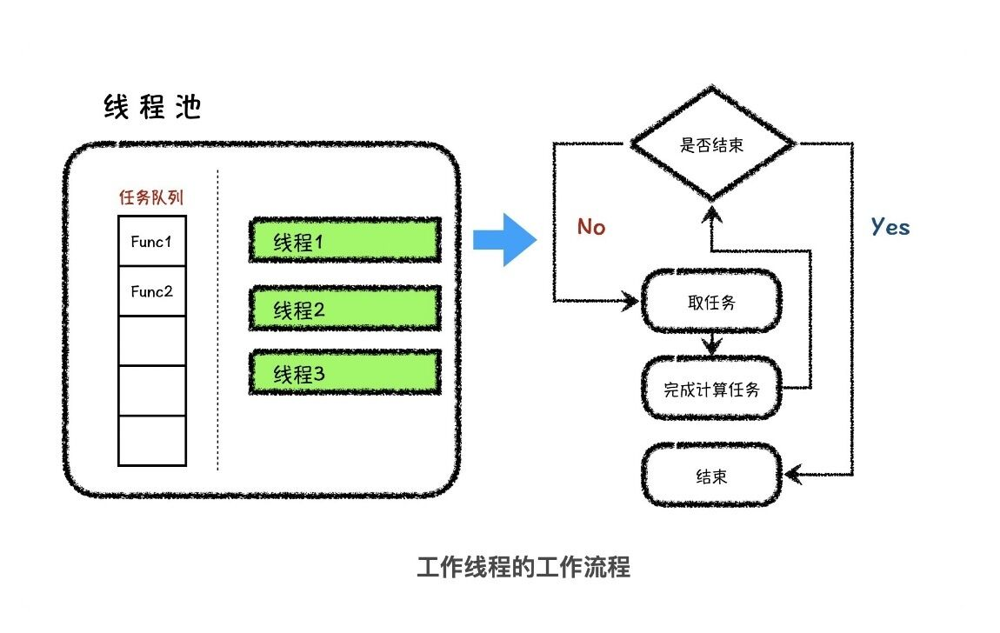
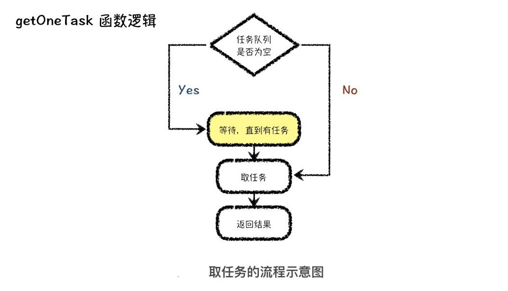

# Thread


## 目录
* [进程](#进程-Process)  
* [线程](#线程-Thread)
* [基本线程函数:创建和终止](#基本线程函数:创建和终止)
    - [pthread_create函数](#pthread_create函数)
    - [pthread_join函数](#pthread_join函数)
    - [pthread_self函数](#pthread_self函数)
    - [ptread_detach函数](#ptread_detach函数)
    - [pthread_exit函数](#pthread_exit函数)
    - [pthread_cancel函数](#pthread_cancel函数)
* [线程池](#线程池-thread_pool)
    - [封装：计算任务类](#封装：计算任务类)
    - [线程池的初始化方法](#线程池的初始化方法)
    - [实现工作线程](#实现工作线程)
    - [实现获取任务的逻辑](#实现获取任务的逻辑)
    - [添加任务的逻辑](#添加任务的逻辑)
    - [可配置任务队列的设计与实现](#可配置任务队列的设计与实现)

## 进程 Process
- 程序：程序是存放在存储介质上的一个可执行文件   
- 进程(process)就是运行起来的程序,程序运行起来需要被加载到内存中,可以理解为进程就是将程序执行起来,进程是一个容器,这个容器有可执行程序以及可执行程序所需要的资源
- 进程是操作系统中进行保护和资源分配的基本单位   
- 当一个进程需要另外一个实体来完成某件事时,它就`fork`一个子进程,并让子进程去执行处理。  
```c++
int main()
{
    int listenfd,connfd;
    pid_t pid;
    socklen_t clilen;
    struct sockaddr_in serv_addr,cli_addr;

    listenfd = socket(AF_INET,SOCK_STREAM,0);

    bzero(&serv_addr,sizeof(serv_addr));
    serv_addr.sin_family = AF_INET;
	serv_addr.sin_port = htons(SERVER_PROT);
	serv_addr.sin_addr.s_addr = htonl(INADDR_ANY);

    bind(listenfd,(struct sockaddr*)&serv_addr,sizeof(serv_addr));

    listen(listenfd,128);

    while(1) {
        clilen = sizeof(cli_addr);
        connfd = accept(listenfd,(struct sockaddr*)&cli_addr,&clilen);

        if((pid = fork()) == 0) { // 子进程
            close(listenfd);      // 关闭listening socket
            doit(connfd);         // 处理执行   
            close(connfd);        // 处理结束,子进程关闭connected socket   
            exit(0);
        }
        close(connfd);          // 父进程关闭connected socket
    }
}
```
上面例子中是并发服务器程序的轮廓,`fork`调用却还存在一些问题:   
- `fork`是昂贵的.`fork`需要把父进程的内存映像复制到子进程,并在子进程中复制所有描述符等等一些资源。现在的实现使用**写时复制**(`copy-on-write`)技术:用以避免在子进程切实需要自己的副本之前把父进程的数据空间复制到到子进程.即使有这样的优化措施,`fork`仍然还是昂贵的。   

- `fork`返回之后父子进程之间信息的传递需要进程间通信(`IPC`)机制。调用`fork`之前父进程向尚未存在的子进程传递信息相当容易，因为子进程将从父进程数据空间及所有描述符的一个副本开始运行.然而从子进程往父进程返回信息却比较费力。   

基于以上,线程的有助于解决这两个问题。  

## 线程 Thread
- 线程存在于进程中,即线程是进程的子任务,线程是一个独立代码执行块
- 线程有时被称为**轻权进程**(lightweight process)
- 线程是`CPU`调度和分派的基本单位
- 同一进程内的所有线程共享相同的全局内存.  
- 同一进程内的所有线程除了共享全局变量外还共享:
    - 进程指令
    - 大多数数据
    - 打开的文件(即文件描述符)
    - 信号处理函数和信号处置
    - 当前工作目录
    - 用户`ID`和组`ID`
- 每个线程有各的目的:
    - 线程`ID`
    - 寄存器集合,包括程序计数器和栈指针
    - 栈(用于存放局部变量和返回地址)
    - `errno`
    - 信号掩码
    - 优先级
- 一个线程挂掉将导致整个进程挂掉

## 基本线程函数:创建和终止
### pthread_create函数
当一个程序由`exec`启动执行时,称为**初始线程**(`initial thread`)或**主线程**(`main thread`)的单个线程就创建了。其余线程则由`pthread_create`函数创建。即在进程中创建一个线程。
```c++
#include <pthread.h>

int pthread_create(pthread_t *tid, const pthread_attr_t *attr, void *(*func)(void *), void *arg);
```
参数描述:
- tid : 一个线程内的每个线程都由一个线程`ID`(`thread ID`)标识,其数据类型为`pthread_t`。如果新的线程成功创建,其`ID`就通过`tid`指针返回。
- attr: 线程的属性(`attribute`):优先级、初始化栈大小、是否应该成为一个守护线程,通常情况下采用默认设置,一般填`NULL`
- func: 线程的回调函数
- arg : 传给线程回调函数的参数
- 返回值: 成功返回`0`,失败返回`errno`值,可以通过`strerror`函数打印`errno`的错误信息,不能通过`perror`去打印`error`错误信息


### pthread_join函数
可以通过调用`pthread_join`等待一个给定线程终止,类似于`waitpid`。即回收子线程的资源。
```c++
#include <pthread.h>

int pthread_join(pthread_t *tid,void **status);
```
参数描述:
- tid : 需要回收线程的线程`ID`
- status : `void*`变量类型的地址,用于接收子线程返回的值。
- 返回值:如成功则返回`0`,若出错则为正的`Exxx`值
**注意**: `pthread_join`一次只回收一个子线程,并且子线程不退出,`pthread_join`不阻塞

### pthread_self函数
每个线程都有一个在所属进程内标识自身的`ID`，可以通过`pthread_self`获取自身的线程`ID`,类似于`getpid`。
```c++
#include <pthread.h>

pthread_t pthread_self(void);
```
参数描述:
- 返回值 : 调用线程的线程`ID`


### ptread_detach函数
将`thread`线程与当前进程分离,分离之后线程退出的资源由系统回收,如果再次调用`pthread_join`是不会等待子线程退出,也不会回收子线程资源。
```c++
#include <pthread.h>

int pthread_detach(pthread_t tid); 
```
参数描述:
- 返回值 : 成功返回`0`,失败返回`errno`值,可以通过`strerror`函数打印`errno`的错误信息,不能通过`perror`去打印`error`错误信息

通常由想让自己脱离的线程调用,则调用以下语句
```c++
pthread_detach(pthread_self());
```


### pthread_exit函数
让一个线程终止的方法是调用`pthread_exit`。不能调用`exit()`,因为调用`exit()`会退出进程,其它线程也会一起退出
```
#include <pthread.h>

void pthread_exit(void *status);
```
**注意**:如果主线程调用`pthread_exit`会退出主线程,如果有其它线程存在,进程不退出,会成为僵尸线程`Zl+`
使用` ps -Lf 进程号`可以查看进程线程的信息

### pthread_cancel函数
取消一个正在执行的线程。
```
 #include <pthread.h>

 int pthread_cancel(pthread_t tid);
```
参数描述:
- tid : 需要取消线程的线程`ID`
- 返回值: 成功返回`0`,失败返回`errno`值,可以通过`strerror`函数打印`errno`的错误信息,不能通过`perror`去打印`error`错误信息


## 线程池 thread_pool
线程池就是管理着线程资源的池子,内部除了管理着若干线程以外,还需要用一个任务队列来缓存要执行的计算任务。而这个任务队列，根据线程池的应用场景不同，可以配置成不同特性的队列。
就是事先创建多个线程,创建一个任务队列,如果有任务就会通知任务线程就去抢任务,如果没有任务,线程就会阻塞睡眠,其实是为了更精准地控制程序中的线程数量,而且为了能让有限的线程处理更多的任务。

### 封装：计算任务类

一个计算任务可以看成是,由某个函数入口加上具体的传入参数组成的一个可以延时执行的方法。

延时执行 : 在线程池中,我们需要将某个函数(需要执行的函数)和其参数打包成一个计算任务放到任务队列中,等线程池中的线程从任务队列中取出这个计算任务以后再执行。从打包放入函数任务,再到执行函数任务,这中间存在的时间间隔就是延时执行。

`C++`实现的一个`Task`类:
```c++
#include <iostream>
#include <functional> // bind function
#include <utility> // for forward

// 将函数和函数调用时所需的参数打包成一个任务对象
class Task{
public:
    template<typename Func_T, typename ...ARGS>
    Task(Func_T func, ARGS ...args) {
        this->func = std::bind(func, std::forward<ARGS>(args)...);
    }
    void run() {
        this->func();
        return ;
    }
    std::function<void()> func;
};
```
这个类的作用就是将函数和函数调用时所需的参数打包成一个任务对象,同时`Task`类提供了一个`run`方法,这个方法就是延时执行计算任务的方法。

```c++
void func(int a, int b) { 
    std::cout << a << "+" << b << "=" << a + b << std::endl; 
    return ;
}

int main()
{
    Task t1(func, 3, 4), t2(func, 5, 6); 
    t2.run(); 
    t1.run(); 
    return 0;
}
```
在主函数中,我们封装了两个计算任务,`t1`和`t2`,然后我们先调用了`t2`的`run`方法,再调用`t1`的`run`方法。这样结果就是先输出 `“5+6=11”`,`后输出“3+4=7”`。计算任务类的封装也就完成了。

### 线程池的初始化方法
接下来,我们就开始设计和封装线程池类。我们知道线程池的核心作用:**就是准确地控制线程的数量**,所以**线程池类的构造函数的作用就是新建相应数量的线程**
```c++
#include <vector>
#include <thread>

class ThreadPool{
public:
    // 在构造函数中新建 n 个线程，保存到 threads 动态数组
    ThreadPool(size_t n) {
        for(int i = 0; i < n; ++i) {
            threads.push_back(
                new std::thread(
                    &ThreadPool::thread_worker,
                    this
                )
            )
        }
    }

    void thread_worker() { 
        std::cout << "waiting for task" << std::endl; 
        // TODO: implement
        return;
    }

    ~ThreadPool() { 
        for (int i = 0; i < threads.size(); i++) { 
            threads[i]->join(); // 通过调用 join 方法等待线程执行结束
            delete threads[i];  // 调用 delete 方法释放线程所占用空间
            threads[i] = NULL;
        } 
        return; 
    }

private:
    std::vector<std::thread *> threads; // 存储线程的动态数组
};

int main()
{
    ThreadPool tp(5);
     return 0;
}
```

### 实现工作线程
 
工作线程入口函数`thread_worker`函数的工作逻辑非常简单,就是在取任务和执行任务之间做循环,直到整个线程池停止工作、被销毁为止。
```c++
class ThreadPool {
public :
    // 在构造函数中新建 n 个线程，保存到 threads 动态数组
    ThreadPool(size_t n) {
        is_running = true;  // 线程池处于工作状态
        for(int i = 0; i < n; ++i) {
            threads.push_back(
                new std::thread(
                    &ThreadPool::thread_worker,
                    this
                )
            )
        }
    }
    // 工作线程
    void thread_worker() {
        while (is_running) {
            Task *t = this->getOneTask();
            if (t == NULL) break; // 获取失败,break
            t->run();             // 执行任务
        }
        return ;
    }

    // 获取一个任务
    Task *getOneTask() {
        // TODO: implement
        return NULL;
    }
    ~ThreadPool() {
        is_running = false; // 线程池即将被销毁要停止工作
        for (int i = 0; i < threads.size(); i++) {
            threads[i]->join(); // 通过调用 join 方法等待线程执行结束
            delete threads[i];  // 调用 delete 方法释放线程所占用空间
            threads[i] = NULL;
        }
        return ;
    }
private:
    std::vector<std::thread *> threads; // 存储线程的动态数组
    bool is_running; // 线程池是否还在继续运行
};

```
`thread_worker`的代码逻辑主要就是一个循环,循环体干的事情就是获取任务、执行任务。不过，在执行任务之前还要有一个判断，来判断获取到的任务是否为空,如果是空的，取任务的方法会等待在原地,直到任务队列中有任务,再取出任务向下执行。其中, `is_running`代表线程池是否还在继续运行。在`thread_pool`的构造函数中,`is_running`被设置为`true`,表示线程池处于工作状态。在`thread_pool`的析构函数中,`is_running `被设置为`false`,表示线程池即将被销毁要停止工作了。

### 实现获取任务的逻辑
 
实现获取任务的逻辑就是每次从任务队列中取一个任务返回给调用者。
```c++
    Task *getOneTask() {
        // 进入临界区时加锁
        std::unique_lock<std::mutex> lock(m_mutex);
        // 等待任务
        while (is_running && tasks.empty()) m_cond.wait(lock);
        // 取任务
        Task *t = NULL;
        if (is_running) { // 线程池处于工作状态
            t = tasks.front(); // 获取任务
            tasks.pop(); // 弹出队列 
        }
        return t;
    }
```
首先,我们要设置进入临界区时的加锁动作,这是保证多线程环境下资源访问安全性的最基本做法。接下来，我们就要访问这个临界资源。

我们在函数中实现了等待的逻辑。这里我们用到了条件量,用以等待队列中被放入任务,或者线程池停止工作。所以,我们需要在代码的另外两个地方加上条件量的通知动作,一个是在放入任务以后，发送一个条件量的通知，,代表队列中被放入了任务。另一个,就是在线程池的析构函数中,我们需要加上条件量的通知操作,代表线程池要停止工作被销毁了。
如果线程池要停止工作了,代表取到任务的`t`变量会指向空地址,否则就指向其取出来的任务。

在析构函数中加上条件量的通知操作。代码如下:
```c++
    ~ThreadPool() {
        do {
            // 条件量的通知
            is_running = false;
            std::unique_lock<std::mutex> lock(m_mutex);
            m_cond.notify_all();    // 唤醒所有等待的线程
        } while (0);

        for (int i = 0; i < threads.size(); i++) {
            threads[i]->join(); // 通过调用 join 方法等待线程执行结束
            delete threads[i];  // 调用 delete 方法释放线程所占用空间
            threads[i] = NULL;
        }
        return;
    }
```
在通知之前,我们需要先将`is_running`设置为`false`,然后再发送条件量的通知,这样才能使各个工作线程,在等待状态中退出。

使用`do while`循环将这一段代码逻辑包含起来这主要是为了将`lock`做成局部变量,出了作用域以后,互斥锁就会被自动释放,而不释放互斥锁的话,其他工作线程就没有办法正常停止工作。至此,我们就算是完成了线程池中工作线程获取任务的逻辑。

### 添加任务的逻辑
对于`addOneTask`函数来说,传入参数应该是一个计算任务对象的地址,然后我们需要将这个对象存储到任务队列中,由于任务队列属于多线程均可访问的临界资源,因此在访问之前我们必须做同步加锁
首先是给临界区加锁,然后将计算任务放到计算队列中,最后是通知正在等待的工作线程,告诉它们来活儿了。
```c++
void addOneTask(Task *t) {
    std::unique_lock<std::mutex> lock(m_mutex);
    tasks.push(t);
    m_cond.notify_one(); // 随机唤醒一个等待的线程
    return ;
}
```

### 可配置任务队列的设计与实现
```c++
template<
    typename T, 
    typename Array=std::vector<T>, 
    typename compare_T=std::less<T>
>
class HeapQueue {
public :
    HeapQueue() { elements.clear(); }
    bool empty() { return elements.size() == 0; }
    T front() { return elements[0]; }
    // 入队，并向上调整
    void push(const T &val) {
        elements.push_back(val);
        up_update();
        return ;
    }
    // 出队，弹出堆顶元素
    void pop() {
        if (empty()) return ;
        int index = 0, n = elements.size();
        swap(elements[n - 1], elements[0]);
        elements.pop_back();
        down_update();
        return ;
    }

private:
    Array elements;
    compare_T compare;
    // 向上调整
    void up_update() {
        int index = elements.size();
        while (index > 1 && 
               compare(elements[index / 2 - 1], elements[index - 1])) {
            swap(elements[index / 2 - 1], elements[index - 1]);
            index /= 2;
        }
        return ;
    }
    // 向下调整
    void down_update() {
        int index = 0, n = elements.size();
        while (index * 2 + 1 < n) {
            int tmp = index;
            if (compare(elements[tmp], elements[index * 2 + 1])) {
                tmp = index * 2 + 1;
            }
            if (index * 2 + 2 < n &&
                compare(elements[tmp], elements[index * 2 + 2])) {
                tmp = index * 2 + 2;
            }
            if (index == tmp) break;
            swap(elements[index], elements[tmp]);
            index = tmp;
        }
        return ;
    }
};
```


**[⬆ 返回顶部](#目录)**