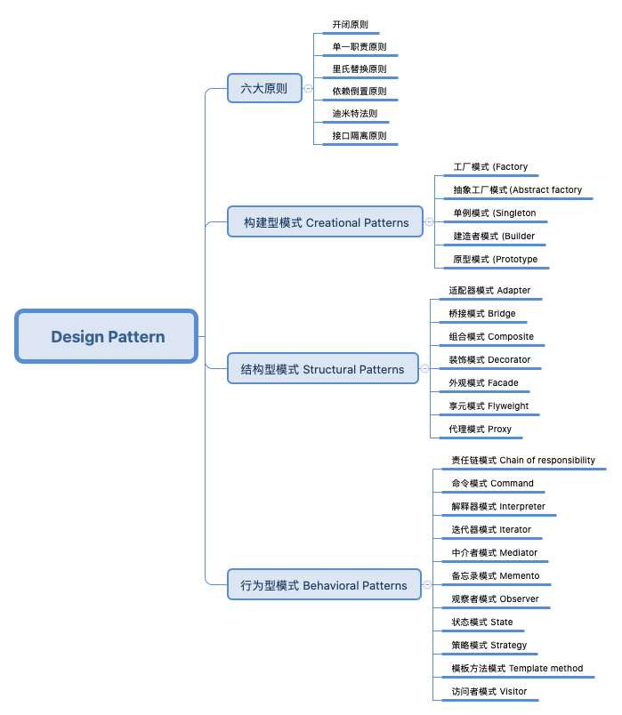

# Design Pattern

面向对象的特点是**可维护**、**可复用**、**可扩展**、**灵活性好**，它最强大的地方在于：随着业务变得越来越复杂，面向对象依然能够使得程序结构良好，而面向过程却会导致程序越来越臃肿。

让面向对象保持结构良好的秘诀就是设计模式，面向对象结合设计模式，才能真正体会到程序变得可维护、可复用、可扩展、灵活性好。

## 目录
* [设计模式的六大原则 Six principles](设计模式的六大原则-Six-principles)
* [构建型模式 Creational Patterns](#构构建型模式-Creational-Patterns)
* [结构型模式 Structural Patterns](#结构型模式-Structural-Patterns)
* [行为型模式 Behavioral Patterns](#行为型模式-Behavioral-Patterns)

## 设计模式的六大原则 Six principles

设计模式的世界丰富多彩，比如生产一个个“产品”的工厂模式，衔接两个不相关接口的适配器模式，用不同的方式做同一件事的策略模式，构建步骤稳定、根据构建过程的不同配置构建出不同对象的建造者模式等等。

无论何种设计模式，都是基于六大设计原则：
- 开闭原则：一个软件实体如类、模块和函数应该对修改封闭，对扩展开放。

- 单一职责原则：一个类只做一件事，一个类应该只有一个引起它修改的原因。

- 里氏替换原则：子类应该可以完全替换父类。也就是说在使用继承时，只扩展新功能，而不要破坏父类原有的功能。

- 依赖倒置原则：细节应该依赖于抽象，抽象不应依赖于细节。把抽象层放在程序设计的高层，并保持稳定，程序的细节变化由低层的实现层来完成。

- 迪米特法则：又名“最少知道原则”，一个类不应知道自己操作的类的细节，换言之，只和朋友谈话，不和朋友的朋友谈话。

- 接口隔离原则：客户端不应依赖它不需要的接口。如果一个接口在实现时，部分方法由于冗余被客户端空实现，则应该将接口拆分，让实现类只需依赖自己需要的接口方法。

## 构建型模式 Creational Patterns

- [工厂模式 (Factory)](factory/README.md):
    为每一类对象建立工厂，将对象交由工厂创建，客户端只和工厂打交道。

- [抽象工厂模式(Abstract factory)](factory/README.md):
    为每一类工厂提取出抽象接口，使得新增工厂、替换工厂变得非常容易。

- [单例模式 (Singleton)](singleton/README.md):
    全局使用同一个对象，分为饿汉式和懒汉式。懒汉式有双检锁和内部类两种实现方式。

- [建造者模式 (Builder)](builder/README.md):
    用于创建构造过程稳定的对象，不同的 Builder 可以定义不同的配置。

- [原型模式 (Prototype)](prototype/README.md):
    为一个类定义 clone 方法，使得创建相同的对象更方便。

## 结构型模式 Structural Patterns

- [适配器模式 Adapter]():
    用于有相关性但不兼容的接口

- [桥接模式 Bridge]():
    用于同等级的接口互相组合

- [组合模式 Composite]():
    用于整体与部分的结构

- [装饰模式 Decorator](decorator/README.md):
    用于在不增加子类的情况下增强一个类的功能

- [外观模式 Facade]():
    体现封装的思想

- [享元模式 Flyweight]():
    体现面向对象的可复用性

- [代理模式 Proxy](proxy/README.md):
    主要用于对某个对象加以控制

## 行为型模式 Behavioral Patterns
行为型模式重点关注类与类之间的交互与协作。如同在工作中，每个人的行为都可能影响到其他同事，同时每个人也会受到别人的影响。我们一边接收上级的指令，一边派发任务给下级，在这样的协作中完成一项项伟大的工作。程序在运行时，每个对象都不是孤立的，他们可以通过通信与协作完成种种复杂的功能。

- [责任链模式 Chain of responsibility]():
    处理职责相同，程度不同的对象，使其在一条链上传递

- [命令模式 Command]():
    封装“方法调用”，将行为请求者和行为实现者解耦

- [解释器模式 Interpreter]():
    定义自己的语法规则

- [迭代器模式 Iterator]() :
    定义`next()`方法和`hasNext()`方法，让外部类使用这两个方法来遍历列表，以达到隐藏列表内部细节的目的

- [中介者模式 Mediator]():
    通过引入中介者，将网状耦合结构变成星型结构

- [备忘录模式 Memento]():
    存储对象的状态，以便恢复

- [观察者模式 Observer]():
    处理一对多的依赖关系，被观察的对象改变时，多个观察者都能收到通知

- [状态模式 State]():
    关于多态的设计模式，每个状态类处理对象的一种状态

- [策略模式 Strategy]():
    殊途同归，用多种方法做同一件事

- [模板方法模式 Template method]():
    关于继承的设计模式，父类是子类的模板

- [访问者模式 Visitor]():
    将数据的结构和对数据的操作分离

**[⬆ 返回顶部](#目录)**