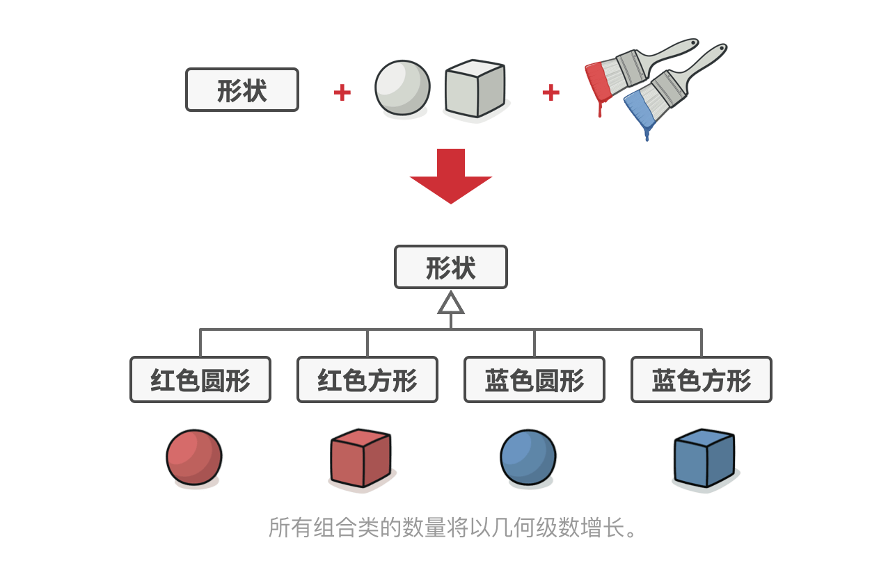
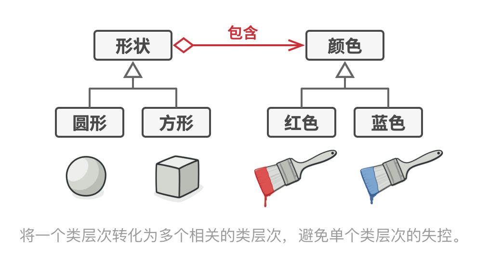

# C++设计模式之桥接模式

## 目录
* [什么是桥接模式？](什么是桥接模式？)

* [桥接模式的应用场景](#桥接模式的应用场景)
* [桥接模式的优缺点](#桥接模式的优缺点)
* [与其他模式的关系](#与其他模式的关系)

## 什么是桥接模式？

**桥接模式**也叫作**桥梁模式**，**Bridge Design Pattern**,可将一个大类或一系列紧密相关的类拆分为抽象和实现两个独立的层次结构， 从而能在开发时分别使用。


假如你有一个几何`形状Shape`类， 从它能扩展出两个子类：`圆形Circle`和`方形Square`。 你希望对这样的类层次结构进行扩展以使其包含颜色， 所以你打算创建名为`红色Red`和`蓝色Blue`的形状子类。 但是， 由于你已有两个子类， 所以总共需要创建四个类才能覆盖所有组合， 例如`蓝色圆形Blue­Circle`和`红色方形Red­Square`。



在层次结构中新增形状和颜色将导致代码复杂程度指数增长。 例如添加三角形状，你需要新增两个子类，也就是每种颜色一个； 此后新增一种新颜色需要新增三个子类，即每种形状一个。如此以往，情况会越来越糟糕。

**解决方案**   
问题的根本原因是我们试图在两个独立的维度——形状与颜色——上扩展形状类。这在处理类继承时是很常见的问题。

**桥接模式通过将继承改为组合的方式来解决这个问题**。 具体来说， 就是抽取其中一个维度并使之成为独立的类层次， 这样就可以在初始类中引用这个新层次的对象， 从而使得一个类不必拥有所有的状态和行为。



根据该方法， 我们可以将颜色相关的代码抽取到拥有`红色`和`蓝色`两个子类的颜色类中， 然后在`形状类`中添加一个指向某一颜色对象的引用成员变量。 现在，形状类可以将所有与颜色相关的工作委派给连入的颜色对象。 这样的引用就成为了`形状`和`颜色`之间的桥梁。 此后，新增颜色将不再需要修改形状的类层次，反之亦然。

实现代码如下：
[bridge_shape_example.cpp](bridge_shape_example.cpp)
```cpp
#include <iostream>

class Color {
public:
    virtual ~Color() {};

    virtual void show() = 0; 
};

class Red : public Color {
public:
    void show() {
        std::cout << "Red::show()" << std::endl;
    }
};

class Blue : public Color {
public:
    void show() {
        std::cout << "Blue::show()" << std::endl;
    }
};

class Shape {
public:
    Shape(Color *color):m_color(color) {}

    virtual ~Shape(){}

    virtual void Operation() = 0;  

protected:
    Color* m_color;
};

class ExtendedShape : public Shape {
public:
    ExtendedShape(Color *color) : Shape(color) {}

    void Operation() {
        this->m_color->show();
    }
};

int main(int argc, char const *argv[])
{

    Color* color = new Red;
    Shape* shape = new ExtendedShape(color);
    shape->Operation();   

    delete shape;
    shape = nullptr;

    delete color;
    color = nullptr;

    color = new Blue;
    shape = new ExtendedShape(color);
    shape->Operation();

    delete shape;
    shape = nullptr;

    delete color;
    color = nullptr;

    return 0;
}
```


## 桥接模式的应用场景
- 想要拆分或重组一个具有多重功能的庞杂类 （例如能与多个数据库服务器进行交互的类）， 可以使用桥接模式。

- 希望在几个独立维度上扩展一个类， 可使用该模式

- 需要在运行时切换不同实现方法， 可使用桥接模式。


## 桥接模式的优缺点
**优点**：
- 可以创建与平台无关的类和程序。

- 仅与高层抽象部分进行互动， 不会接触到平台的详细信息。

- 开闭原则。 可以新增抽象部分和实现部分， 且它们之间不会相互影响。

- 单一职责原则。 抽象部分专注于处理高层逻辑， 实现部分处理平台细节。

**缺点**：
-  对高内聚的类使用该模式可能会让代码更加复杂。

## 与其他模式的关系

- 桥接模式通常会于开发前期进行设计， 使你能够将程序的各个部分独立开来以便开发。 另一方面， 适配器模式通常在已有程序中使用， 让相互不兼容的类能很好地合作。

- 桥接、 状态模式和策略模式 （在某种程度上包括适配器） 模式的接口非常相似。 实际上， 它们都基于组合模式——即将工作委派给其他对象， 不过也各自解决了不同的问题。 模式并不只是以特定方式组织代码的配方， 你还可以使用它们来和其他开发者讨论模式所解决的问题。

- 你可以将抽象工厂模式和桥接搭配使用。 如果由桥接定义的抽象只能与特定实现合作， 这一模式搭配就非常有用。 在这种情况下， 抽象工厂可以对这些关系进行封装， 并且对客户端代码隐藏其复杂性。

- 你可以结合使用生成器模式和桥接模式： 主管类负责抽象工作， 各种不同的生成器负责实现工作。


**[⬆ 返回顶部](#目录)**