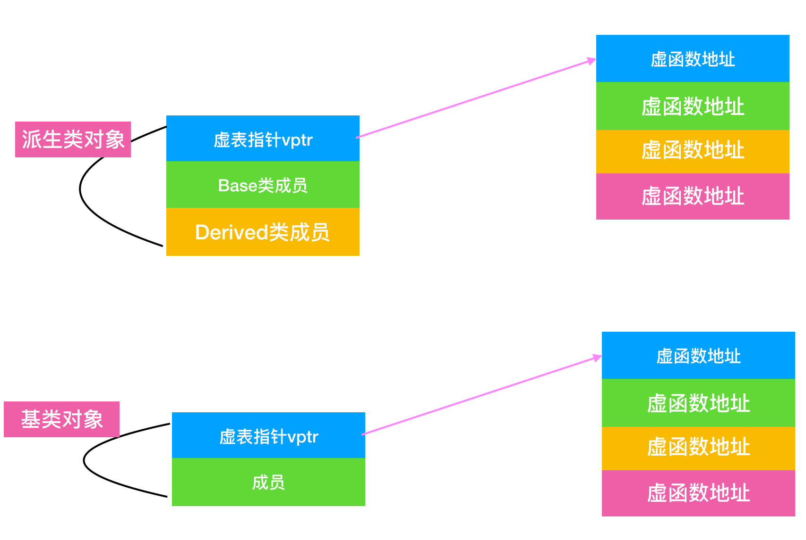

# c++ question

## 目录
* [在main执行之前和之后执行的代码可能是什么？](#1在main执行之前和之后执行的代码可能是什么)
* [结构体内存对齐问题？](#2结构体内存对齐问题)
* [指针和引用的区别](#3指针和引用的区别)
* [堆和栈的区别](#4堆和栈的区别)
* [区别指针类型](#5区别指针类型)
* [基类的虚函数表存在内存的什么区，虚表指针vptr的初始化时间](#6基类的虚函数表存在内存的什么区虚表指针vptr的初始化时间)
* [new / delete 与 malloc / free 的异同](#7new--delete-与-malloc--free-的异同)
* [new和delete是如何实现的？](#8new和delete是如何实现的)
* [malloc和new的区别](#9malloc和new的区别)
* [delete和delete []的区别](#10delete和delete-的区别)
* [宏定义和函数的区别](#11宏定义和函数的区别)
* [宏定义和typedef的区别](#12宏定义和typedef的区别)
* [变量声明和定义区别](#13变量声明和定义区别)
* [哪几种情况必须用到初始化成员列表](#14哪几种情况必须用到初始化成员列表)
* [strlen和sizeof的区别](#15strlen和sizeof的区别)
* [常量指针和指针常量的区别](#16常量指针和指针常量的区别)
* [a和&a的区别](#17a和a的区别)
* [数组名和指向数组首元素的指针的区别](#18数组名和指向数组首元素的指针的区别)
* [野指针和悬空指针](#19野指针和悬空指针)
* [迭代器失效的情况](#20迭代器失效的情况)
* [struct和class的区别](#21struct和class的区别)
* [define宏定义与const的区别](#22define宏定义与const的区别)
* [const和static的作用](#23const和static的作用)
* [顶层const和底层const](#24顶层const和底层const)
* [类的对象存储空间](#25类的对象存储空间)
* [final和override关键字](#26final和override关键字)
* [拷贝初始化和直接初始化](#27拷贝初始化和直接初始化)
* [初始化和赋值的区别](#28初始化和赋值的区别)
* [extern "C"的用法](#29extern-c的用法)
* [模板函数和模板类的特例化](#30模板函数和模板类的特例化)
* [C和C++的类型安全](31c和c的类型安全)
* [为什么析构函数一般写成虚函数](#32为什么析构函数一般写成虚函数)
* [构造函数能否声明为虚函数或者纯虚函数，析构函数？](#33构造函数能否声明为虚函数或者纯虚函数析构函数)
* [C++中的重载、重写(覆盖)和隐藏的区别](#34c中的重载重写覆盖和隐藏的区别)
* [C++的多态是如何实现的(原理)？](#35c的多态是如何实现的原理)
* [C++有哪几种构造函数](#36c有哪几种构造函数)
* [浅拷贝和深拷贝的区别](#37浅拷贝和深拷贝的区别)
* [内联函数和宏定义的区别](#38内联函数和宏定义的区别)
* [构造函数、析构函数、虚函数是否可以声明为内联函数](#39构造函数析构函数虚函数是否可以声明为内联函数)
* [auto、decltype和decltype(auto)的用法](#40autodecltype和decltypeauto的用法)
* [public，protected和private访问和继承权限/public/protected/private的区别](#41publicprotected和private访问和继承权限publicprotectedprivate的区别)


## 1、在main执行之前和之后执行的代码可能是什么？
**`main`函数执行之前**，主要就是初始化系统相关资源：
- 设置栈指针

- 初始化静态`static`变量和`global`全局变量，即`.data`段的内容

- 将未初始化部分的全局变量赋初值：数值型`short`，`int`，`long`等为`0`，`bool`为`FALSE`，指针为`NULL`等等，即`.bss`段的内容

- 全局对象初始化，在`main`之前调用构造函数，这是可能会执行前的一些代码

- 将`main`函数的参数`argc`，`argv`等传递给`main`函数，然后才真正运行`main`函数

**`main`函数执行之后**：
- 全局对象的析构函数会在`main`函数之后执行

- 可以用`atexit`注册一个函数，它会在`main`之后执行

## 2、结构体内存对齐问题？
- 结构体内成员按照声明顺序存储，第一个成员地址和整个结构体地址相同。

- 未特殊说明时，按结构体中`size`最大的成员对齐（若有`double`成员，按`8`字节对齐。）


## 3、指针和引用的区别
- 指针是一个变量，存储的是一个地址，引用跟原来的变量实质上是同一个东西，是原变量的别名

- 指针可以有多级，引用只有一级

- 指针可以为空，引用不能为`NULL`且在定义时必须初始化

- 指针在初始化后可以改变指向，而引用在初始化之后不可再改变

- `sizeof`指针得到的是本指针的大小，`sizeof`引用得到的是引用所指向变量的大小

- 当把指针作为参数进行传递时，也是将实参的一个拷贝传递给形参，两者指向的地址相同，但不是同一个变量，在函数中改变这个变量的指向不影响实参，而引用却可以。

- 引用只是别名，不占用具体存储空间，只有声明没有定义；指针是具体变量，需要占用存储空间。

- 引用在声明时必须初始化为另一变量，一旦出现必须为`typename refname &varname`形式；指针声明和定义可以分开，可以先只声明指针变量而不初始化，等用到时再指向具体变量。

- 引用一旦初始化之后就不可以再改变（变量可以被引用为多次，但引用只能作为一个变量引用）；指针变量可以重新指向别的变量。

- 不存在指向空值的引用，必须有具体实体；但是存在指向空值的指针。

## 4、堆和栈的区别

- **申请方式不同**：栈由系统自动分配；堆是由自己申请和释放的。

- **申请大小限制不同**：栈顶和栈底是之前预设好的，栈是由栈底扩展，大小固定，可以通过`ulimit -a`命令查看，由`ulimit -s`修改；堆向高地址扩展，是不连续的内存区域，大小可以灵活调整。

- **申请效率不同**：栈由系统分配，速度快，不会有碎片；堆由程序员自由分配，速度慢，并且会有碎片。


## 5、区别指针类型
```cpp
int *p[10]
int (*p)[10]
int *p(int)
int (*p)(int)
```

- `int *p[10]`表示指针数组，强调数组概念，是一个数组变量，数组大小为`10`,数组内每个元素都是指向`int`类型的指针变量。

- `int (*p)[10]`表示数组指针，强调的是指针，只有一个变量，是指针类型，不过指向的是一个`int`类型的数组，这个数组大小是`10`。

- `int *p(int)`是函数声明，函数名是`p`,参数是`int`类型的，返回值是`int*`类型的。

- `int (*p)(int)`是函数指针，强调是指针，该指针指向的函数具有`int`类型参数，并且返回值是`int`类型的。


## 6、基类的虚函数表存在内存的什么区，虚表指针vptr的初始化时间
虚函数表的特征：
- 虚函数表是全局共享的元素，即全局仅有一个，在编译时就构造完成

- 虚函数表类似一个数组，类对象中存储`vptr`指针，指向虚函数表，即虚函数表不是函数，不是程序代码，不可能存储在代码段

- 虚函数表存储函数的地址，即虚函数表的元素是指向类成员函数的指针，而类中虚函数的个数在编译时期可以确定，即虚函数表的大小可以确定，即大小在编译器确定的，不必动态分配内存空间存储虚函数表，所以不在堆中。

根据以上特征，虚函数表类似于类中静态成员变量，静态成员变量也是全局共享，大小确定，因此最有可能存在全局数据区，测试结果显示：

虚函数表`vtable`在`linux/unix`中存放在可执行文件的只读数据段中(`rodata`)，这与微软的编译器将虚函数表存放在常量段存在一些差别。

由于虚表指针`vptr`跟虚函数密不可分，对于有虚函数或者继承于拥有虚函数的基类，对该类进行实例化时，在构造函数执行时会对虚表指针进行初始化，并且存在对象内存布局的最前面。

## 7、new / delete 与 malloc / free 的异同

**相同点**：
- 都可以用于内存的动态申请和释放

**不同点**：
- 前者是`C++`运算符，后者是`C/C++`语言标准库函数

- `new`自动计算要分配的空间大小，`malloc`需要手工计算

- `new`是类型安全的，`malloc`不是。例如：
```c++
int *ptr = new float[2]; // 编译错误
int *ptr = (int*)malloc(2 * sizeof(double)); // 编译无错误
```

- `new`调用名为`operator new`的标准库函数分配足够空间并调用相关对象的构造函数，`delete`对指针所指对象运行适当的析构函数；然后通过调用名为`operator delete`的标准库函数释放该对象所用内存。后者均没有相关调用

- 后者需要库文件支持，前者不用

- `new`是封装了`malloc`,直接`free`不会报错，但是这只是释放内存，而不会析构对象


## 8、new和delete是如何实现的？
- `new`的实现过程是：首先调用名为`operate new`的标准库函数，分配足够大的原始为类型化的内存，以保存指定类型的一个对象；接下来运行该类型的一个构造函数，用指定初始化构造对象；最后返回指向新分配并构造后的对象的指针。

- `delete`的实现过程： 对指针指向的对象运行适当的析构函数；然后通过调用名为`operate delete`的标准库函数释放该对象所用内存。


## 9、malloc和new的区别
- `malloc`和`free`是标准库函数，支持覆盖；`new`和`delete`是运算符，并且支持重载。

- `malloc`仅仅分配内存空间，`free`仅仅回收空间，不具备调用构造函数和析构函数功能，用`malloc`分配空间存储类的对象存在风险；`new`和`delete`除了分配回收功能外，还会调用构造函数和析构函数。

- `malloc`和`free`返回的是`void`类型指针（必须进行类型转换），`new`和`delete`返回的是具体类型指针。


## 10、delete和delete []的区别
- `delete`只会调用一次析构函数。

- `delete []`会调用数组中每个元素的析构函数

## 11、宏定义和函数的区别
- 宏在编译时完成替换，之后被替换的文本参与编译，相当于直接插入了代码，运行时不存在函数调用，执行起来更快；函数调用在运行时需要跳转到具体调用函数。

- 宏定义属于在结构中插入代码，没有返回值；函数调用具有返回值。

- 宏定义参数没有类型，不进行类型检查；函数参数具有类型，需要检查类型。

- 宏定义不要在最后加分号

## 12、宏定义和typedef的区别
- 宏主要用于定义常量以及书写复杂的内容；`typedef`主要用于定义类型别名。

- 宏替换发生在编译阶段之前，属于文本插入替换；`typedef`是编译的一部分。

- 宏不检查类型；`typedef`会检查数据类型。

- 宏不是语句，不在最后加分号；`typedef`是语句，要加分号标识结束。

- 注意对指针的操作，`typedef char* ptr_char`和`#define ptr_char char*`区别巨大。

## 13、变量声明和定义区别
- 声明仅仅是把变量的声明的位置及类型提供给编译器，并不分配内存空间；定义要在定义的地方为其分配存储空间。

- 相同变量可以在多处声明(外部变量`extern`)，但只能在一处定义。

## 14、哪几种情况必须用到初始化成员列表
- 初始化一个`const`成员

- 初始化一个`reference`成员

- 调用一个基类的构造函数，而该函数有一组参数

- 调用一个数据成员对象的构造函数，而该函数有一组参数。

## 15、strlen和sizeof的区别
- `sizeof`是运算符，并不是函数，结果在编译时得到而非运行中获得；`strlen`是字符处理的库函数

- `sizeof`参数可以是任何数据的类型或者数据(`sizeof`参数不退化);`strlen`的参数只能是字符指针且结尾是`'\0'`的字符串

- `sizeof`值在编译时确定，所以不能用来得到动态分配（运行时分配）存储空间的大小。

```cpp
int main(int argc,char const *argv[]) 
{
    const char* str = "name";
    sizeof(str); // 取的是指针str的长度，大小是8
    strlen(str); // 取的是这个字符串的长度，不包含结尾的\0。 大小是4   
    return 0;
}
```

## 16、常量指针和指针常量的区别
- 常量指针是一个指针，读成常量的指针，指向一个只读常量。如`int const *ptr` 或`const int *ptr`。

- 指针常量是一个不能给改变指向的指针，本身是一个常量。指针是个常量，不能中途改变指向，例如`int *const p`。
```cpp
int main(int argc,char const *argv[]) 
{
    const int p; // p 为常量，初始化后不可更改， const后边的内容都为"常量"
    // 从右往左读，遇到p就替换成"p is a" 遇到*就替换成"point to" 
    const int *p; // p is a point to int const  即p 是一个指向整型常量的指针。

    int const *p; // p is point to const int 即p 是一个指向整型常量的指针。

    int *const p; // p is a const point to int 即 p 是一个指针常量，指向整型

    const int *const p; // p is a const point to int const 即 p 是一个指针常量，指向一个int类型

    int const *const p; // p is a const point to const int 即 p 是一个指针常量，指向一个int类型
    return 0;
}
```

## 17、a和&a的区别
```cpp
int main(int argc,char const *argv[]) 
{
    int a[10];
    int (*p)[10] = &a;
    return 0;
}
```
- `a`是数组名，是数组首元素地址，`+1`表示地址值加上一个`int`类型的大小，如果`a`的值是`0x00000001`，加`1`操作后变为`0x00000005`。  `*(a+1) = a[1]`。

- `&a`是数组的指针，其类型为`int(*)[10]`(数组指针),其加`1`时，系统会认为是数组首地址加上整个数组的偏移(`10`个`int`类变量)，值为数组`a`尾元素后一个元素的地址。

- 若`(int *)p`,此时输出`*p`时，其值为`a[0]`的值，因为被转为`int *`类型，解引用时按照`int`类型大小来读取。

## 18、数组名和指向数组首元素的指针的区别
- 二者均可通过增减偏移量来访问数组中的元素

- 数组名不是真正意义上的指针，可以理解为常指针，所以数组名没有自增、自减等操作。

- 当数组名当作形参传递给调用函数后，就失去了原有特性，退化成一般指针，多了自增、自减操作，但`sizeof`运算符不能再得到原数组的大小。

## 19、野指针和悬空指针
都是指向无效内存区域(这里的无效指的是"不安全不可控")的指针，访问行为将会导致未定义行为。

- **野指针**，指的是没有初始化的指针
```cpp
int main()
{
    int *ptr; // 野指针
    std::cout << *ptr << std::endl; // error
    return 0;
}
```
因此，为了防止出错，对于指针初始化时都是赋值为`nullptr`，这样在使用时编译器就会直接报错，产生非法内存访问。

- **悬空指针**,指针最初指向的内存已经被释放了的一种指针。
```cpp
int main()
{
    int *ptr1 = nullptr;
    int *ptr2 = new int;
    ptr1 = ptr2;
    delete ptr2;
}
```
此时，`ptr1`和`ptr2`就是悬空指针，指向的内存已经被释放。继续使用这两个指针，行为不可预料。需要设置为`ptr1 = ptr2 = nullptr`。此时再使用，编译器会直接报错。

避免野指针比较简单，但悬空指针比较麻烦。`c++`引入了智能指针，`c++`智能指针的本质就是避免悬空指针的产生。

**产生原因及解决办法**：
- 野指针：指针变量未及时初始化 ----> 定义指针变量时及时初始化，那么置空。

- 悬空指针：指针`free`或`delete`之后没有及时置空 ---->  释放操作后立即置空。


## 20、迭代器失效的情况
以`vector`为例:

**插入元素**：
- 1、尾后插入: `size` < `capacity`时，首迭代器不失效尾迭代失效（未重新分配空间),`size` == `capacity`时，所有迭代器均失效（需要重新分配空间)

- 2、中间插入：`size` < `capacity`时，首迭代器不会失效但插入元素之后所有迭代失效,`size` == `capacity`时，所有迭代器均失效。

**删除元素**：
- 尾后删除：只有尾迭代器失效

- 中间删除： 删除位置之后所有迭代器失效。


## 21、struct和class的区别
**相同点**：
- 两者都拥有成员函数、公有和私有部分

- 任何可以使用`class`完成的工作，同样可以使用`struct`完成

**不同点**：
- 两者中如果不对成员不指定公私有，`struct`默认是公有的,`class`则默认是私有的

- `class`默认是`private`继承，而`struct`模式是`public`继承

- `class`可以作为模板类型，`struct`不可以

**引申**：`C++`和`C`的`struct`区别
- `C`语言中 : `struct`是用户自定义数据类型(`UDT`)；`c++`中`struct`是抽象数据类型(`ADT`)，支持成员函数的定义，(`C++`中的`struct`能继承，能实现多态)

- `C`中`struct`是没有权限的设置的，并且`struct`中只能是一些变量的集合体，可以封装数据却不可以隐藏数据，而且成员不可以是函数

- `C++`中,`struct`增加了访问权限，且可以和类一样有成员函数，成员默认访问说明符为`public`（为了与`C`兼容）

- `struct`作为类的一种特例是用来自定义数据结构体的。一个结构体标记声明后，在`C`中必须在结构标记前加上`struct`，才能做结构类型名(除：`typedef struct class{};`);`C++`中结构体标记（结构体名）可以直接作为结构体类型名使用，此外结构体`struct`在`C++`中被当作类的一种特例。

## 22、define宏定义与const的区别
**编译阶段**：
- `define`是在编译的**预处理**阶段起作用，而`const`是在编译、运行的时候起作用

**安全性**：
- `define`只做替换，不做类型检查和计算，也不求解，容易产生错误，一般最好加上一个大括号包含住全部的内容，要不然很容易出错

- `const`常量有数据类型，编译器可以对其进行类型安全检查

**内存占用**：
- `define`只是将宏名称进行替换，在内存中会产生多份相同的备份。`const`在程序运行中只有一份备份，并且可以执行常量折叠，能将复杂的表达式计算除结果放入常量表

- 宏替换发生在编译阶段之前，属于文本插入替换；`const`作用发生于编译过程中

- 宏不检查类型；`const`会检查数据类型

- 宏定义的数据没有分配内存空间，只是插入替换掉；`const`定义的变量只是值不能改变，但要分配内存空间

## 23、const和static的作用

**static**  
不考虑类的情况

- 隐藏。所有不加`static`的全局变量和函数具有全局可见性，可以在其他文件中使用，加了之后只能在该文件所在的编译模块中使用。

- 默认初始化为`0`，包括未初始化的全局静态变量与局部静态变量，都存在全局未初始化区

- 静态变量在函数内定义，始终存在，并且只进行一次初始化，具有记忆性，其作用范围与局部变量相同，函数退出后仍然存在，但不能使用

考虑类的情况
- `static`成员变量：只与类关联，不与类的对象关联。定义时要分配空间，不能在类声明中初始化，必须在类定义体外部初始化，初始化时不需要标示为`static`；可以被非`static`成员函数任意访问。

- `static`成员函数：不具有`this`指针，无法访问类对象的非`static`成员变量和非`static`成员函数；**不能被声明为`const`、虚函数和`volatile`；可以被非`static`成员函数任意访问。

**const**  
不考虑类的情况
- `const`常量在定义时必须初始化，之后无法更改

- `const`形参可以接收`const`和非`const`类型的实参，例如：
```cpp
// i 可以是int 型或者 const int 型
void func(const int&i) {
    // ...
}
```

考虑类的情况
- `const`成员变量：不能在类定义外部初始化，只能通过构造函数初始化列表进行初始化，并且必须有构造函数；不同类对其`const`数据成员的值可以不同，所以不能在类中声明时初始化

- `const`成员函数：`const`对象不可以调用非`const`成员函数；非`const`对象都可以调用；不可以改变非`mutable`(用该关键字声明的变量可以在`const`成员函数中被修改)数据的值。


## 24、顶层const和底层const
**概念区分**
- **顶层**`const`：指的是`const`修饰的变量本身是一个常量，无法修改，指的是指针，就是`*`号的右边

- **底层**`const`：指的是`const`修饰的变量所指向的对象是一个常量，指的是所指变量，就是`*`号的左边

```cpp
int a = 10;
int* const ptr1 = &a;       // 顶层const，ptr1 本身是一个常量
const int* ptr2 = &a;       // 底层const, ptr2 本身可变，所指的对象是常量
const int b = 20;           // 顶层const, b 是常量不可变 
const int* const ptr3 = &a; // 前一个const为底层，后一个为顶层，ptr3不可变
const int& ref = a;         // 用于声明引用变量，都是底层const
```
**区分作用**：
- 执行对象拷贝时有限制，常量的底层`const`不能赋值给非常量的底层`const`

- 使用命名的强制类型转换函数`const_cast`时，只能改变运算对象的底层`const`

```cpp
const int a;
int const a;
const int *a;
int *const a;
```
- `int const a`和`const int a`均表示定义常量类型`a`

- `const int *a`，其中`a`为指向`int`型变量的指针，`const`在`*`左侧，表示`a`指向不可变常量。(可以看成`const(*a)`，对引用加`const`)

- `int *const a`,依旧是指针类型，表示`a`为指向整型数据的常指针。(可以看成`const(a)`,对指针`const`)

## 25、类的对象存储空间

- 非静态成员的数据类型大小之和

- 编译器加入的额外成员变量（如指向虚函数表的指针）

- 为了边缘对齐优化加入的`padding`。


## 26、final和override关键字
- `override`：保证在派生类中声明的重载函数，与基类的虚函数有相同的签名；

- `final`：阻止类的进一步派生和虚函数的进一步重写。

**override**  
当在父类中使用了虚函数时，可能需要在某个子类中对虚函数进行重写，以下方法都可以：
```cpp
class Base
{
    virtual void foo();
};

class Derived : public Base 
{
    void foo(); // ok
    virtual void foo(); // ok
    void foo() override; // ok
};
```
如果不使用`override`，将`foo()`写成了`f00()`会怎么样呢？结果是编译器并不会报错，因为它并不知道你的目的是重写虚函数，而是把它当成了新的函数。如果这个虚函数很重要的话，那就会对整个程序不利。所以，`override`的作用就出来了，它指定了子类的这个虚函数是重写的父类的，如果你名字不小心打错了的话，编译器是不会编译通过的：
```cpp
class Base
{
    virtual void foo();
};

class Derived : public Base 
{
    virtual void f00(); // ok, 这个函数是Derived 新增的,不是继承的
    virtual void f0o() override; // error , 加了override之后，这个函数一定是继承自Base的
};
```

**final**  
当不希望某个类被继承，或不希望某个虚函数被重写，可以在类名和虚函数后添加`final`关键字，添加`final`关键字后被继承或重写，编译器会报错，例如：
```cpp
class Base 
{
    virtual void func() final;
};

class Derived : public Base
{
    virtual void func() final; // error 重写提示报错
};
```

## 27、拷贝初始化和直接初始化
当用于类类型对象时，初始化的拷贝形式和直接形式有所不同：
- 直接初始化直接调用与实参匹配的构造函数，拷贝初始化总是调用拷贝构造函数。拷贝初始化首先使用指定构造函数创建一个临时对象，然后用拷贝构造函数将那个临时对象拷贝到正在创建的对象。
```cpp
int main()
{
    std::string str1("I am a string");  // 语句1 直接初始化
    std::str2(str1);                    // 语句2 直接初始化，str1是已经存在的对象，直接调用构造函数对str2进行初始化
    std::string str3 = "I am a string"; // 语句3 拷贝初始化，先为字符串”I am a string“创建临时对象，再把临时对象作为参数，使用拷贝构造函数构造str3
    std::string str4 = str1;            // 语句4 拷贝初始化，这里相当于隐式调用拷贝构造函数，而不是调用赋值运算符函数
    return 0;
}
```

为了提高效率，允许编译器跳过创建临时对象这一步，直接调用构造函数构造要创建的对象，这样就完全等价于直接初始化了(语句1和语句3等价)。但是需要辨别两种情况
- 当拷贝构造函数为`private`时：语句3和语句4在编译时会报错

- 使用`explicit`修饰构造函数时：如果构造函数存在隐式转换，编译时会报错

## 28、初始化和赋值的区别
- 对于简单类型来说，初始化和赋值没什么区别

- 对于类和复杂数据类型来说，两者的区别很低，例如：
```cpp
class Base
{
public:
    Base(int a = 0, int b = 0):m_num1(a),m_num2(b) {}

    Base(const Base& a) {}

    Base& operator=(const Base& a) { // 重载 = 号操作符函数
        m_num1 = a.m_num1 + 1;
        m_num2 = a.m_num2 + 1;
        return *this;
    }
private:
    int m_num1;
    int m_num2;
};

int main(int argc ,const char *argv[])
{
    Base a(1,1);
    Base b = a;  // 拷贝初始化操作，调用拷贝构造函数

    Base c;
    c = a;      // 赋值操作，对象a中,m_num1 = 1, m_num2 = 1; 对象c中，m_num1 = 2, m_num2 = 2
    return 0;
}
```

## 29、extern "C"的用法
为了能够正确的在`C++`代码中调用`C`语言的代码：在程序中加上`extern "C"`后，相当于告诉编译器这部分代码是`C`语言写的，因此要按照`C`语言进行编译，而不是`C++`；

哪些情况下使用`extern "C"`:
- `C++`代码中调用`C`语言代码；

- 在`C++`中的头文件中使用；

- 在多个人协同开发时，可能有人擅长`C`语言，而有人擅长`C++`；

```cpp
#ifndef __MY_HANDLE_H__
#define __MY_HANDLE_H__

extern "C"{
    typedef unsigned int result_t;
    typedef void* my_handle_t;

    my_handle_t create_handle(const char* name);
    result_t operate_on_handle(my_handle_t handle);
    void close_handle(my_handle_t handle);
}
```
综上，总结出使用方法，在`C`语言的头文件中，对其外部函数只能指定为`extern`类型，`C`语言中不支持`extern "C"`声明，在`.c`文件中包含了`extern "C"`时会出现编译语法错误。所以使用`extern "C"`全部都放在于`cpp`程序相关文件或其头文件中。

总结出如下形式：

- `C++`调用`C`函数：
```cpp
// xx.h
extern int add(...)

// xx.c
int add(){

}

// xx.cpp
extern "C" {
    #include "xx.h"
}
```

- `C`调用`C++`函数
```c
// xx.h
extern "C"{
    int add();
}
// xx.cpp
int add(){

}
// xx.c
extern int add();
```

## 30、模板函数和模板类的特例化
**引入原因**

编写单一的模板，它能适应多种类型的需求，使每种类型都具有相同的功能，但对于某种特定类型，如果要实现其特有的功能，单一模板就无法做到，这时就需要模板特例化

**定义**

对单一模板提供的一个特殊实例，它将一个或多个模板参数绑定到特定的类型或值上

- 模板函数特例化  
必须为原函数模板的每个模板参数都提供实参，并且使用关键字`template`后跟一个空尖括号对`<>`，表明将原模板的所有模板参数提供实参，例如：
```cpp
template<typename T> // 模板函数
int compare(const T &v1, const T &v2) {
    if (v1 > v2) return -1;
    if (v2 > v1) return 1;
    return 0;
}

// 模板特例化，满足针对字符串特地的比较，要提供所有实参，这里只有一个T
template<>
int compare(const char* const &v1, const char* const &v2) {
    return strcmp(p1,p2);
}
```
**本质**  

特例化的本质是实例化一个模板，而非重载它。特例化不影响参数匹配。参数匹配都以最佳匹配为原则。例如，此处如果是`compare(3,5)`,则调用普通的模板，若为`compare("hi","haha")`则调用特例化版本(因为这个`const char*`相对于`T`，更匹配实参类型)，注意二者函数体的语句不一样了，实现了不同功能。

**Tips**

模板及其特例化版本应该声明在同一个头文件中，且所有同名模板的声明应该放在前面，后面放特例化版本。

- 类模板特例化

原理类似函数模板，不过在类中，我们可以对模板进行特例化，也可以对类进行部分特例化。对类进行特例化时，仍然用`template<>`表示是一个特例化版本,例如：
```cpp
template<>
class Hash<sales_data>
{
    size_t operator()(sales_data& s);
    // 里面所有T都换成特例化类型版本sales_data
    // 按照最佳匹配原则，若T != sales_data，就用普通类模板，否则，就使用含有特定功能的特例化版本。
}
```

**类模板的部分特例化**

不必为所有模板参数提供实参，可以指定一部分而非所有模板参数，一个类模板的部分特例化本身仍是一个模板，使用它时还必须为其特例化版本中未指定的模板参数提供实参(特例化时类名一定要和原来的模板相同，只是参数类型不同，按最佳匹配原则，哪个最匹配，就用相应的模板)

**特例化类中的部分成员**

可以特例化类中的部分成员函数而不是整个类,例如：
```cpp
template<typename T>
class Base
{
    void func();
    void foo(T a)();
};

template<>
void Base<int>::func()
{
    // 进行int类型的特例化
    std::cout << "int specialization" << std::endl;
}

int main(int argc,char const* argv[])
{
    Base<string> b;
    Base<int> bi; // 使用特例化
    b.func(); // 使用的是普通模板，即Base<string>::func()
    bi.func(); // 特例化版本，执行Base<int>::func()
    // Base<string>::func()和Base<int>::func功能不同
}
```

## 31、C和C++的类型安全
**什么是类型安全？**   
类型安全很大程度上可以等价于内存安全，类型安全的代码不会试图访问自己没被授权的内存区域。“类型安全”常被用来形容编程语言，其根据在于该门编程语言是否提供保障类型安全的机制；有的时候也用“类型安全”形容某个程序，判别的标准在于该程序是否隐含类型错误。类型安全的编程语言与类型安全的程序之间，没有必然联系。好的程序员可以使用类型不那么安全的语言写出类型相当安全的程序，相反的，差一点儿的程序员可能使用类型相当安全的语言写出类型不太安全的程序。绝对类型安全的编程语言暂时还没有。

- `C`的类型安全  

`C`只在局部上下文中表现出类型安全，比如试图从一种结构体的指针转换成另一种结构体的指针时，编译器将会报告错误，除非使用显式类型转换。然而，`C`中相当多的操作是不安全的。例如：
```c
#include <stdio.h>

int main()
{
    printf("Integer output：%d\n",10); // output： Integer output：10
    printf("float output： %f\n",10); // output：float output：0.000000
}
```
上述代码中，使用`%d`控制整型数字的输出，没有问题，但是改成`%f`时，明显输出错误，再改成`%s`时，运行直接报`segmentation fault`错误。

例如，`malloc`是`C`中进行内存分配的函数，它的返回类型是`void*`，即空类型指针，常常会有如下用法：
```c
    char* ptr_str = (char*)malloc(100 * sizeof(char));
```
在上面的代码中，明显做了显式的类型转换。类型匹配尚且没有问题，但是一旦出现以下转换，就可能会带来一些问题，而这样的转换在`C`语言中并不会提示错误。
```c
    int* ptr_int = (int*)malloc(100 * sizeof(char));
```


- `C++`的类型安全    
如果`C++`使用得当，它将远比`C`更有类型安全性。相比于`C`语言，`C++`提供了一些新的机制保障类型安全：
   - 操作符`new`返回的指针类型严格与对象匹配，而不是`void*`。

   - `C`语言中很多以`void*`为参数的函数可以改写为`C++`模板函数，而模板是支持类型检查的；

    - 引入`const`关键字代替`#define constants`,它是有类型、有作用域的，而`#define constants`只是简单的文本替换

    - 一些`#define`宏可被改写为`inline`函数，结合函数的重载，可在类型安全的前提下支持多种类型，当然改写为模板也能保证类型安全

    - `C++`提供了`dynamic_cast`关键字，使得转换过程更加安全，因为`dynamic_cast`比`static_cast`涉及更多具体的类型检查。

    例1: 使用`void*`进行类型转换
    ```cpp
    #define <iostream>

    int main()
    {
        int i = 5;
        void* ptr_int = &i;
        double d = (*(double*)ptr_int);
        std::cout << "转换后输出为: " << d << std::endl; // 每次输出都不相同
        return 0;               
     ```
    例2: 不同类型指针之间转换
    ```cpp
    #include<iostream>                     
     
    class Base
    { 
    };
    
    
    class Derived1 : public Base
    {
    public:
        Derived1(int data):m_data(data){}
        void PrintData() {
             std::cout << m_data << std::endl;
        } 
    private:
         int m_data;
    };
    
    
    class Derived2 : public Base
    {
    public:
        Derived2(double data):m_data(data){}
    
        void PrintData() {
            std::cout << m_data << std::endl;
        }
    private:
        double m_data;
    };
    
    
    int main()
    {
        Derived1 d1(5);
        Derived2 d2(3.3);
    
        Base* ptr_b = nullptr;
        Derived1* ptr_d1 = nullptr;
    
        ptr_b = &d1;
        ptr_d1 = (Derived1*)ptr_b; // 类型向下转换，强制转换，由于类型仍然为  rived1*, 不造成错误
        ptr_d1->PrintData();       // output : 5
    
        ptr_b = &d2;
        ptr_d1 = (Derived1*)ptr_b; // 强制转换，且类型发生变化，将造成错误
        ptr_d1->PrintData();       // output: 1717986918
        return 0;
    }
    ```
上面两个例子之所以引起类型不安全的问题，是因为程序员使用不得当。第一个例子用到了空类型指针`void*`，第二个例子则是在两个类型指针之间进行强制转换。因此，想保证程序的类型安全性，应尽量避免使用空类型指针`void*`，尽量不对两种类型指针做强制转换。

## 32、为什么析构函数一般写成虚函数
由于类的多态性，基类指针可以指向派生类的对象，如果删除该基类的指针，就会调用该指针指向的派生类析构函数，而派生类的析构函数又自动调用基类的析构函数，这样整个派生类的对象完全被释放。如果析构函数不被声明成虚函数，则编译器实施静态绑定，在删除基类指针时，只会调用基类的析构函数而不调用派生类析构函数，这样就会造成派生类对象析构不完全，造成内存泄漏。所以将析构函数声明为虚函数是十分必要的。在实现多态时，当用基类操作派生类，在析构时防止只析构基类而不析构派生类的状况发生，要将基类的析构函数声明为虚函数。
```cpp
include <iostream>
 
class Base
{
public:
    Base() {
         std::cout << "Base construct function " << std::endl;
    }
 
    ~Base() {
          std::cout << "Base destructor function" << std::endl;
    }
};
  
class Derived : public Base
{
public:
    Derived() {
        std::cout << "Derived construct function " << std::endl;
    }
  
    ~Derived() {
        std::cout << "Derived destructor function " << std::endl;
    }
};
  
  
int main()
{
    Base * base = new Derived();
    delete base;
    base = nullptr;
    return 0;
}
```
运行结果如下：
```sh
Base construct function 
Derived construct function 
Base destructor function
```
将基类的析构函数声明为虚函数：
```cpp
include <iostream>
 
class Base
{
public:
    Base() {
         std::cout << "Base construct function " << std::endl;
    }
 
    virtual ~Base() {
          std::cout << "Base destructor function" << std::endl;
    }
};
  
class Derived : public Base
{
public:
    Derived() {
        std::cout << "Derived construct function " << std::endl;
    }
  
    ~Derived() {
        std::cout << "Derived destructor function " << std::endl;
    }
};
  
  
int main()
{
    Base * base = new Derived();
    delete base;
    base = nullptr;
    return 0;
}
```
运行结果如下：
```cpp
Base construct function 
Derived construct function 
Derived destructor function 
Base destructor function
```

## 33、构造函数能否声明为虚函数或者纯虚函数，析构函数？
**析构函数**
- 析构函数可以为虚函数，并且一般情况下基类析构函数要定义为虚函数

- 只有在基类析构函数定义为虚函数时，调用操作符`delete`销毁指向对象的基类指针时，才能准确调用派生类的析构函数(从该级向上按序调用虚函数)，才能准确销毁数据。

- 析构函数可以是纯虚函数，含有纯虚函数的类是抽象类，此时不能被实例化。但派生类中可以根据自身需求重新改写基类中但纯虚函数。

**构造函数**
- 构造函数不能定义为虚函数。在构造函数中可以调用虚函数，不过此时调用的是正在构造的类中的虚函数，而不是子类的虚函数，因为此时子类尚未构造好。

## 34、C++中的重载、重写(覆盖)和隐藏的区别
- 重载 (`overload`)
重载是指在同一范围定义中的同名成员函数才存在重载关系。主要特点是函数名相同，参数类型和数目有所不同，不能出现参数个数和类型均相同，仅仅依靠返回值不同来区分的函数。重载和函数成员是否是虚函数无关。例如：
```cpp
class Base 
{
    ...
    virtual int func();
    void func(int);
    void func(double,double);
    static int func(char);
    ...
};
```

- 重写(覆盖)(`override`)
重写指的是在派生类中覆盖基类中的同名函数，重写就是重写函数体，要求基类函数必须是虚函数且：
   - 与基类的虚函数有相同的参数个数
   - 与基类的虚函数有相同的参数类型
   - 与基类的虚函数有相同的返回值类型
```cpp
// 基类
class Base
{
public:
    virtual int func(int param){}
};

// 派生类
class Derived : public Base 
{
public:
    // 重写，一般加override可以确保是重写父类的函数
    virtual int func(int param) override{}
};
```
重载与重写的区别：
- 重写是基类和派生类之间的垂直关系，重载是不同函数之间的水平关系
- 重写要求参数列表相同，重载则要求参数列表不同，返回值不要求
- 重写关系中，调用方法根据对象类型决定，重载根据调用时实参表与形参表的对应关系来选择函数体


- 隐藏(`hide`)
隐藏指的是某些情况下，派生类中的函数屏蔽了基类中的同名函数，包括以下情况：
- 两个函数参数相同，但是基类函数不是虚函数。**和重写的区别在于基类函数是否是虚函数**。
```cpp
// 基类
class Base
{
public:
    void func(int param) {
        std::cout << "Base::func()" << std::endl;
    }
};

// 派生类
class Derived : public Base 
{
public:
    // 隐藏基类的func函数
    void func(int param) {
        std::cout << "Derived::func()" << std::endl;
    }
};
int main(int argc,char const* argv[])
{
    Derived d;
    d.func(2); // 调用的是Derived中的func函数
    d.Base::func(2); // 调用的是Base中的func函数
    return 0;
}
```
- 两个函数参数不同，无论基类函数是不是虚函数，都会被隐藏。和重载的区别在于两个函数不在同一个类中。
```cpp
// 基类
class Base
{
public:
    virtual void func(int param) {
        std::cout << "Base::func()" << std::endl;
    }
};

// 派生类
class Derived : public Base 
{
public:
    // 隐藏基类的func函数
    virtual void func(char* param) {
        std::cout << "Derived::func()" << std::endl;
    }
};
int main(int argc,char const* argv[])
{
    Derived d;
    d.func(2); // 报错，调用的是Derived中的func函数，参数类型不对
    d.Base::func(2); // 调用的是Base中的func函数
    return 0;
}
```

## 35、C++的多态是如何实现的(原理)？
在基类的函数前加上`virtual`关键字，在派生类中重写该函数，运行时将会根据所指对象的实际类型来调用相应的函数，如果对象类型是派生类，就调用派生类的函数，如果对象类型是基类，就调用基类的函数。
```cpp
#include<iostream>                                                                    
class Base
{
public:
    virtual void func() {
        std::cout << "Base::func()" << std::endl;
    }
};
    
class Derived1 : public Base
{
public:
    virtual void func() override {
        std::cout << "Derived1::func()" << std::endl;
    }
};
    
class Derived2 : public Base 
{
    
};
    
int main()
{
    Base* base = new Derived1;
    base->func();
    
    base = new Derived2;
    base->func();
    
    delete base;
    base = nullptr;
    return 0;
}
```
输出如下：
```sh
Derived1::func()
Base::func()
```

例子中，`Base`为基类，其中的函数为虚函数。派生类`1`继承并重写了基类的函数，派生类`2`继承基类但没有重写基类的函数，从结果分析子类体现了多态性，那么为什么会出现多态性，其底层的原理是什么？这里需要引出虚表和虚基表指针的概念。

- 虚表： 虚函数表的缩写，类中含有`virtual`关键字修饰的方法时，编译器会自动生成虚表。

- 虚表指针：在含有虚函数的类实例化对象时，对象地址的前四个字节存储的指向虚表的指针。

上图中展示了虚表和虚表指针在基类对象和派生类对象中的模型，下面阐述实现多态的过程：
1. 编译器在发现基类中有虚函数时，会自动为每个含有虚函数的类生成一份虚表，该表是一个一维数组，虚表里保存类虚函数的入口地址  
2. 编译器会在每个对象的前四个字节中保存一个虚表指针，即`vptr`，指向对象所属类的虚表。在构造时，根据对象的类型去初始化虚指针`vptr`，从而让`vptr`指向正确的虚表，从而在调用虚函数时，能找到正确的函数。  
3. 所谓的合适时机，在派生类定义对象时，程序运行会自动调用构造函数，在构造函数中创建虚表并对虚表初始化。在构造派生类对象时，会先调用基类的构造函数，此时，编译器只“看到了”基类，并为基类对象初始化虚表指针，令它指向基类的虚表；当调用派生类的构造函数时，为派生类初始化虚表指针，令它指向派生类的虚表。  
4. 当派生类对基类的虚函数没有重写时，派生类的虚表指针指向的是基类的虚表；当派生类对基类的虚函数重写时，派生类的虚表指针指向的是自身的虚表；当派生类中有自己的虚函数时，在自己的虚表中将此虚函数地址添加在后面。

这样指向派生类的基类指针在运行时，就可以根据派生类对虚函数重写情况动态的进行调用，从而实现多态性。

在`windows`上可以使用`cl.exe`验证虚表的位置   
1. 找到`windows`开发工具命令行   
2. `cd` 到你所在`cpp`文件的目录中   
3. 执行命令 `cl /d1 reportSingleClassLayoutMultiDerive analysis_virtual_by_tools.cpp`   


## 36、C++有哪几种构造函数

`C++`中的构造函数可以分为`6`类

- 默认构造函数 （没有参数）

- 初始化构造函数 (有参数)

- 拷贝构造函数

- 移动构造函数 (`move`和右值引用)

- 委托构造函数

- 转换构造函数

```cpp
#include <iostream>

class Base 
{
public:
    Base() { // 默认构造函数，没有参数
        this->m_a = 1;
        this->m_b = 2;
    }

    // 初始化构造函数，有参数和参数列表
    Base(int a,int b):m_a(a),m_b(b) {}

    // 拷贝构造函数，这里与编译器生成的一致
    Base(const Base& b) {
        this->m_a = b.m_a;
        this->m_b = b.m_b;
    }

    // 转换构造函数，形参是其它类型变量，且只有一个形参
    Base(int data) {
        this->m_a = data;
        this->m_b = 3;
    }

    ～Base(){}


private:
    int m_a;
    int m_b;
};
```
- 默认构造函数和初始化构造函数在定义类的对象，完成对象的初始化工作

- 复制构造函数用于复制本类的对象

- 转换构造函数用于将其他类型的变量，隐式转换为本类对象


## 37、浅拷贝和深拷贝的区别
**浅拷贝**

浅拷贝只是拷贝一个指针，并没有新开辟一个地址，拷贝的指针和原来的指针指向同一块地址，如果原来的指针所指向的资源释放了，那么再释放浅拷贝的指针的资源就会出现错误。

**深拷贝**

深拷贝不仅拷贝值，还开辟出一块新的空间用来存放新的值，即使原先的对象被析构掉，释放内存了也不会影响到深拷贝得到的值。在自己实现拷贝赋值的时候，如果有指针变量的话是需要自己实现深拷贝的。

```cpp
#include <iostream>
#include <string.h>
 
class Base
{
public:
    Base() {
        m_char = new char(20);
        std::cout << "Base construct function" << std::endl;
    }
  
    ~Base() {
        std::cout << "Base destructor function ：" << &m_char << std::endl;
        delete m_char;
        m_char = nullptr;
    }
  
    Base(const Base& data) { // 拷贝构造函数
        // 浅拷贝，当对象的m_char和传入对象的m_char指向相同的地址
        m_char = data.m_char;                                                         
        // 深拷贝
        // m_char = new char(20);
        // memcpy(m_char,data.m_char,strlen(data.m_char));
        std::cout << "Base copy construct function " << std::endl;
    }
private:
    int m_int;
    char* m_char;
};
  
int main()
{
    Base base1;
    Base Base2(base1); // 拷贝对象
    return 0;
}
```
输出结果如下：   
浅拷贝：
```sh
Base construct function
Base copy construct function 
Base destructor function ：0x7ffc1193d558
Base destructor function ：0x7ffc1193d568
free(): double free detected in tcache 2
```

深拷贝：
```sh
Base construct function
Base copy construct function 
Base destructor function ：0x7ffc55c217e8
Base destructor function ：0x7ffc55c217f8
```
从执行结果可以看出，浅拷贝在对象的拷贝创建时存在风险，即被拷贝的对象析构释放资源之后，拷贝对象析构时会再次释放一个已经释放的资源，深拷贝的结果是两个对象之间没有任何关系，各自成员地址不同。

## 38、内联函数和宏定义的区别

内联(`inline`)函数和普通函数相比可以加快程序运行的速度，因为不需要中断调用，在编译的时候内联函数可以直接嵌入到目标代码中。


**内联函数适用场景**

- 使用宏定义的地方都可以使用`inline`函数
- 作为类成员接口函数来读写类的私有成员或者保护成员，会提高效率


**为什么不能把所有的函数写成内联函数?**

内联函数以代码复杂为代价，它以省去函数调用的开销来提高执行效率。所以一方面如果内联函数体内代码执行时间相比函数调用开销较大，则没有太大的意义；另一方面每一处内联函数的调用都要复制代码，消耗更多的内存空间，因此以下情况不宜使用内联函数：

- 函数体内的代码比较长，将导致内存消耗代价
- 函数体内有循环，函数执行时间要比函数调用开销大


**主要区别**

- 内联函数在编译时展开，宏在预编译时展开

- 内联函数直接嵌入到目标代码中，宏是简单的做文本替换

- 内联函数有类型检测、语法判断等功能，而宏没有

- 内联函数是函数，宏不是

- 宏定义时要注意书写（参数要括起来）否则容易出现歧义，内联函数不会产生歧义

- 内联函数代码是被放到符号表中，使用时像宏一样展开，没有调用的开销，效率很高；

- 在使用时，宏只做简单字符串替换（编译前）。而内联函数可以进行参数类型检查（编译时），且具有返回值。

- 内联函数本身是函数，强调函数特性，具有重载等功能。

- 内联函数可以作为某个类的成员函数，这样可以使用类的保护成员和私有成员，进而提升效率。而当一个表达式涉及到类保护成员或私有成员时，宏就不能实现了。

## 39、构造函数、析构函数、虚函数是否可以声明为内联函数
首先，将这些函数声明为内联函数，在语法上没有错误。因为`inline`同`register`一样，只是个建议，编译器并不一定真正的内联。

> `register`关键字：这个关键字请求编译器尽可能的将变量存在`CPU`内部寄存器中，而不是通过内存寻址访问，以提高效率

```cpp
#include <iostream>

class Base 
{
public:
    inline Base() {
        std::cout << "inline construct()" << std::endl;
    }

    inline ~Base() {
        std::cout << "inline destruct()" << std::endl;
    }

    inline virtual void virtualFunc() {
        std::cout << "inline virtual function " << std::endl;
    }
};

int main()
{
    Base base;
    base.virtualFunc();
    return 0;
}
```
输出结果如下：
```cpp
inline construct()
inline virtual function 
inline destruct()
```
**构造函数和析构函数声明为内联函数是没有意义的**

`《Effective C++》`中所阐述的是：将构造函数和析构函数声明为`inline`是没有什么意义的，即编译器并不真正对声明为`inline`的构造和析构函数进行内联操作，因为编译器会在构造和析构函数中添加额外的操作（申请/释放内存，构造/析构对象等），致使构造函数/析构函数并不像看上去的那么精简。其次，`class`中的函数默认是`inline`型的，编译器也只是有选择性的`inline`，将构造函数和析构函数声明为内联函数是没有什么意义的。

**将虚函数声明为`inline`，要分情况讨论**

有的人认为虚函数被声明为`inline`，但是编译器并没有对其内联，他们给出的理由是`inline`是编译期决定的，而虚函数是运行期决定的，即在不知道将要调用哪个函数的情况下，如何将函数内联呢？

上述观点看似正确，其实不然，如果虚函数在编译器就能够决定将要调用哪个函数时，就能够内联，那么什么情况下编译器可以确定要调用哪个函数呢，答案是当用对象调用虚函数（此时不具有多态性）时，就内联展开

综合上述：
- 当是指向派生类的指针（多态性）调用声明为`inline`的虚函数时，不会内联展开；

- 当是对象本身调用虚函数时，会内联展开，当然前提依然是函数并不复杂的情况下

## 40、auto、decltype和decltype(auto)的用法
- `auto`  

`C++11`新标准引入了`auto`类型说明符，用它就能让编译器替我们去分析表达式所属的类型。和原来那些只对应某种特定的类型说明符(例如 `int`)不同，

`auto`让编译器通过初始值来进行类型推演。从而获得定义变量的类型，所以说`auto`定义的变量必须有初始值。例如：
```cpp
#include <iostream>
#include <typeinfo>

int main()
{
    // 普通类型
    int a = 1, b = 3;
    auto c = a + b; // c 为int型
    std::cout << typeid(c).name() << std::endl; // output: i

    // const 类型
    const int = 5;                                                           
    auto j = i;  // 变量i是顶层const,会被忽略,所以j的类型是int型
    std::cout << typeid(j).name() << std::endl; // output：i
    auto k = &i; // 变量i是一个常量，对常量取地址是一种底层const,所以k的类型是const int *
    std::cout << typeid(k).name() << std::endl; // output：PKi
    const auto m = i; // 如果希望推断出的类型是顶层const的,那么就需要在auto面前加上const
    std::cout << typeid(m).name() << std::endl; // output：i

    // 引用和指针类型
    int x = 2; 
    int& y = x;
    auto z = y;  // z 是int型 不是int& 型
    std::cout << typeid(z).name() << std::endl; // output：i
    auto& p = y; // p 是int&型
    std::cout << typeid(p).name() << std::endl; // output：i
    auto q = &x; // q是指针类型int* 
    std::cout << typeid(q).name() << std::endl; // output：Pi
    return 0;
}
```

- `decltype`

有的时候我们还会遇到这种情况，我们希望从表达式中推断出要定义变量的类型，但却不想用表达式的值去初始化变量。还有可能是函数的返回类型为某表达式的值类型。在这些时候`auto`显得就无力了，所以`C++11`又引入了第二种类型说明符`decltype`，它的作用是**选择并返回操作数的数据类型**。在此过程中，编译器只是分析表达式并得到它的类型，却不进行实际的计算表达式的值。

```cpp
#include <iostream>                                                           
#include <typeinfo>
    
int func() {
    return 0;
}   

int main()
{   
    
    // 普通类型 
    decltype(func()) m = 5; // m 的类型是函数func()的返回值的类型int, 但是这时不会实际调用函数func()
    std::cout << "m type is ：" << typeid(m).name() << std::endl;
    
    int a = 0;
    decltype(a) b = 4;     // a的类型是int, 所以b的类型也是int
    std::cout << "b type is ：" << typeid(b).name() << std::endl;

    // 不论是顶层const还是底层const, decltype都会保留   
    const int c = 3;
    decltype(c) d = c;    // d的类型和c是一样的, 都是顶层const
    std::cout << "d type is ：" << typeid(d).name() << std::endl;

    int e = 4;
    const int* f = &e;    // f是底层const
    std::cout << "f type is ：" << typeid(f).name() << std::endl;
    decltype(f) g = f;    // g也是底层const
    std::cout << "g type is ：" << typeid(g).name() << std::endl;

    // 引用与指针类型
    // 1. 如果表达式是引用类型, 那么decltype的类型也是引用
    const int i = 3, &j = i;
    decltype(j) k = 5; // k的类型是 const int&
    std::cout << "k type is ：" << typeid(k).name() << std::endl;

    // 2. 如果表达式是引用类型, 但是想要得到这个引用所指向的类型, 需要修改表达式:
    int ii = 3, &ref = ii;
    decltype(ref + 0) t = 5; // 此时t是int类型
    std::cout <<"t type is ：" << typeid(t).name() << std::endl;

    // 3. 对指针的解引用操作返回的是引用类型
    int n = 3, q = 6, *p = &n;
    decltype(*p) z = q; // z是int&类型, z和q绑定在一起
    std::cout << "z type is ：" << typeid(z).name() << std::endl;

    // 4. 如果一个表达式的类型不是引用, 但是我们需要推断出引用, 那么可以加上一对括号, 就变成了引用类型了
    int l = 3;
    decltype((l)) o = l; // 此时o的类型是int&类型, o和l绑定在了一起
    std::cout << "o type is ：" << typeid(o).name() << std::endl;
    return 0;
}
```

- `decltype(auto)`

`decltype(auto)`是`C++14`新增的类型指示符，可以用来声明变量以及指示函数返回类型。在使用时，会将“=”号左边的表达式替换掉`auto`，再根据`decltype`的语法规则来确定类型。
```cpp
#include <iostream>

int main()
{
    int i = 1;
    const int* p = &i;      // p 是底层const
    decltype(auto) j = p;   // j 的类型是const int* ,并且指向的i
}
```

## 41、public，protected和private访问和继承权限/public/protected/private的区别

- `public`的变量和函数在类的内部外部都可以访问

- `protected`的变量和函数只能在类的内部和其派生类中访问

- `private`修饰的元素只能在类内访问。

**访问权限**  

派生类可以继承基类中除了构造/析构、赋值运算符重载函数之外的成员，但是这些成员的访问属性在派生过程中也是可以调整的，三种派生方式的访问权限如下表所示：注意外部访问并不是真正的外部访问，而是在通过派生类的对象对基类成员的访问。  
<div style="text-align:center"><table cellspacing="0" cellpadding="0" style="border-collapse:collapse; margin:0 auto; width:544.65pt"><tbody><tr style="height:22.85pt"><td style="border-bottom-color:#000000; border-bottom-style:solid; border-bottom-width:0.75pt; border-left-color:#000000; border-left-style:solid; border-left-width:0.75pt; border-right-color:#000000; border-right-style:solid; border-right-width:0.75pt; border-top-color:#000000; border-top-style:solid; border-top-width:0.75pt; padding-left:5.03pt; padding-right:5.03pt; vertical-align:top; width:50.05pt"><p style="font-size:10.5pt; line-height:200%; margin:0pt; orphans:0; text-align:center; widows:0"><span style="font-family:等线; font-size:10.5pt">基类成员</span></p></td><td style="border-bottom-color:#000000; border-bottom-style:solid; border-bottom-width:0.75pt; border-left-color:#000000; border-left-style:solid; border-left-width:0.75pt; border-right-color:#000000; border-right-style:solid; border-right-width:0.75pt; border-top-color:#000000; border-top-style:solid; border-top-width:0.75pt; padding-left:5.03pt; padding-right:5.03pt; vertical-align:top; width:35.75pt"><p style="font-size:10.5pt; line-height:200%; margin:0pt; orphans:0; text-align:center; widows:0"><span style="font-family:等线; font-size:10.5pt">p</span><span style="font-family:等线; font-size:10.5pt">rivate</span></p></td><td style="border-bottom-color:#000000; border-bottom-style:solid; border-bottom-width:0.75pt; border-left-color:#000000; border-left-style:solid; border-left-width:0.75pt; border-right-color:#000000; border-right-style:solid; border-right-width:0.75pt; border-top-color:#000000; border-top-style:solid; border-top-width:0.75pt; padding-left:5.03pt; padding-right:5.03pt; vertical-align:top; width:45.05pt"><p style="font-size:10.5pt; line-height:200%; margin:0pt; orphans:0; text-align:center; widows:0"><span style="font-family:等线; font-size:10.5pt">p</span><span style="font-family:等线; font-size:10.5pt">rotect</span><span style="font-family:等线; font-size:10.5pt">ed</span></p></td><td style="border-bottom-color:#000000; border-bottom-style:solid; border-bottom-width:0.75pt; border-left-color:#000000; border-left-style:solid; border-left-width:0.75pt; border-right-color:#000000; border-right-style:solid; border-right-width:0.75pt; border-top-color:#000000; border-top-style:solid; border-top-width:0.75pt; padding-left:5.03pt; padding-right:5.03pt; vertical-align:top; width:35.7pt"><p style="font-size:10.5pt; line-height:200%; margin:0pt; orphans:0; text-align:center; widows:0"><span style="font-family:等线; font-size:10.5pt">p</span><span style="font-family:等线; font-size:10.5pt">ublic</span></p></td><td style="border-bottom-color:#000000; border-bottom-style:solid; border-bottom-width:0.75pt; border-left-color:#000000; border-left-style:solid; border-left-width:0.75pt; border-right-color:#000000; border-right-style:solid; border-right-width:0.75pt; border-top-color:#000000; border-top-style:solid; border-top-width:0.75pt; padding-left:5.03pt; padding-right:5.03pt; vertical-align:top; width:38pt"><p style="font-size:10.5pt; line-height:200%; margin:0pt; orphans:0; text-align:center; widows:0"><span style="font-family:等线; font-size:10.5pt">p</span><span style="font-family:等线; font-size:10.5pt">rivate</span></p></td><td style="border-bottom-color:#000000; border-bottom-style:solid; border-bottom-width:0.75pt; border-left-color:#000000; border-left-style:solid; border-left-width:0.75pt; border-right-color:#000000; border-right-style:solid; border-right-width:0.75pt; border-top-color:#000000; border-top-style:solid; border-top-width:0.75pt; padding-left:5.03pt; padding-right:5.03pt; vertical-align:top; width:72.65pt"><p style="font-size:10.5pt; line-height:200%; margin:0pt; orphans:0; text-align:center; widows:0"><span style="font-family:等线; font-size:10.5pt">p</span><span style="font-family:等线; font-size:10.5pt">rotect</span><span style="font-family:等线; font-size:10.5pt">ed</span></p></td><td style="border-bottom-color:#000000; border-bottom-style:solid; border-bottom-width:0.75pt; border-left-color:#000000; border-left-style:solid; border-left-width:0.75pt; border-right-color:#000000; border-right-style:solid; border-right-width:0.75pt; border-top-color:#000000; border-top-style:solid; border-top-width:0.75pt; padding-left:5.03pt; padding-right:5.03pt; vertical-align:top; width:45.1pt"><p style="font-size:10.5pt; line-height:200%; margin:0pt; orphans:0; text-align:center; widows:0"><span style="font-family:等线; font-size:10.5pt">p</span><span style="font-family:等线; font-size:10.5pt">ublic</span></p></td><td style="border-bottom-color:#000000; border-bottom-style:solid; border-bottom-width:0.75pt; border-left-color:#000000; border-left-style:solid; border-left-width:0.75pt; border-right-color:#000000; border-right-style:solid; border-right-width:0.75pt; border-top-color:#000000; border-top-style:solid; border-top-width:0.75pt; padding-left:5.03pt; padding-right:5.03pt; vertical-align:top; width:34.95pt"><p style="font-size:10.5pt; line-height:200%; margin:0pt; orphans:0; text-align:center; widows:0"><span style="font-family:等线; font-size:10.5pt">p</span><span style="font-family:等线; font-size:10.5pt">rivate</span></p></td><td style="border-bottom-color:#000000; border-bottom-style:solid; border-bottom-width:0.75pt; border-left-color:#000000; border-left-style:solid; border-left-width:0.75pt; border-right-color:#000000; border-right-style:solid; border-right-width:0.75pt; border-top-color:#000000; border-top-style:solid; border-top-width:0.75pt; padding-left:5.03pt; padding-right:5.03pt; vertical-align:top; width:45.05pt"><p style="font-size:10.5pt; line-height:200%; margin:0pt; orphans:0; text-align:center; widows:0"><span style="font-family:等线; font-size:10.5pt">p</span><span style="font-family:等线; font-size:10.5pt">rotect</span><span style="font-family:等线; font-size:10.5pt">ed</span></p></td><td style="border-bottom-color:#000000; border-bottom-style:solid; border-bottom-width:0.75pt; border-left-color:#000000; border-left-style:solid; border-left-width:0.75pt; border-right-color:#000000; border-right-style:solid; border-right-width:0.75pt; border-top-color:#000000; border-top-style:solid; border-top-width:0.75pt; padding-left:5.03pt; padding-right:5.03pt; vertical-align:top; width:33.4pt"><p style="font-size:10.5pt; line-height:200%; margin:0pt; orphans:0; text-align:center; widows:0"><span style="font-family:等线; font-size:10.5pt">p</span><span style="font-family:等线; font-size:10.5pt">ublic</span></p></td></tr><tr style="height:24.05pt"><td style="border-bottom-color:#000000; border-bottom-style:solid; border-bottom-width:0.75pt; border-left-color:#000000; border-left-style:solid; border-left-width:0.75pt; border-right-color:#000000; border-right-style:solid; border-right-width:0.75pt; border-top-color:#000000; border-top-style:solid; border-top-width:0.75pt; padding-left:5.03pt; padding-right:5.03pt; vertical-align:top; width:50.05pt"><p style="font-size:10.5pt; line-height:200%; margin:0pt; orphans:0; text-align:center; widows:0"><span style="font-family:等线; font-size:10.5pt">派生方式</span></p></td><td colspan="3" style="border-bottom-color:#000000; border-bottom-style:solid; border-bottom-width:0.75pt; border-left-color:#000000; border-left-style:solid; border-left-width:0.75pt; border-right-color:#000000; border-right-style:solid; border-right-width:0.75pt; border-top-color:#000000; border-top-style:solid; border-top-width:0.75pt; padding-left:5.03pt; padding-right:5.03pt; vertical-align:top; width:138.2pt"><p style="font-size:10.5pt; line-height:200%; margin:0pt; orphans:0; text-align:center; widows:0"><span style="font-family:等线; font-size:10.5pt">p</span><span style="font-family:等线; font-size:10.5pt">rivate</span></p></td><td colspan="3" style="border-bottom-color:#000000; border-bottom-style:solid; border-bottom-width:0.75pt; border-left-color:#000000; border-left-style:solid; border-left-width:0.75pt; border-right-color:#000000; border-right-style:solid; border-right-width:0.75pt; border-top-color:#000000; border-top-style:solid; border-top-width:0.75pt; padding-left:5.03pt; padding-right:5.03pt; vertical-align:top; width:177.4pt"><p style="font-size:10.5pt; line-height:200%; margin:0pt; orphans:0; text-align:center; widows:0"><span style="font-family:等线; font-size:10.5pt">p</span><span style="font-family:等线; font-size:10.5pt">rotect</span><span style="font-family:等线; font-size:10.5pt">ed</span></p></td><td colspan="3" style="border-bottom-color:#000000; border-bottom-style:solid; border-bottom-width:0.75pt; border-left-color:#000000; border-left-style:solid; border-left-width:0.75pt; border-right-color:#000000; border-right-style:solid; border-right-width:0.75pt; border-top-color:#000000; border-top-style:solid; border-top-width:0.75pt; padding-left:5.03pt; padding-right:5.03pt; vertical-align:top; width:135.05pt"><p style="font-size:10.5pt; line-height:200%; margin:0pt; orphans:0; text-align:center; widows:0"><span style="font-family:等线; font-size:10.5pt">p</span><span style="font-family:等线; font-size:10.5pt">ublic</span></p></td></tr><tr style="height:20.25pt"><td style="border-bottom-color:#000000; border-bottom-style:solid; border-bottom-width:0.75pt; border-left-color:#000000; border-left-style:solid; border-left-width:0.75pt; border-right-color:#000000; border-right-style:solid; border-right-width:0.75pt; border-top-color:#000000; border-top-style:solid; border-top-width:0.75pt; padding-left:5.03pt; padding-right:5.03pt; vertical-align:top; width:50.05pt"><p style="font-size:10.5pt; line-height:200%; margin:0pt; orphans:0; text-align:center; widows:0"><span style="font-family:等线; font-size:10.5pt">派生类中</span></p></td><td style="border-bottom-color:#000000; border-bottom-style:solid; border-bottom-width:0.75pt; border-left-color:#000000; border-left-style:solid; border-left-width:0.75pt; border-right-color:#000000; border-right-style:solid; border-right-width:0.75pt; border-top-color:#000000; border-top-style:solid; border-top-width:0.75pt; padding-left:5.03pt; padding-right:5.03pt; vertical-align:top; width:35.75pt"><p style="font-size:10.5pt; line-height:200%; margin:0pt; orphans:0; text-align:center; widows:0"><span style="font-family:等线; font-size:10.5pt">不可见</span></p></td><td style="border-bottom-color:#000000; border-bottom-style:solid; border-bottom-width:0.75pt; border-left-color:#000000; border-left-style:solid; border-left-width:0.75pt; border-right-color:#000000; border-right-style:solid; border-right-width:0.75pt; border-top-color:#000000; border-top-style:solid; border-top-width:0.75pt; padding-left:5.03pt; padding-right:5.03pt; vertical-align:top; width:45.05pt"><p style="font-size:10.5pt; line-height:200%; margin:0pt; orphans:0; text-align:center; widows:0"><span style="font-family:等线; font-size:10.5pt">p</span><span style="font-family:等线; font-size:10.5pt">rivate</span></p></td><td style="border-bottom-color:#000000; border-bottom-style:solid; border-bottom-width:0.75pt; border-left-color:#000000; border-left-style:solid; border-left-width:0.75pt; border-right-color:#000000; border-right-style:solid; border-right-width:0.75pt; border-top-color:#000000; border-top-style:solid; border-top-width:0.75pt; padding-left:5.03pt; padding-right:5.03pt; vertical-align:top; width:35.7pt"><p style="font-size:10.5pt; line-height:200%; margin:0pt; orphans:0; text-align:center; widows:0"><span style="font-family:等线; font-size:10.5pt">p</span><span style="font-family:等线; font-size:10.5pt">rivate</span></p></td><td style="border-bottom-color:#000000; border-bottom-style:solid; border-bottom-width:0.75pt; border-left-color:#000000; border-left-style:solid; border-left-width:0.75pt; border-right-color:#000000; border-right-style:solid; border-right-width:0.75pt; border-top-color:#000000; border-top-style:solid; border-top-width:0.75pt; padding-left:5.03pt; padding-right:5.03pt; vertical-align:top; width:38pt"><p style="font-size:10.5pt; line-height:200%; margin:0pt; orphans:0; text-align:center; widows:0"><span style="font-family:等线; font-size:10.5pt">不可见</span></p></td><td style="border-bottom-color:#000000; border-bottom-style:solid; border-bottom-width:0.75pt; border-left-color:#000000; border-left-style:solid; border-left-width:0.75pt; border-right-color:#000000; border-right-style:solid; border-right-width:0.75pt; border-top-color:#000000; border-top-style:solid; border-top-width:0.75pt; padding-left:5.03pt; padding-right:5.03pt; vertical-align:top; width:72.65pt"><p style="font-size:10.5pt; line-height:200%; margin:0pt; orphans:0; text-align:center; widows:0"><span style="font-family:等线; font-size:10.5pt">p</span><span style="font-family:等线; font-size:10.5pt">rotect</span><span style="font-family:等线; font-size:10.5pt">ed</span></p></td><td style="border-bottom-color:#000000; border-bottom-style:solid; border-bottom-width:0.75pt; border-left-color:#000000; border-left-style:solid; border-left-width:0.75pt; border-right-color:#000000; border-right-style:solid; border-right-width:0.75pt; border-top-color:#000000; border-top-style:solid; border-top-width:0.75pt; padding-left:5.03pt; padding-right:5.03pt; vertical-align:top; width:45.1pt"><p style="font-size:10.5pt; line-height:200%; margin:0pt; orphans:0; text-align:center; widows:0"><span style="font-family:等线; font-size:10.5pt">p</span><span style="font-family:等线; font-size:10.5pt">rotect</span><span style="font-family:等线; font-size:10.5pt">ed</span></p></td><td style="border-bottom-color:#000000; border-bottom-style:solid; border-bottom-width:0.75pt; border-left-color:#000000; border-left-style:solid; border-left-width:0.75pt; border-right-color:#000000; border-right-style:solid; border-right-width:0.75pt; border-top-color:#000000; border-top-style:solid; border-top-width:0.75pt; padding-left:5.03pt; padding-right:5.03pt; vertical-align:top; width:34.95pt"><p style="font-size:10.5pt; line-height:200%; margin:0pt; orphans:0; text-align:center; widows:0"><span style="font-family:等线; font-size:10.5pt">不可见</span></p></td><td style="border-bottom-color:#000000; border-bottom-style:solid; border-bottom-width:0.75pt; border-left-color:#000000; border-left-style:solid; border-left-width:0.75pt; border-right-color:#000000; border-right-style:solid; border-right-width:0.75pt; border-top-color:#000000; border-top-style:solid; border-top-width:0.75pt; padding-left:5.03pt; padding-right:5.03pt; vertical-align:top; width:45.05pt"><p style="font-size:10.5pt; line-height:200%; margin:0pt; orphans:0; text-align:center; widows:0"><span style="font-family:等线; font-size:10.5pt">p</span><span style="font-family:等线; font-size:10.5pt">rotect</span><span style="font-family:等线; font-size:10.5pt">ed</span></p></td><td style="border-bottom-color:#000000; border-bottom-style:solid; border-bottom-width:0.75pt; border-left-color:#000000; border-left-style:solid; border-left-width:0.75pt; border-right-color:#000000; border-right-style:solid; border-right-width:0.75pt; border-top-color:#000000; border-top-style:solid; border-top-width:0.75pt; padding-left:5.03pt; padding-right:5.03pt; vertical-align:top; width:33.4pt"><p style="font-size:10.5pt; line-height:200%; margin:0pt; orphans:0; text-align:center; widows:0"><span style="font-family:等线; font-size:10.5pt">p</span><span style="font-family:等线; font-size:10.5pt">ublic</span></p></td></tr><tr style="height:30.15pt"><td style="border-bottom-color:#000000; border-bottom-style:solid; border-bottom-width:0.75pt; border-left-color:#000000; border-left-style:solid; border-left-width:0.75pt; border-right-color:#000000; border-right-style:solid; border-right-width:0.75pt; border-top-color:#000000; border-top-style:solid; border-top-width:0.75pt; padding-left:5.03pt; padding-right:5.03pt; vertical-align:top; width:50.05pt"><p style="font-size:10.5pt; line-height:200%; margin:0pt; orphans:0; text-align:center; widows:0"><span style="font-family:等线; font-size:10.5pt">外部</span></p></td><td style="border-bottom-color:#000000; border-bottom-style:solid; border-bottom-width:0.75pt; border-left-color:#000000; border-left-style:solid; border-left-width:0.75pt; border-right-color:#000000; border-right-style:solid; border-right-width:0.75pt; border-top-color:#000000; border-top-style:solid; border-top-width:0.75pt; padding-left:5.03pt; padding-right:5.03pt; vertical-align:top; width:35.75pt"><p style="font-size:10.5pt; line-height:200%; margin:0pt; orphans:0; text-align:center; widows:0"><span style="font-family:等线; font-size:10.5pt">不可见</span></p></td><td style="border-bottom-color:#000000; border-bottom-style:solid; border-bottom-width:0.75pt; border-left-color:#000000; border-left-style:solid; border-left-width:0.75pt; border-right-color:#000000; border-right-style:solid; border-right-width:0.75pt; border-top-color:#000000; border-top-style:solid; border-top-width:0.75pt; padding-left:5.03pt; padding-right:5.03pt; vertical-align:top; width:45.05pt"><p style="font-size:10.5pt; line-height:200%; margin:0pt; orphans:0; text-align:center; widows:0"><span style="font-family:等线; font-size:10.5pt">不可见</span></p></td><td style="border-bottom-color:#000000; border-bottom-style:solid; border-bottom-width:0.75pt; border-left-color:#000000; border-left-style:solid; border-left-width:0.75pt; border-right-color:#000000; border-right-style:solid; border-right-width:0.75pt; border-top-color:#000000; border-top-style:solid; border-top-width:0.75pt; padding-left:5.03pt; padding-right:5.03pt; vertical-align:top; width:35.7pt"><p style="font-size:10.5pt; line-height:200%; margin:0pt; orphans:0; text-align:center; widows:0"><span style="font-family:等线; font-size:10.5pt">不可见</span></p></td><td style="border-bottom-color:#000000; border-bottom-style:solid; border-bottom-width:0.75pt; border-left-color:#000000; border-left-style:solid; border-left-width:0.75pt; border-right-color:#000000; border-right-style:solid; border-right-width:0.75pt; border-top-color:#000000; border-top-style:solid; border-top-width:0.75pt; padding-left:5.03pt; padding-right:5.03pt; vertical-align:top; width:38pt"><p style="font-size:10.5pt; line-height:200%; margin:0pt; orphans:0; text-align:center; widows:0"><span style="font-family:等线; font-size:10.5pt">不可见</span></p></td><td style="border-bottom-color:#000000; border-bottom-style:solid; border-bottom-width:0.75pt; border-left-color:#000000; border-left-style:solid; border-left-width:0.75pt; border-right-color:#000000; border-right-style:solid; border-right-width:0.75pt; border-top-color:#000000; border-top-style:solid; border-top-width:0.75pt; padding-left:5.03pt; padding-right:5.03pt; vertical-align:top; width:72.65pt"><p style="font-size:10.5pt; line-height:200%; margin:0pt; orphans:0; text-align:center; widows:0"><span style="font-family:等线; font-size:10.5pt">不可见</span></p></td><td style="border-bottom-color:#000000; border-bottom-style:solid; border-bottom-width:0.75pt; border-left-color:#000000; border-left-style:solid; border-left-width:0.75pt; border-right-color:#000000; border-right-style:solid; border-right-width:0.75pt; border-top-color:#000000; border-top-style:solid; border-top-width:0.75pt; padding-left:5.03pt; padding-right:5.03pt; vertical-align:top; width:45.1pt"><p style="font-size:10.5pt; line-height:200%; margin:0pt; orphans:0; text-align:center; widows:0"><span style="font-family:等线; font-size:10.5pt">不可见</span></p></td><td style="border-bottom-color:#000000; border-bottom-style:solid; border-bottom-width:0.75pt; border-left-color:#000000; border-left-style:solid; border-left-width:0.75pt; border-right-color:#000000; border-right-style:solid; border-right-width:0.75pt; border-top-color:#000000; border-top-style:solid; border-top-width:0.75pt; padding-left:5.03pt; padding-right:5.03pt; vertical-align:top; width:34.95pt"><p style="font-size:10.5pt; line-height:200%; margin:0pt; orphans:0; text-align:center; widows:0"><span style="font-family:等线; font-size:10.5pt">不可见</span></p></td><td style="border-bottom-color:#000000; border-bottom-style:solid; border-bottom-width:0.75pt; border-left-color:#000000; border-left-style:solid; border-left-width:0.75pt; border-right-color:#000000; border-right-style:solid; border-right-width:0.75pt; border-top-color:#000000; border-top-style:solid; border-top-width:0.75pt; padding-left:5.03pt; padding-right:5.03pt; vertical-align:top; width:45.05pt"><p style="font-size:10.5pt; line-height:200%; margin:0pt; orphans:0; text-align:center; widows:0"><span style="font-family:等线; font-size:10.5pt">不可见</span></p></td><td style="border-bottom-color:#000000; border-bottom-style:solid; border-bottom-width:0.75pt; border-left-color:#000000; border-left-style:solid; border-left-width:0.75pt; border-right-color:#000000; border-right-style:solid; border-right-width:0.75pt; border-top-color:#000000; border-top-style:solid; border-top-width:0.75pt; padding-left:5.03pt; padding-right:5.03pt; vertical-align:top; width:33.4pt"><p style="font-size:10.5pt; line-height:200%; margin:0pt; orphans:0; text-align:center; widows:0"><span style="font-family:等线; font-size:10.5pt">可见</span></p></td></tr><tr style="height:0pt"><td style="width:60.85pt; border:none"></td><td style="width:46.55pt; border:none"></td><td style="width:55.85pt; border:none"></td><td style="width:46.6pt; border:none"></td><td style="width:48.8pt; border:none"></td><td style="width:83.45pt; border:none"></td><td style="width:55.95pt; border:none"></td><td style="width:45.75pt; border:none"></td><td style="width:55.85pt; border:none"></td><td style="width:44.25pt; border:none"></td></tr></tbody></table></div>


派生类对基类成员的访问形象有如下两种：

- 内部访问：由派生类中新增的成员函数对从基类继承来的成员的访问
- 外部访问：在派生类外部，通过派生类的对象对从基类继承来的成员的访问

- 继承权限

**`public`继承**

公有继承的特点是基类的公有成员和保护成员作为派生类的成员时，都保持原有的状态，而基类的私有成员任然是私有的，不能被这个派生类的子类所访问

**`protected`继承**

保护继承的特点是基类的所有公有成员和保护成员都成为派生类的保护成员，并且只能被它的派生类成员函数或友元函数访问，基类的私有成员仍然是私有的.

**`private`继承**

私有继承的特点是基类的所有公有成员和保护成员都成为派生类的私有成员，并不被它的派生类的子类所访问，基类的成员只能由自己派生类访问，无法再往下继承，访问规则如下表

<table cellspacing="0" cellpadding="0" style="border-collapse:collapse; margin:0 auto; width:540pt"><tbody><tr style="height:17.6pt"><td colspan="2" style="border-bottom-color:#000000; border-bottom-style:solid; border-bottom-width:0.75pt; border-left-color:#000000; border-left-style:solid; border-left-width:0.75pt; border-right-color:#000000; border-right-style:solid; border-right-width:0.75pt; border-top-color:#000000; border-top-style:solid; border-top-width:0.75pt; padding-left:5.03pt; padding-right:5.03pt; vertical-align:top; width:145.45pt"><p style="font-size:10.5pt; line-height:200%; margin:0pt; orphans:0; text-align:center; widows:0"><span style="font-family:等线; font-size:10.5pt">基类成员</span></p></td><td style="border-bottom-color:#000000; border-bottom-style:solid; border-bottom-width:0.75pt; border-left-color:#000000; border-left-style:solid; border-left-width:0.75pt; border-right-color:#000000; border-right-style:solid; border-right-width:0.75pt; border-top-color:#000000; border-top-style:solid; border-top-width:0.75pt; padding-left:5.03pt; padding-right:5.03pt; vertical-align:top; width:116.75pt"><p style="font-size:10.5pt; line-height:200%; margin:0pt; orphans:0; text-align:center; widows:0"><span style="font-family:等线; font-size:10.5pt">p</span><span style="font-family:等线; font-size:10.5pt">rivate</span></p></td><td style="border-bottom-color:#000000; border-bottom-style:solid; border-bottom-width:0.75pt; border-left-color:#000000; border-left-style:solid; border-left-width:0.75pt; border-right-color:#000000; border-right-style:solid; border-right-width:0.75pt; border-top-color:#000000; border-top-style:solid; border-top-width:0.75pt; padding-left:5.03pt; padding-right:5.03pt; vertical-align:top; width:116.75pt"><p style="font-size:10.5pt; line-height:200%; margin:0pt; orphans:0; text-align:center; widows:0"><span style="font-family:等线; font-size:10.5pt">p</span><span style="font-family:等线; font-size:10.5pt">rotect</span><span style="font-family:等线; font-size:10.5pt">ed</span></p></td><td style="border-bottom-color:#000000; border-bottom-style:solid; border-bottom-width:0.75pt; border-left-color:#000000; border-left-style:solid; border-left-width:0.75pt; border-right-color:#000000; border-right-style:solid; border-right-width:0.75pt; border-top-color:#000000; border-top-style:solid; border-top-width:0.75pt; padding-left:5.03pt; padding-right:5.03pt; vertical-align:top; width:116.85pt"><p style="font-size:10.5pt; line-height:200%; margin:0pt; orphans:0; text-align:center; widows:0"><span style="font-family:等线; font-size:10.5pt">p</span><span style="font-family:等线; font-size:10.5pt">ublic</span></p></td></tr><tr style="height:9.2pt"><td rowspan="2" style="border-bottom-color:#000000; border-bottom-style:solid; border-bottom-width:0.75pt; border-left-color:#000000; border-left-style:solid; border-left-width:0.75pt; border-right-color:#000000; border-right-style:solid; border-right-width:0.75pt; border-top-color:#000000; border-top-style:solid; border-top-width:0.75pt; padding-left:5.03pt; padding-right:5.03pt; vertical-align:top; width:67.2pt"><p style="font-size:10.5pt; line-height:300%; margin:0pt; orphans:0; text-align:center; widows:0"><span style="font-family:等线; font-size:10.5pt">访问方式</span></p></td><td style="border-bottom-color:#000000; border-bottom-style:solid; border-bottom-width:0.75pt; border-left-color:#000000; border-left-style:solid; border-left-width:0.75pt; border-right-color:#000000; border-right-style:solid; border-right-width:0.75pt; border-top-color:#000000; border-top-style:solid; border-top-width:0.75pt; padding-left:5.03pt; padding-right:5.03pt; vertical-align:top; width:67.45pt"><p style="font-size:10.5pt; line-height:200%; margin:0pt; orphans:0; text-align:center; widows:0"><span style="font-family:等线; font-size:10.5pt">内部访问</span></p></td><td style="border-bottom-color:#000000; border-bottom-style:solid; border-bottom-width:0.75pt; border-left-color:#000000; border-left-style:solid; border-left-width:0.75pt; border-right-color:#000000; border-right-style:solid; border-right-width:0.75pt; border-top-color:#000000; border-top-style:solid; border-top-width:0.75pt; padding-left:5.03pt; padding-right:5.03pt; vertical-align:top; width:116.75pt"><p style="font-size:10.5pt; line-height:200%; margin:0pt; orphans:0; text-align:center; widows:0"><span style="font-family:等线; font-size:10.5pt">不可访问</span></p></td><td style="border-bottom-color:#000000; border-bottom-style:solid; border-bottom-width:0.75pt; border-left-color:#000000; border-left-style:solid; border-left-width:0.75pt; border-right-color:#000000; border-right-style:solid; border-right-width:0.75pt; border-top-color:#000000; border-top-style:solid; border-top-width:0.75pt; padding-left:5.03pt; padding-right:5.03pt; vertical-align:top; width:116.8pt"><p style="font-size:10.5pt; line-height:200%; margin:0pt; orphans:0; text-align:center; widows:0"><span style="font-family:等线; font-size:10.5pt">可访问</span></p></td><td style="border-bottom-color:#000000; border-bottom-style:solid; border-bottom-width:0.75pt; border-left-color:#000000; border-left-style:solid; border-left-width:0.75pt; border-right-color:#000000; border-right-style:solid; border-right-width:0.75pt; border-top-color:#000000; border-top-style:solid; border-top-width:0.75pt; padding-left:5.03pt; padding-right:5.03pt; vertical-align:top; width:116.8pt"><p style="font-size:10.5pt; line-height:200%; margin:0pt; orphans:0; text-align:center; widows:0"><span style="font-family:等线; font-size:10.5pt">可访问</span></p></td></tr><tr style="height:9.2pt"><td style="border-bottom-color:#000000; border-bottom-style:solid; border-bottom-width:0.75pt; border-left-color:#000000; border-left-style:solid; border-left-width:0.75pt; border-right-color:#000000; border-right-style:solid; border-right-width:0.75pt; border-top-color:#000000; border-top-style:solid; border-top-width:0.75pt; padding-left:5.03pt; padding-right:5.03pt; vertical-align:top; width:67.45pt"><p style="font-size:10.5pt; line-height:200%; margin:0pt; orphans:0; text-align:center; widows:0"><span style="font-family:等线; font-size:10.5pt">外部访问</span></p></td><td style="border-bottom-color:#000000; border-bottom-style:solid; border-bottom-width:0.75pt; border-left-color:#000000; border-left-style:solid; border-left-width:0.75pt; border-right-color:#000000; border-right-style:solid; border-right-width:0.75pt; border-top-color:#000000; border-top-style:solid; border-top-width:0.75pt; padding-left:5.03pt; padding-right:5.03pt; vertical-align:top; width:116.75pt"><p style="font-size:10.5pt; line-height:200%; margin:0pt; orphans:0; text-align:center; widows:0"><span style="font-family:等线; font-size:10.5pt">不可访问</span></p></td><td style="border-bottom-color:#000000; border-bottom-style:solid; border-bottom-width:0.75pt; border-left-color:#000000; border-left-style:solid; border-left-width:0.75pt; border-right-color:#000000; border-right-style:solid; border-right-width:0.75pt; border-top-color:#000000; border-top-style:solid; border-top-width:0.75pt; padding-left:5.03pt; padding-right:5.03pt; vertical-align:top; width:116.8pt"><p style="font-size:10.5pt; line-height:200%; margin:0pt; orphans:0; text-align:center; widows:0"><span style="font-family:等线; font-size:10.5pt">不可访问</span></p></td><td style="border-bottom-color:#000000; border-bottom-style:solid; border-bottom-width:0.75pt; border-left-color:#000000; border-left-style:solid; border-left-width:0.75pt; border-right-color:#000000; border-right-style:solid; border-right-width:0.75pt; border-top-color:#000000; border-top-style:solid; border-top-width:0.75pt; padding-left:5.03pt; padding-right:5.03pt; vertical-align:top; width:116.8pt"><p style="font-size:10.5pt; line-height:200%; margin:0pt; orphans:0; text-align:center; widows:0"><span style="font-family:等线; font-size:10.5pt">不可访问</span></p></td></tr><tr style="height:0pt"><td style="width:78pt; border:none"></td><td style="width:78.3pt; border:none"></td><td style="width:127.6pt; border:none"></td><td style="width:127.65pt; border:none"></td><td style="width:127.7pt; border:none"></td></tr></tbody></table>


