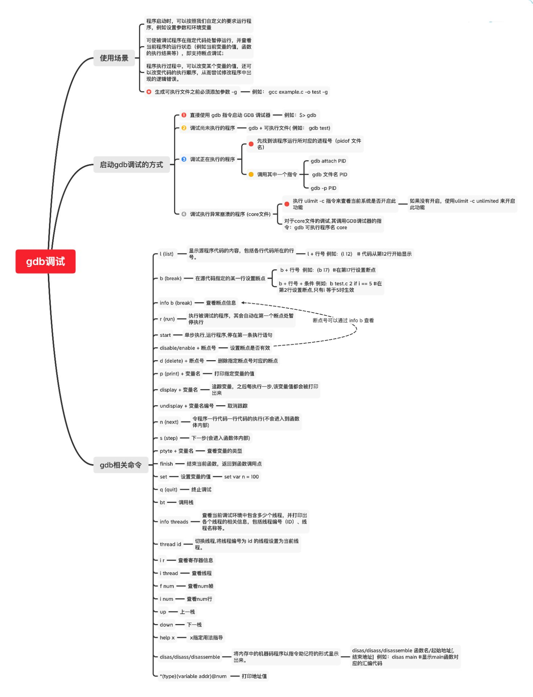

# GDB


## 目录
* [GDB是什么？](#GDB是什么？)
* [GDB的应用场景](#GDB的应用场景)  
* [调用GDB调试器的几种方式](#调用GDB调试器的几种方式)  
    - [直接使用 gdb 指令启动 GDB 调试器](#直接使用-gdb-指令启动-GDB-调试器)
    - [调试尚未执行的程序](#调试尚未执行的程序)
    - [调试正在执行的程序](#调试正在执行的程序)
    - [调试执行异常崩溃的程序](#调试执行异常崩溃的程序)

 

### GDB是什么？
`GDB`全称`“GNU symbolic debugger”`,它诞生于`GNU`计划（同时诞生的还有`GCC`、`Emacs`等,是`Linux`下常用的程序调试器.

### GDB的应用场景
- 程序启动时,可以按照我们自定义的要求运行程序,例如设置参数和环境变量
- 可使被调试程序在指定代码处暂停运行,并查看当前程序的运行状态（例如当前变量的值，函数的执行结果等）,即支持断点调试   
- 程序执行过程中，可以改变某个变量的值,还可以改变代码的执行顺序,从而尝试修改程序中出现的逻辑错误。  

### 调用GDB调试器的几种方式

#### 直接使用 gdb 指令启动 GDB 调试器
```shell
root@MacBook-Pro ~ %  gdb
```
由于此方式启动的`GDB`调试器事先未指定要调试的具体程序,因此需启动后借助`file`或者`exec-file`命令指定   


#### 调试尚未执行的程序
对于具备调试信息（使用`-g`选项编译而成）的可执行文件,调用`GDB`调试器的指令格式为：
```shell
gdb program
```
其中`program`为可执行文件的文件名,例如：
```shell
gcc example.c -o test -g
gdb test 
```

#### 调试正在执行的程序
当想调试一个当前已经启动的程序时,但又不想重启该程序,每个进程都配有唯一的进程号（`PID`),需要先找到该程序运行所对应的进程号.
```shell
pidof 文件名
```
例如:
```
pidof test
```
找到`PID`号之后,可以调用`GDB`对该程序进行调试,调用指令有以下 3 种形式，选择其中一条即可:
```
(1)  gdb attach PID
(2)  gdb 文件名 PID
(3)  gdb -p PID
```

#### 调试执行异常崩溃的程序
在程序运行过程中常常会因为各种异常或者`Bug`而崩溃,比如内存访问越界（例如数组下标越界、输出字符串时该字符串没有 `\0`结束符等）、非法使用空指针等,此时就需要调试程序。    

在`Linux`操作系统中,当程序执行发生异常崩溃时,系统可以将发生崩溃时的内存数据、调用堆栈情况等信息自动记录下载,并存储到一个文件中,该文件通常称为`core`文件,`Linux`系统所具备的这种功能又称为核心转储（`core dump`）.

默认情况下,`Linux`系统是不开启`core dump`这一功能的,可以借助执行`ulimit -c`指令来查看当前系统是否开启此功能：

```shell
root@MacBook-Pro ~ % ulimit -a
-t: cpu time (seconds)              unlimited
-f: file size (blocks)              unlimited
-d: data seg size (kbytes)          unlimited
-s: stack size (kbytes)             8192
-c: core file size (blocks)         0
-v: address space (kbytes)          unlimited
-l: locked-in-memory size (kbytes)  unlimited
-u: processes                       5568
-n: file descriptors                2560
```

其中,如果`core file size`（`core` 文件大小）对应的值为 `0`，表示当前系统未开启`core dump`功能。这种情况下,可以通过执行如下指令改变`core`文件的大小：
```shell
root@MacBook-Pro ~ % ulimit -c unlimited
root@MacBook-Pro ~ % ulimit -a
-t: cpu time (seconds)              unlimited
-f: file size (blocks)              unlimited
-d: data seg size (kbytes)          unlimited
-s: stack size (kbytes)             8192
-c: core file size (blocks)         unlimited
-v: address space (kbytes)          unlimited
-l: locked-in-memory size (kbytes)  unlimited
-u: processes                       5568
-n: file descriptors                2560
```
> 其中`unlimited` 表示不限制 `core`文件的大小。   
  
当程序执行发生异常崩溃时,系统就可以自动生成相应的`core`文件。

对于`core`文件的调试,其调用`GDB`调试器的指令为：
```shell
gdb program core
```
例如: 当`test`在运行的时候发生错误,生成了core文件
```
gdb test core
```


**[⬆ 返回顶部](#目录)**