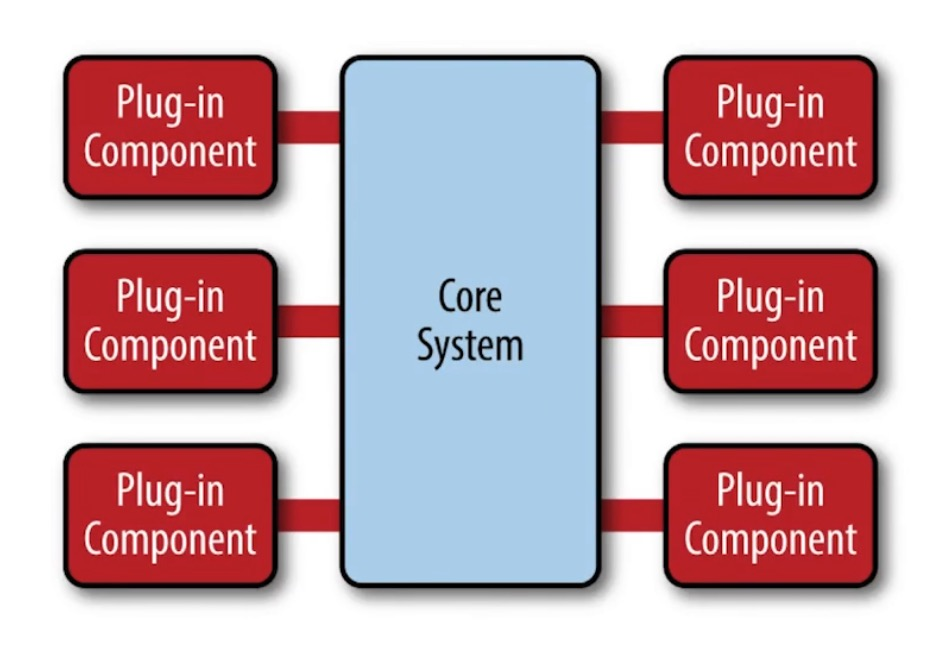
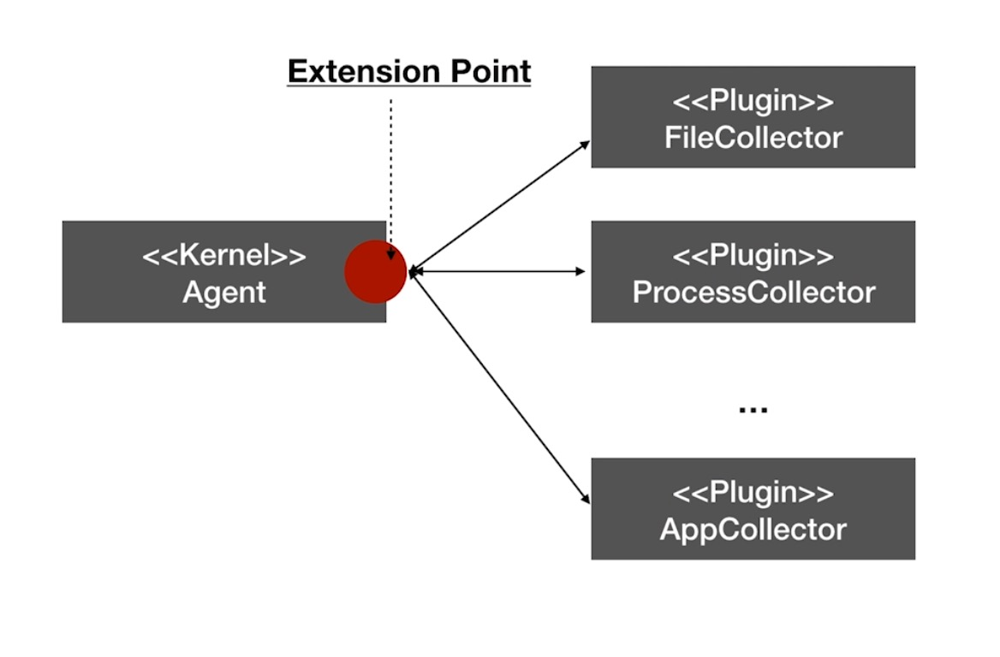

# Pipe-Filter模式
- 非常适合与数据处理及数据分析系统
- `Filter`封装数据处理的功能
- 松耦合:`Filter`只跟数据(格式)耦合
- `Pipe`用于连接`Filter`传递数据或者在异步处理过程中缓冲数据流进程内同步调用时,`pipe`演变为数据在方法调用间传递 

# Micro-Kernel

特点:
- 易于扩展
- 错误隔离
- 保持架构一致性

要点:
- 内核包含公共流程或通用逻辑
- 将可变或可扩展部分规划为扩展点
- 抽象扩展点行为,定义接口
- 利用插件进行扩展

示例:
