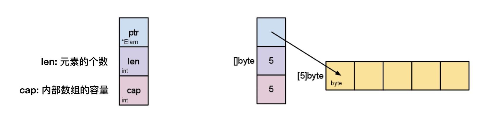
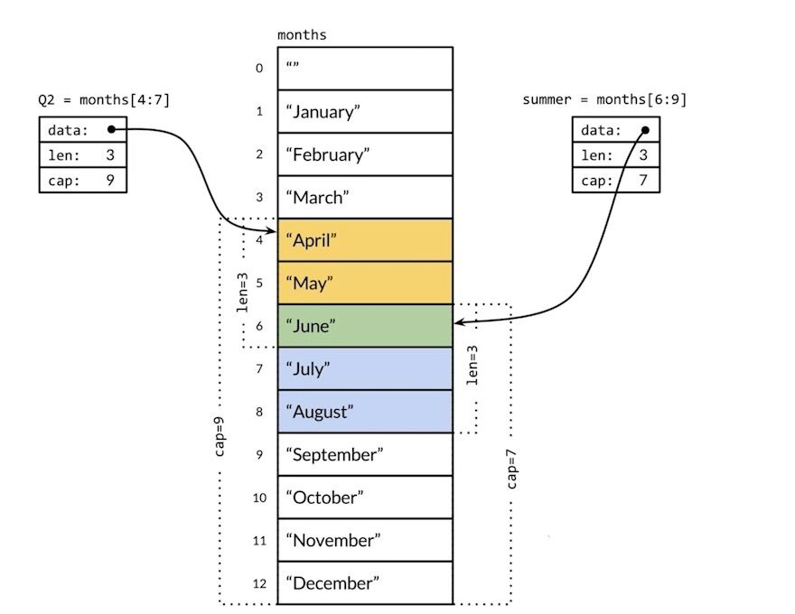

# 数组的声明
```go
var a [3]int // 声明并初始化为默认零值
a[0] = 1

b := [3]int {1 , 2, 3}          // 声明同时初始化
c := [2][2]int { {1,2}, {3, 4}} // 多维数组的初始化
```

# 数组的截取
arr[开始索引(包含)，结束索引(不包含)]

```go
arr := [...]int {1,2,3,4,5}
arr[1:2] // 2
arr[1:3] // 2,3
arr[1:len(arr)]  // 2,3,4,5
arr[1:] // 2,3,4,5
arr[:3] // 1,2,3
```

# 切片内部结构


# 切片的声明
```go
var s [] int
s = append(s,1)

s1 := []int{}

s2 := make([]int , 2)
/* []type,len,cap 
    其中len个元素会被初始化为默认零值,未初始化元不可以访问
*/ 
```

# 切片共享存储结构


# 数组 vs 切片
- 容量是否可伸缩，数组不可以伸缩
- 是否可以进行比较，对于相同维数数组可以进行比较,切片只能和`nil`进行比较


