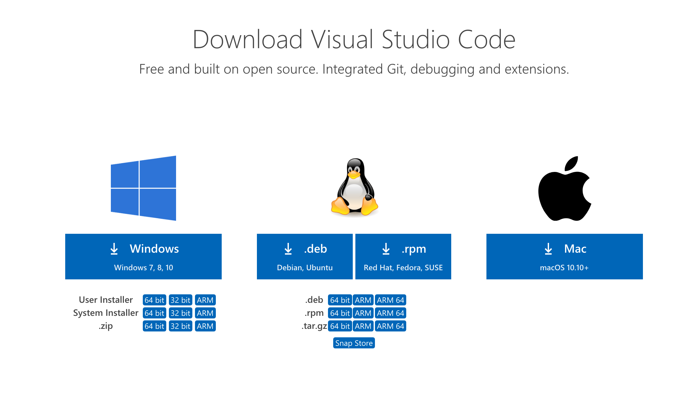
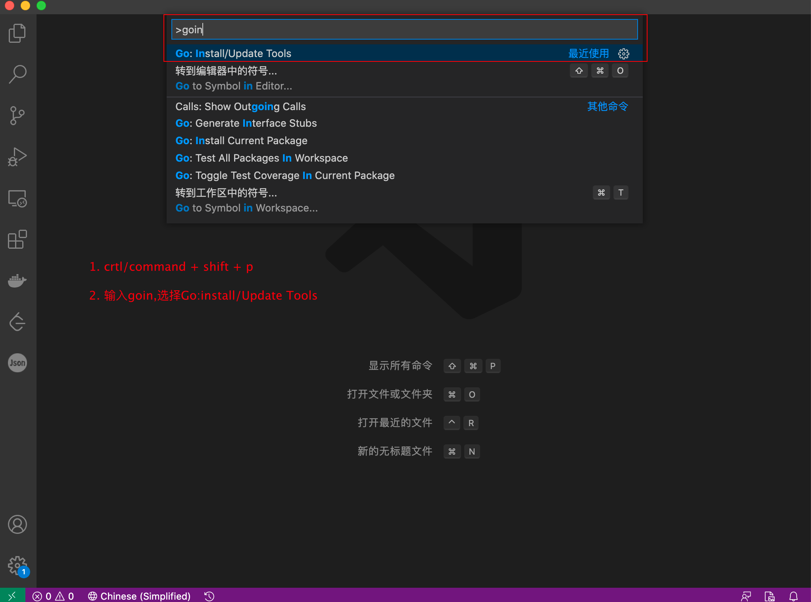
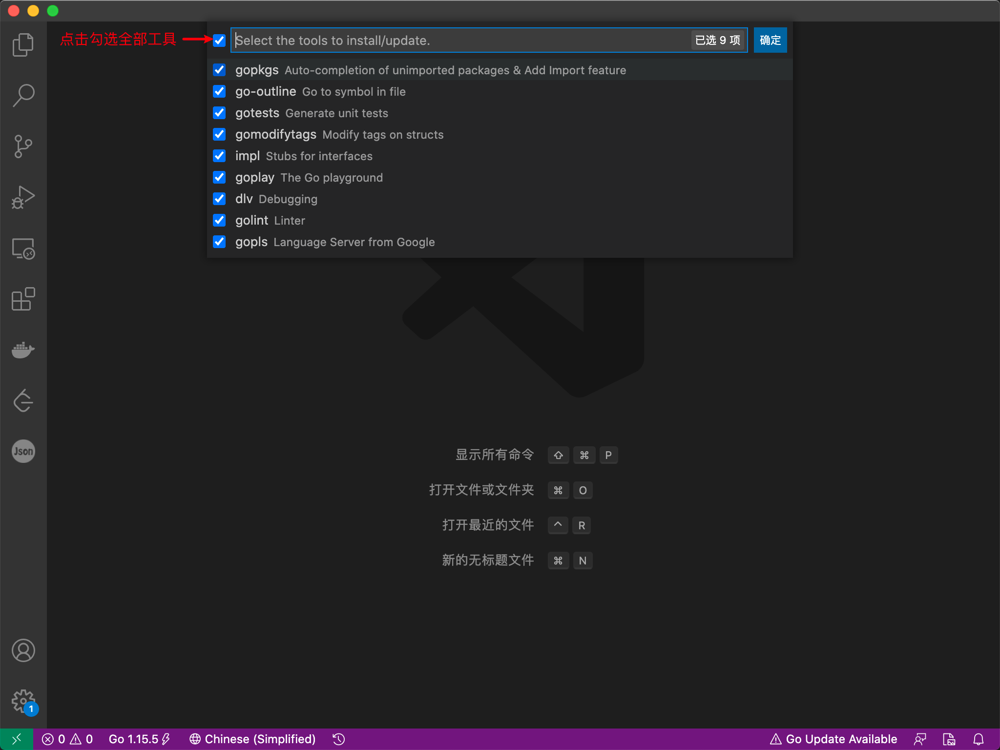
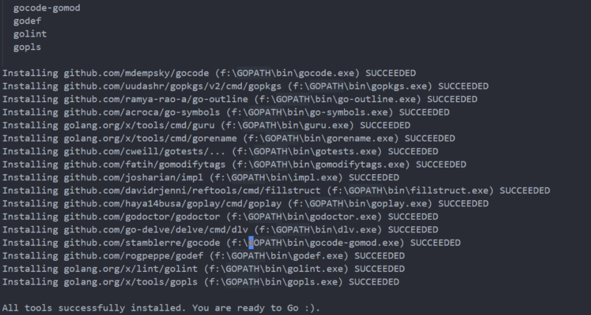

## VS Code中便捷开发golang项目

## 目录
* [VS Code下载与安装](#VS-Code下载与安装)
    * [安装中文简体插件](#安装中文简体插件)
    * [安装Go开发扩展](#安装Go开发扩展)
* [安装所有工具](#安装所有工具)
* [高效单元测试](#高效单元测试)
    * [快速开始单测](#快速开始单测)
    * [详细日志信息](#详细日志信息)
    * [自动填充结构体](#自动填充结构体)
* [高效日常开发](#高效日常开发)
    * [自动实现接口](#自动实现接口)
    * [自动生成结构体tag](#自动生成结构体tag)
    * [快速导入包](#快速导入包)
    * [快速修改命名](#快速修改命名)
    * [快速抽取变量](#快速抽取变量)
    * [添加第三分库当当前工作区](#添加第三分库当当前工作区)
    * [保存代码](#保存代码)
    * [右键快捷键添加](#右键快捷键添加)

## VS Code下载与安装
`VS Code`官方下载地址：[https://code.visualstudio.com/Download]()
三大主流平台都支持，请根据自己的电脑平台选择对应的安装包。

双击下载好的安装文件，双击安装即可。


### 安装中文简体插件
点击左侧菜单栏最后一项管理扩展，在搜索框中输入`chinese` ，选中结果列表第一项，点击`install`安装。

安装完毕后右下角会提示重启`VS Code`，重启之后你的`VS Code`就显示中文啦！


### 安装Go开发扩展
点击左侧菜单栏最后一项管理扩展，在搜索框中输入`GO`,选中结果列表第一项，点击`install`安装。   
安装之后重启`VS Code`。

## 安装所有工具
在`VS Code`主界面中`ctrl/command + shift + p`输入`goin`,选择第一行`Go:Install/Update Tools`,回车后，勾选所有的工具，点击确定，随后就开始安装了。




等到看到下图安装成功提示后，重启`VSCode`即可


有时由于国内的网络环境基本上都会出现安装失败,解决方案：
- 使用`git`下载源代码再安装  
我们可以手动从`github`上下载工具，(执行此步骤前提需要你的电脑上已经安装了`git`)

第一步：先在自己的`GOPATH`的`src`目录下创建`golang.org/x`目录

第二步：在终端`/cmd中cd到GOPATH/src/golang.org/x`目录下

第三步：执行`git clone https://github.com/golang/tools.git tools`命令

第四步：执行`git clone https://github.com/golang/lint.git`命令

第五步：按下`Ctrl/Command+Shift+P`再次执行`Go:Install/Update Tools`命令，在弹出的窗口全选并点击确定，这一次的安装都会`SUCCESSED`了。

经过上面的步骤就可以安装成功了。这个时候创建一个`Go`文件，就能正常使用代码提示、代码格式化等工具了。

## 高效单元测试
### 快速开始单测
假设现在需求是：完成两个数相加，我们只需要一个函数便可以完成该任务。

在开发中，我们需要对该函数进行功能测试，如何快速进行单元测试呢？
例如：
```go
package code

func Add(a, b int) int {
	return a + b
}
```
鼠标放在需要测试的函数上点击右键，选择`GO:Generate Unit Tests For Function`即会在函数所在文件的同级目录下生成`file_test.go`文件，文件内容如下：
```go
package code

import "testing"

func TestAdd(t *testing.T) {
	type args struct {
		a int
		b int
	}
	tests := []struct {
		name string
		args args
		want int
	}{
		// TODO: Add test cases.
	}
	for _, tt := range tests {
		t.Run(tt.name, func(t *testing.T) {
			if got := Add(tt.args.a, tt.args.b); got != tt.want {
				t.Errorf("Add() = %v, want %v", got, tt.want)
			}
		})
	}
}
```
其中 `TODO: Add test cases.`需要你填写自己的测试用例


### 详细日志信息
在进行单元测试的时候，我们经常会使用`Log`打印信息，例如：
```go
    t.Log("test")
```
直接在`VSCode`中进行`run test`是看不到任何输出的，我们需要在`setting.json`添加：
- 在`VSCode`中点击左下角的设置图标
- 选中设置
- 输入`Go:test Flags`，添加`-v`项，如下：
```json
     "go.testFlags": [
        "-v"
    ],
```

实际上就是给`go test`添加`-v`参数，更多参数可以输入`go help testflag`。


### 自动填充结构体
在生成的单元测试文件中有如下信息：
```go
    tests := []struct {
        name string
		args args
		want int
    }{
        // TODO: Add test cases.
    }
```
其中`TODO`位置是我们要填写的多个就构体数据信息

当结构体数据比较多的时候，我们手动填写就比较麻烦，这里只需要在`TODO`位置这样操作：
- 先添加`{}`,并将鼠标放到`{}`中间。
```go
    tests := []struct {
        name string
		args args
		want int
    }{
        // TODO: Add test cases.
        {},   // here
    }
```
- 按快捷键`ctrl/command + shift + p`输入:`goshow`,会看到`Go:Show All Commands...`,回车后输入`fill`,选择`Go:Fill struct`,此时便会输出：
```go
	{
			name: "",
			args: args{
				a: 0,
				b: 0,
			},
			want: 0,
	},
```
测试的时候，只需要修改这些值就可以了。


## 高效日常开发

### 自动实现接口

命令：`Go:Generate Interface Stubs`

该命令需要参数，输入三个内容：

- 方法接受者形参名`eg`：`s`
- 方法接受者名称，即实现类的名称，`eg：*Student`，可以指定是值类型还是引用类型
- 要实现的接口的名称，需要加上包名`eg：packageName.Method`

例如：

```go
package code

type Speaker interface {
	// Speak speak action
	Speak()
}

type Student struct {
}
```
在`VSCode`中按`ctrl/command + shift + p`输入`show`选择`Go:Show All commands...`，回车后输入`generate`，选择`Go:Generate interface stubs`，
输入完整内容：`s *Student code.Speaker` 。

此时在文件中会生成如下方法：
```go
// Speak speak action
func (s *Student) Speak() {
	panic("not implemented") // TODO: Implement
}
```

### 自动生成结构体tag

增加命令：`Go:Add Tags To Struct Fileds`   

删除命令：`Go:Remove Tags From Struct Fileds`

选中你要生成`tag`的字段，执行命令（增加和删除都是同理，需要选中字段，只会执行已选中的字段）  

默认是只生成`json tag`，可以自定义。在`setting.json`，加入`go.addTags`设置即可  

```json
// 结构体tag 设置
  "go.addTags": {
    // 可配置多个tag json,orm
    "tags": "json,form,scope:read-only",
    // options 可以填入json=omitempty
    "options": "",
    "promptForTags": false,
    // snakecase:下划线分隔， camelcase:驼峰命名
    "transform": "camelcase"
  },
```

`tags`字段可以在生出的`tag`中添加多个字段，例如：`json:,scope:,xml:,orm:,form:`等，还可以给定默认值，如上的`scope:read-only`,在`options`选项中，我们可以给定每个字段的具体值，如将`Data`结构体中的所有字段都为`1`,设置`"options":"json=1"`,`transform上述设置为`camelcase`表示字段按小驼峰标识转换。

配置好之后，可以在结构体字段中按下`ctrl/command + shift + p`输入`Go:Add Tags to Sturct Fields`便可以添加`tags`,删除`tags`可以输入`Go:Remove Tags From Struct Fileds`。


### 快速修改命名

直接按`F2`在名字上或者鼠标右键`Rename Symbol`,便可以对标识修改名字，此修改会在所有文件生效，非常适合在大项目中重构使用。

