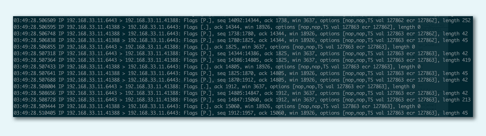

# tcpdump

## 目录
* [简介](#简介)
* [命令格式](#命令格式)
* [参数说明](#参数说明)
* [默认启动](#默认启动)
* [监视指定网络接口的数据包](#监视指定网络接口的数据包)
* [监视指定主机的数据包](#监视指定主机的数据包)
* [使用tcpdump抓取HTTP包](#使用tcpdump抓取HTTP包)
* [检测是否受到DDos攻击](#检测是否受到DDos攻击)
* [抓包的原理](#抓包的原理)

## 简介
`tcpdump`是一个用于截取网络分组,并输出分组内容的工具。凭借强大的功能和灵活的截取策略，使其成为类`UNIX`系统下用于网络分析和问题排查的首选工具。在官网上提供了一个用于网络流量捕获的`c/c++库`(可移植),可用于网络协议分析领域的二次开发。

`tcpdump`支持针对网络层、协议、主机、网络或端口的过滤,并提供`and`、`or`、`not`等逻辑语句来可以帮助你去掉无用的信息

# 安装
可在[官方网站](http://www.tcpdump.org)下载最新的`tcpdump`源码包
```shell
tar -zxvf tcpdump-4.3.0.tar.gz
cd tcpdump-4.3.0
./configure
make&make install
```

## 命令格式
```
tcpdump [-adeflnNOpqStvx][-c<数据包数目>][-dd][-ddd][-F<表达文件>][-i<网络界面>][-r<数据包文件>][-s<数据包大小>][-tt][-T<数据包类型>][-vv][-w<数据包文件>][输出数据栏位]
```

## 参数说明
```
-A                  以ASCII格式打印出所有分组，并将链路层的头最小化。
-a                  尝试将网络和广播地址转换成名称。
-c <数据包数目>       收到指定的数据包数目后，就停止进行倾倒操作。
-d                  把编译过的数据包编码转换成可阅读的格式，并倾倒到标准输出。
-dd                 把编译过的数据包编码转换成C语言的格式，并倾倒到标准输出。
-ddd                把编译过的数据包编码转换成十进制数字的格式，并倾倒到标准输出。
-e                  在每列倾倒资料上显示连接层级的文件头。
-f                  用数字显示网际网络地址。
-F <表达文件>        指定内含表达方式的文件。
-i <网络界面>        使用指定的网络截面送出数据包。
-l                  使用标准输出列的缓冲区。
-n                  不把主机的网络地址转换成名字。只以数字形式列出主机地址(如IP地址),这样能够避免DNS查询；
-N                  不列出域名。
-O                  不将数据包编码最佳化。
-p                  不让网络界面进入混杂模式。
-q                  快速输出，仅列出少数的传输协议信息。
-r <数据包文件>       从指定的文件读取数据包数据。
-s <数据包大小>       设置每个数据包的大小。
-S                  用绝对而非相对数值列出TCP关联数。
-t                  在每列倾倒资料上不显示时间戳记。
-tt                 在每列倾倒资料上显示未经格式化的时间戳记。
-T <数据包类型>       强制将表达方式所指定的数据包转译成设置的数据包类型。
-v                  详细显示指令执行过程。
-vv                 更详细显示指令执行过程。
-x                  用十六进制字码列出数据包资料。
-w <数据包文件>       把数据包数据写入指定的文件。
```

# 默认启动
普通情况下,直接启动`tcpdump`将监视第一个网络接口上所有流过的数据包。
```shell
tcpdump
```

## 监视指定网络接口的数据包
如果不指定网卡,默认`tcpdump`只会监视第一个网络接口,一般是`eth0`
比如指定网卡1:
```shell
tcpdump -i eth1
```

## 监视指定主机的数据包
```shell
tcpdump src host hostname
```
比如满足源主机是使用80端口发出的报文都过滤出来
```
tcpdump src port 80
```
例如：
抓的包是`TCP`,且端口是`80`,包来自`IP`地址为`192.168.1.25`的主机地址。
```shell
tcpdump 'tcp and port 80 and src host 192.168.1.25' 
```
如果对`TCP`协议非常熟悉,还可以写出这样的`tcpdump`命令:
```shell
tcpdump 'tcp and port 80 and tcp[13:1]&2 != 0'
```
这里`tcp[13:1]`表示的是`TCP`头部开始处偏移为`13`的字节,如果这个值为`2`,说明设置了`SYN`分节,当然,我们也可以设置成其他值来获取希望类型的分节。   

`tcpdump`在开启抓包的时候,会自动创建一个类型为`AF_PACKET`的网络套接口,并向系统内核注册。当网卡接收到一个网络报文之后,它会遍历系统中所有已经被注册的网络协议,包括其中已经注册了的`AF_PACKET`网络协议。系统内核接下来就会将网卡收到的报文发送给该协议的回调函数进行一次处理,回调函数可以把接收到的报文完完整整地复制一份,假装是自己接收到的报文,然后交给 `tcpdump`程序,进行各种条件的过滤和判断,再对报文进行解析输出。

下面这张图显示的是 tcpdump 的输出格式:

首先我们看到的是时间戳,之后类似 `192.168.33.11.41388 > 192.168.33.11.6443 `这样的,显示的是**源地址**（`192.168.33.11.41388`）到**目的地址**（`192.168.33.11.6443`）；然后 `Flags [ ] `是包的标志,`[P]`表示是数据推送,比较常见的包格式如下：
- `[S]`：`SYN`,表示开始连接
- `[.]`：没有标记,一般是确认
- `[P]`：`PSH`,表示数据推送
- `[F]`：`FIN`,表示结束连接
- `[R]` ：`RST`,表示重启连接

我们可以看到最后有几个数据,它们代表的含义如下：

- `seq`：包序号,就是`TCP`的确认分组
- `cksum`：校验码
- `win`：滑动窗口大小
- `length`：承载的数据（`payload`）长度`length`，如果没有数据则为`0`


## 使用tcpdump抓取HTTP包
```
tcpdump  -XvvennSs 0 -i eth0 tcp[20:2]=0x4745 or tcp[20:2]=0x4854
```
`0x4745`为`"GET"`前两个字母`"GE"`,`0x4854`为`"HTTP"`前两个字母`"HT"`。

## 检测是否受到DDos攻击
假如怀疑系统正受到拒绝服务(`DoS`)攻击，网络管理员能够通过截获发往本机的任何`ICMP`包,来确定现在是否有大量的`ping`指令流向服务器,此时就能够使用下面的命令:
```
tcpdump icmp -n -i eth0
```

## 抓包的原理
嗅探器工作于网络环境的底层(链路层）,能够拦截所有在网络上传送的数据,再通过响应的软件工,就可以实时分析这些数据的内容
- 收集：从网卡上收集二进制信息（将网卡设置成混杂模式完成抓包）
- 转换：将捕获的二进制信息转换成可读形式。
- 分析：对捕获和转换后的数据进行分析。

要捕获的东西必须是要物理信号能收到的报文信息。显然只要通知网卡接收其收到的所有包（一般叫做混杂`promiscuous`模式：指网络上的所有设备都对总线上传送的数据进行侦听,并不仅仅是它们自己的数据。）在`HUB`(集线器)下就能接收到这个网段的所有包，但是交换机下就只能是自己的包加上广播包。

要想在交换机下接收别人的包,那就要让其发往你的机器所在端口。交换机记住一个口的`MAC`是通过接收来自这个口的数据后并记住其源`MAC`,就像一个机器的`IP`与`MAC`对应的`ARP`列表,交换机维护一个物理口与`MAC`的表,所以是可以欺骗交换机的。

正常情况下其它网络报文被检测到也未必会被抓包,因为网卡设置默认是不是我们的物理地址,网卡不会收取这个报文,一般都要开启混杂模式   
开启`eth1`的混杂模式在Linux下使用命令:
```
sudo ifconfig eth1 promisc
```

**[⬆ 返回顶部](#目录)**