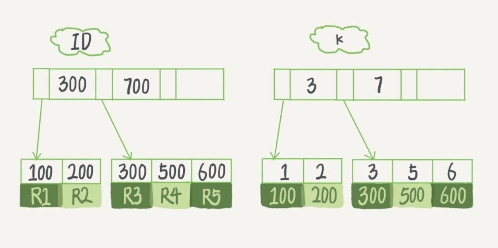
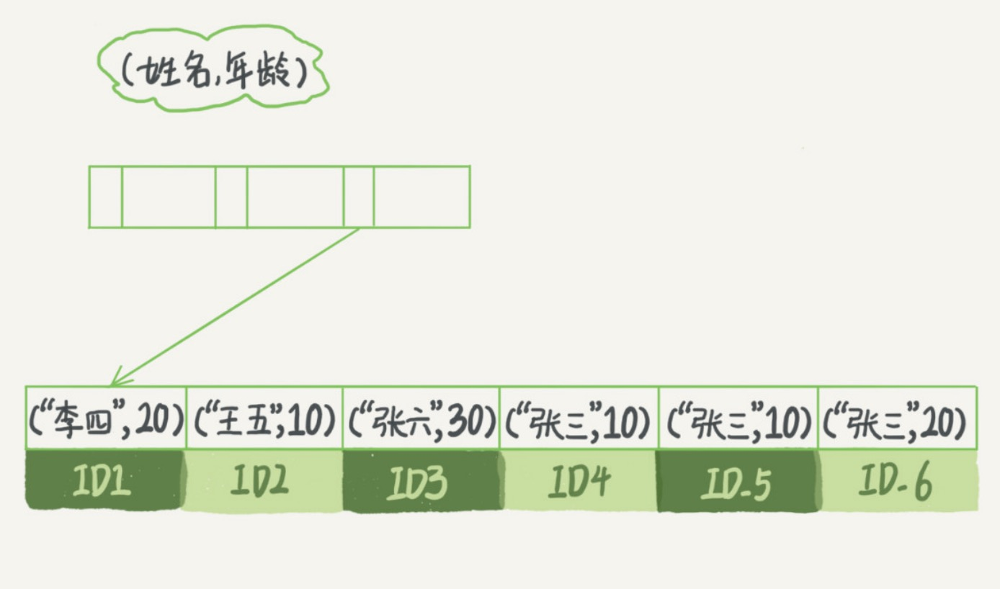
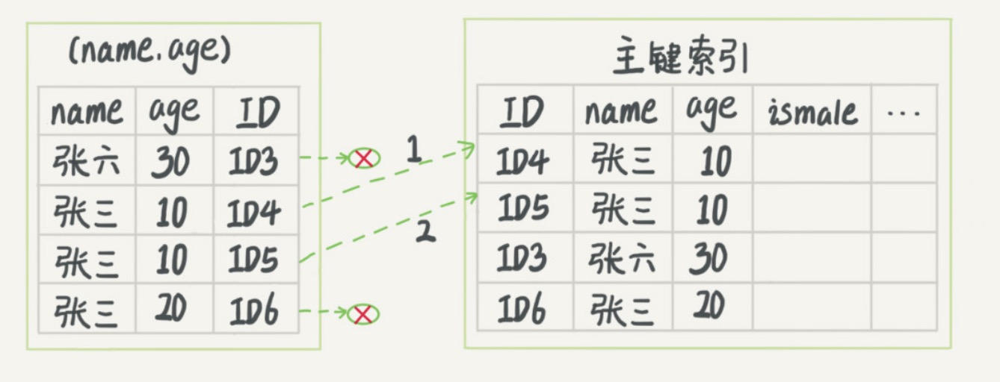

# MySql索引

索引的出现其实就是为了提高数据查询的效率，就像书的目录一样。对于数据库的表而言，索引其实就是它的`“目录”`。
## 目录
* [索引的常见模型](#索引的常见模型)
    - [哈希表](#哈希表)
    - [有序数组](#有序数组)
    - [搜索树](#搜索树)
* [InnoDB 的索引模型](#InnoDB-的索引模型)
* [索引维护](#索引维护)
* [覆盖索引](#覆盖索引)
* [最左前缀原则](#最左前缀原则)

* [个人总结](#个人总结)

## 索引的常见模型
索引的出现是为了提高查询效率，但是实现索引的方式却有很多种,常见、比较简单的数据结构，它们分别是哈希表、有序数组和搜索树。

### 哈希表
哈希表是一种以**键 - 值**（`key-value`）存储数据的结构，只要输入待查找的值即`key`，就可以找到其对应的值即`Value`。哈希的思路很简单，把值放在数组里，用一个哈希函数把`key`换算成一个确定的位置，然后把`value`放在数组的这个位置。

多个`key`值经过哈希函数的换算，会出现同一个值的情况。处理这种情况的一种方法是，拉出一个链表。

假设，你现在维护着一个身份证信息和姓名的表，需要根据身份证号查找对应的名字，这时对应的哈希索引的示意图如下所示：

图中，`User2`和`User4`根据身份证号算出来的值都是`N`，但没关系，后面还跟了一个链表。假设，这时候你要查`ID_card_n2`对应的名字是什么，处理步骤就是：首先，将`ID_card_n2`通过哈希函数算出`N`；然后，按顺序遍历，找到`User2`。

需要注意的是，图中四个`ID_card_n`的值并不是递增的，这样做的好处是增加新的`User`时速度会很快，只需要往后追加。但缺点是，因为不是有序的，所以哈希索引做区间查询的速度是很慢的。
如果你现在要找身份证号在 [`ID_card_X`, `ID_card_Y`] 这个区间的所有用户，就必须全部扫描一遍了。

所以，**哈希表这种结构适用于只有等值查询的场景**，比如`Memcached`及其他一些`NoSQL`引擎。

### 有序数组
有序数组是一种特殊的数组，里面的元素，按一定的顺序排列。**有序数组在等值查询和范围查询场景中的性能都非常优秀**。
还是上面这个根据身份证号查名字的例子，如果我们使用有序数组来实现的话，示意图如下所示：

这里我们假设身份证号没有重复，这个数组就是按照身份证号递增的顺序保存的。这时候如果你要查`ID_card_n2`对应的名字，用二分法就可以快速得到，这个时间复杂度是`O(log(N))`。

同时很显然，这个索引结构支持范围查询。你要查身份证号在 [`ID_card_X`, `ID_card_Y`] 区间的`User`，可以先用二分法找到`ID_card_X`（如果不存在`ID_card_X`，就找到大于`ID_card_X`的第一个`User`），然后向右遍历，直到查到第一个大于`ID_card_Y`的身份证号，退出循环。

如果仅仅看查询效率，有序数组就是最好的数据结构了。但是，在需要更新数据的时候就麻烦了，你往中间插入一个记录就必须得挪动后面所有的记录，成本太高。

所以，**有序数组索引只适用于静态存储引擎**，比如你要保存的是`2017`年某个城市的所有人口信息，这类不会再修改的数据。


### 搜索树
二叉搜索树（`BST`）又称二叉查找树或二叉排序树。一棵二叉搜索树是以二叉树来组织的，可以使用一个链表数据结构来表示，其中每一个结点就是一个对象。

还是上面根据身份证号查名字的例子，如果我们用二叉搜索树来实现的话，示意图如下所示：

二叉搜索树的特点是：每个节点的左节点小于父节点，父节点又小于右节点。这样如果你要查`ID_card_n2`的话，按照图中的搜索顺序就是按照`UserA` -> `UserC` -> `UserF` -> `User2`这个路径得到。这个时间复杂度是`O(log(N))`。

当然为了维持`O(log(N))`的查询复杂度，你就需要保持这棵树是平衡二叉树。为了做这个保证，更新的时间复杂度也是`O(log(N))`。

树可以有二叉，也可以有多叉。多叉树就是每个节点有多个节点，节点之间的大小保证从左到右递增。二叉树是搜索效率最高的，但是实际上大多数的数据库存储却并不使用二叉树。其原因是，索引不止存在内存中，还要写到磁盘上。

你可以想象一下一棵`100`万节点的平衡二叉树，树高`20`(深度)。一次查询可能需要访问`20`个数据块。在机械硬盘时代，从磁盘随机读一个数据块需要`10 ms `左右的寻址时间。也就是说，对于一个`100`万行的表，如果使用二叉树来存储，单独访问一个行可能需要`20`个`10 ms`的时间，这个查询可真够慢的。

为了让一个查询尽量少地读磁盘，就必须让查询过程访问尽量少的数据块。那么，我们就不应该使用二叉树，而是要使用`“N 叉”`树。这里，`“N 叉”`树中的`“N”`取决于数据块的大小。

以`InnoDB`的一个整数字段索引为例，这个`N`差不多是`1200`。这棵树高是`4`的时候，就可以存`1200`的`3`次方个值，这已经`17`亿了。考虑到树根的数据块总是在内存中的，一个`10`亿行的表上一个整数字段的索引，查找一个值最多只需要访问`3`次磁盘。其实，树的第二层也有很大概率在内存中，那么访问磁盘的平均次数就更少了。

`N`叉树由于在读写上的性能优点，以及适配磁盘的访问模式，已经被广泛应用在数据库引擎中了。

不管是哈希还是有序数组，或者`N `叉树，它们都是不断迭代、不断优化的产物或者解决方案。数据库技术发展到今天，跳表、`LSM`树等数据结构也被用于引擎设计中

我们要有个概念，数据库底层存储的核心就是基于这些数据模型的。每碰到一个新数据库，我们需要先关注它的数据模型，这样才能从理论上分析出这个数据库的适用场景。


在`MySQL`中，索引是在存储引擎层实现的，所以并没有统一的索引标准，即不同存储引擎的索引的工作方式并不一样。而即使多个存储引擎支持同一种类型的索引，其底层的实现也可能不同。`InnoDB`存储引擎在`MySQL`数据库中使用最为广泛。


## InnoDB 的索引模型
在`InnoDB`中，**表都是根据主键顺序以索引的形式存放的，这种存储方式的表称为索引组织表**。
- `InnoDB`使用了`B+`树索引模型，所以数据都是存储在`B+`树中的。
- 每一个索引在`InnoDB`里面对应一棵`B+`树。
假设，我们有一个主键列为`ID`的表，表中有字段`k`，并且在`k`上有索引。  
这个表的建表语句是：
```mysql
mysql> create table T(
id int primary key, 
k int not null, 
name varchar(16),
index (k))engine=InnoDB;
```
表中 `R1`~`R5` 的 (`ID`,`k`) 值分别为 (`100`,`1`)、(`200`,`2`)、(`300`,`3`)、(`500`,`5`) 和 (`600`,`6`)，两棵树的示例示意图如下。

从图中不难看出，根据叶子节点的内容，索引类型分为主键索引和非主键索引。
主键索引的叶子节点存的是整行数据。在`InnoDB`里，主键索引也被称为聚簇索引（`clustered index`）。

非主键索引的叶子节点内容是主键的值。在`InnoDB`里，非主键索引也被称为二级索引（`secondary index`）。

**基于主键索引和普通索引的查询的区别**：
- 如果语句是`select * from T where ID=500`，即主键查询方式，则只需要搜索`ID`这棵`B+`树；
- 如果语句是`select * from T where k=5`，即普通索引查询方式，则需要先搜索`k`索引树，得到`ID`的值为`500`，再到`ID`索引树搜索一次。这个过程称为回表。

也就是说，基于非主键索引的查询需要多扫描一棵索引树。因此，我们在应用中应该尽量使用主键查询。

## 索引维护
`B+`树为了维护索引有序性，在插入新值的时候需要做必要的维护。以上面这个图为例，如果插入新的行`ID`值为`700`，则只需要在`R5`的记录后面插入一个新记录。如果新插入的`ID`值为`400`，就相对麻烦了，需要逻辑上挪动后面的数据，空出位置。

如果`R5`所在的数据页已经满了，根据`B+`树的算法，这时候需要申请一个新的数据页，然后挪动部分数据过去。这个过程称为页分裂。在这种情况下，性能自然会受影响。

除了性能外，页分裂操作还影响数据页的利用率。原本放在一个页的数据，现在分到两个页中，整体空间利用率降低大约`50%`。

有分裂就有合并。当相邻两个页由于删除了数据，利用率很低之后，会将数据页做合并。合并的过程，可以认为是分裂过程的逆过程。


使用自增主键的场景:

自增主键是指自增列上定义的主键，在建表语句中一般是这么定义的： `NOT NULL PRIMARY KEY AUTO_INCREMENT`。

插入新记录的时候可以不指定`ID`的值，系统会获取当前`ID`最大值加`1`作为下一条记录的`ID`值。

也就是说，自增主键的插入数据模式，正符合了我们前面提到的递增插入的场景。每次插入一条新记录，都是追加操作，都不涉及到挪动其他记录，也不会触发叶子节点的分裂。

而有业务逻辑的字段做主键，则往往不容易保证有序插入，这样写数据成本相对较高。

除了考虑性能外，我们还可以从存储空间的角度来看。假设你的表中确实有一个唯一字段，比如字符串类型的身份证号，那应该用身份证号做主键，还是用自增字段做主键呢？

由于每个非主键索引的叶子节点上都是主键的值。如果用身份证号做主键，那么每个二级索引的叶子节点占用约`20`个字节，而如果用整型做主键，则只要`4`个字节，如果是长整型（`bigint`）则是`8`个字节。

显然，**主键长度越小，普通索引的叶子节点就越小，普通索引占用的空间也就越小**。

所以，从性能和存储空间方面考量，自增主键往往是更合理的选择。

适合用业务字段直接做主键的场景:
- 只有一个索引；
- 该索引必须是唯一索引。

这就是典型的`KV`场景。

由于没有其他索引，所以也就不用考虑其他索引的叶子节点大小的问题。

这时候我们就要优先考虑上一段提到的“尽量使用主键查询”原则，直接将这个索引设置为主键，可以避免每次查询需要搜索两棵树。


`B+`树能够很好地配合磁盘的读写特性，减少单次查询的磁盘访问次数。

由于`InnoDB`是索引组织表，一般情况下会建议你创建一个自增主键，这样非主键索引占用的空间最小

对于上面例子中的`InnoDB`表`T`，如果你要重建索引`k`，你的两个`SQL`语句可以这么写：
```mysql
alter table T drop index k;
alter table T add index(k);
```
如果你要重建主键索引，也可以这么写：
```mysql
alter table T drop primary key;
alter table T add primary key(id);
```
索引可能因为删除，或者页分裂等原因，导致数据页有空洞，重建索引的过程会创建一个新的索引，把数据按顺序插入，这样页面的利用率最高，也就是索引更紧凑、更省空间。

对于上面这两个重建索引的作法,重建索引`k`的做法是合理的，可以达到省空间的目的。但是，重建主键的过程不合理。不论是删除主键还是创建主键，都会将整个表重建。所以连着执行这两个语句的话，第一个语句就白做了。这两个语句，你可以用这个语句代替 ： 
```mysql
alter table T engine=InnoDB
```

## 覆盖索引
在执行`select * from T where k between 3 and 5`，需要执行几次树的搜索操作，会扫描多少行？
这个表的初始化语句:
```mysql
mysql> create table T (
ID int primary key,
k int NOT NULL DEFAULT 0, 
s varchar(16) NOT NULL DEFAULT '',
index k(k))
engine=InnoDB;
 
insert into T values(100,1, 'aa'),(200,2,'bb'),(300,3,'cc'),(500,5,'ee'),(600,6,'ff'),(700,7,'gg');
```

这条`SQL`查询语句的执行流程：
1. 在`k`索引树上找到`k=3`的记录，取得`ID` = `300`；
2. 再到`ID`索引树查到`ID`=`300`对应的`R3`；
3. 在`k`索引树取下一个值`k=5`，取得`ID`=`500`；
4. 再回到`ID`索引树查到`ID=500`对应的`R4`；
5. 在`k`索引树取下一个值`k=6`，不满足条件，循环结束。

在这个过程中，**回到主键索引树搜索的过程，我们称为回表**。可以看到，这个查询过程读了`k`索引树的`3`条记录（步骤 1、3 和 5），回表了两次（步骤 2 和 4）。   
在这个例子中，由于查询结果所需要的数据只在主键索引上有，所以不得不回表。  

如果执行的语句是`select ID from T where k between 3 and 5`，这时只需要查`ID`的值，而`ID`的值已经在`k`索引树上了，因此可以直接提供查询结果，不需要回表。也就是说，在这个查询里面，索引`k`已经“覆盖了”我们的查询需求，我们称为覆盖索引.

**由于覆盖索引可以减少树的搜索次数，显著提升查询性能，所以使用覆盖索引是一个常用的性能优化手段。**


需要注意的是，在引擎内部使用覆盖索引在索引`k`上其实读了三个记录，`R3`~`R5`（对应的索引`k`上的记录项），但是对于`MySQL`的 `Server`层来说，它就是找引擎拿到了两条记录，因此`MySQL`认为扫描行数是`2`。

索引字段的维护总是有代价的。因此，在建立冗余索引来支持覆盖索引时就需要权衡考虑了。这正是业务`DBA`，或者称为业务数据架构师的工作。


## 最左前缀原则
**B+ 树这种索引结构，可以利用索引的“最左前缀”，来定位记录。**  

可以看到，**索引项是按照索引定义里面出现的字段顺序排序的。**

当你的逻辑需求是查到所有名字是“张三”的人时，可以快速定位到`ID4`，然后向后遍历得到所有需要的结果。  
如果你要查的是所有名字第一个字是“张”的人，你的`SQL`语句的条件是`"where name like ‘张 %’"`。这时，你也能够用上这个索引，查找到第一个符合条件的记录是`ID3`，然后向后遍历，直到不满足条件为止。

可以看到，不只是索引的全部定义，只要满足最左前缀，就可以利用索引来加速检索。这个最左前缀可以是联合索引的最左`N`个字段，也可以是字符串索引的最左`M`个字符。

基于上面对最左前缀索引的说明，我们来讨论一个问题：**在建立联合索引的时候，如何安排索引内的字段顺序?**。

这里我们的评估标准是，**索引的复用能力**。因为可以支持最左前缀，所以当已经有了 (`a`,`b`) 这个联合索引后，一般就不需要单独在`a`上建立索引了。因此，**第一原则是，如果通过调整顺序，可以少维护一个索引，那么这个顺序往往就是需要优先考虑采用的**。

那么，如果既有联合查询，又有基于`a`、`b`各自的查询呢？查询条件里面只有`b`的语句，是无法使用 (`a`,`b`) 这个联合索引的，这时候你不得不维护另外一个索引，也就是说你需要同时维护 (`a`,`b`)、(`b`) 这两个索引。

这时候，我们要**考虑的原则就是空间**了。比如上面这个表的情况，`name`字段是比`age`字段大的 ，那么就建议你创建一个（`name`,`age`) 的联合索引和一个 (`age`) 的单字段索引。

## 索引下推
上一段我们说到满足最左前缀原则的时候，最左前缀可以用于在索引中定位记录。这时，你可能要问，那些不符合最左前缀的部分，会怎么样呢？

还是以上述表的联合索引（`name`, `age`）为例。如果现在有一个需求：检索出表中“名字第一个字是张，而且年龄是`10`岁的所有男孩”。那么，`SQL`语句是这么写的：
```mysql
mysql> select * from tuser where name like '张 %' and age=10 and ismale=1;
```

你已经知道了前缀索引规则，所以这个语句在搜索索引树的时候，只能用 “张”，找到第一个满足条件的记录`ID3`。当然，这还不错，总比全表扫描要好。

然后呢？

当然是判断其他条件是否满足。

在`MySQL 5.6`之前，只能从`ID3`开始一个个回表。到主键索引上找出数据行，再对比字段值。

而`MySQL 5.6`引入的索引下推优化（`index condition pushdown`)， 可以在索引遍历过程中，对索引中包含的字段先做判断，直接过滤掉不满足条件的记录，减少回表次数。

无索引下推执行流程:


索引下推执行流程:

上面2图的区别：`InnoDB`在 (`name`,`age`) 索引内部就判断了`age`是否等于`10`，对于不等于`10`的记录，直接判断并跳过。在我们的这个例子中，只需要对`ID4`、`ID5`这两条记录回表取数据判断，就只需要回表`2`次。


**在满足语句需求的情况下， 尽量少地访问资源是数据库设计的重要原则之一。我们在使用数据库的时候，尤其是在设计表结构时，也要以减少资源消耗作为目标。**

### 个人总结
1. 索引的出现其实就是为了提高数据查询的效率，就像书的目录一样。对于数据库的表而言，索引其实就是它的`“目录”`。
2. 索引的常见模型：[哈希表](#哈希表)、[有序数组](#有序数组)和[搜索树](#搜索树)
- 哈希表这种结构适用于只有等值查询的场景
- 有序数组索引只适用于静态存储引擎
- 索引是在存储引擎层实现的，所以并没有统一的索引标准，即不同存储引擎的索引的工作方式并不一样
3. 在`InnoDB`中，**表都是根据主键顺序以索引的形式存放的，这种存储方式的表称为索引组织表**。
4. `B+`树为了维护索引有序性，在插入新值的时候需要做必要的维护，主键长度越小，普通索引的叶子节点就越小，普通索引占用的空间也就越小
5. 回到主键索引树搜索的过程，称为回表,由于覆盖索引可以减少树的搜索次数，显著提升查询性能，所以使用覆盖索引是一个常用的性能优化手段
6. `B+`树这种索引结构，可以利用索引的“最左前缀”，来定位记录
7. 添加索引原则:
    - 第一原则是，如果通过调整顺序，可以少维护一个索引，那么这个顺序往往就是需要优先考虑采用的.例如，有a,b 联合查询的需求，又有b独立查询的需求，这时应该建联合索引（b,a),而不是(a,b) 。
    - `MySQL 5.6`引入的索引下推优化（`index condition pushdown`)， 可以在索引遍历过程对索引中包含的字段先做判断，直接过滤掉不满足条件的记录，减少回表次数。
    - 在满足语句需求的情况下， 尽量少地访问资源是数据库设计的重要原则之一。我们在使用数据库的时候，尤其是在设计表结构时，也要以减少资源消耗作为目标.
    - 在查询中很少使用或者参考的列不应该创建索引。这是因为，既然这些列很少使用到，因此有索引或者无索引，并不能提高查询速度。相反，由于增加了索引，反而降低了系统的维护速度和增大了空间需求。
    - 只有很少数据值的列也不应该增加索引
    - 定义为`text`、`image`和`bit`数据类型的列不应该增加索引。这是因为，这些列的数据量要么相当大，要么取值很少。
    - 当修改性能远远大于检索性能时，不应该创建索引。这是因为，修改性能和检索性能是互相矛盾的。当增加索引时，会提高检索性能，但是会降低修改性能。当减少索引时，会提高修改性能，降低检索性能。因此，当修改性能远远大于检索性能时，不应该创建索引。

索引的一个主要目的就是加快检索表中数据的方法.`DB`在执行一条`Sql`语句的时候，默认的方式是根据搜索条件进行全表扫描，遇到匹配条件的就加入搜索结果集合。如果我们对某一字段增加索引，查询时就会先去索引列表中一次定位到特定值的行数，大大减少遍历匹配的行数，所以能明显增加查询的速度。

**优点**：

- 通过创建唯一性索引，可以保证数据库表中每一行数据的唯一性。

- 可以大大加快数据的检索速度，这也是创建索引的最主要的原因。

- 可以加速表和表之间的连接，特别是在实现数据的参考完整性方面特别有意义。

- 在使用分组和排序子句进行数据检索时，同样可以显著减少查询中分组和排序的时间。

- 通过使用索引，可以在查询的过程中，使用优化隐藏器，提高系统的性能。

**缺点**：

- 创建索引和维护索引要耗费时间，这种时间随着数据量的增加而增加。

- 索引需要占物理空间，除了数据表占数据空间之外，每一个索引还要占一定的物理空间，如果要建立聚簇索引，那么需要的空间就会更大。

- 当对表中的数据进行增加、删除和修改的时候，索引也要动态的维护，这样就降低了数据的维护速度。


**[⬆ 返回顶部](#目录)**

