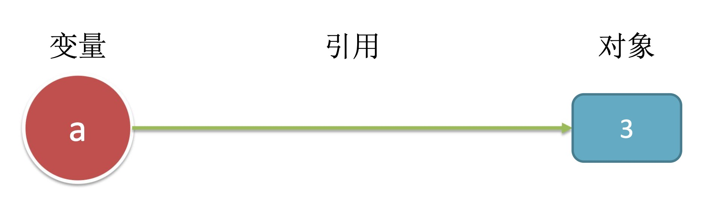
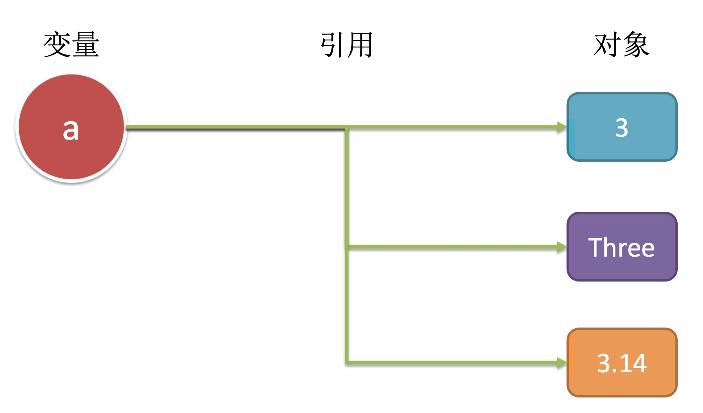
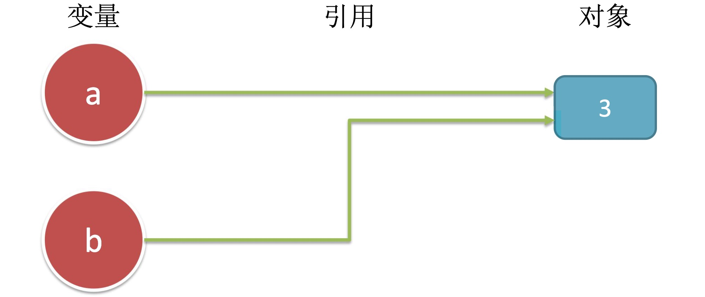
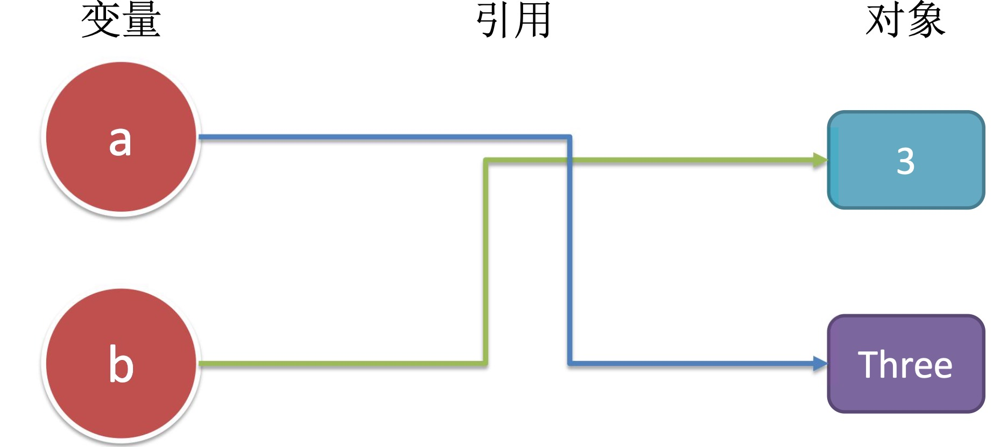
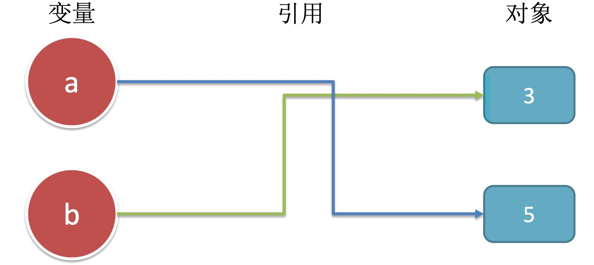

# Python的类型与运算-动态类型

## 目录
* [变量、对象、引用](#变量、对象、引用)
- [共享引用](#共享引用)

### 变量、对象、引用

**变量**:在`Python`里，不像别的一些语言，需要声明变量类型。因为在`Python`里变量没有类型。
```py
a=3         #在这里3是整数
a="Three"   #在这里"Three"是字符串
```
**变量创建**:当第一次赋值给一个变量的时候，它就自动被创建了。
```py
a=3 #创建变量a，创建对象3,a变量引用对象3
```
**变量类型**:在`Python`里变量没有类型
**变量使用**:当变量被表达式使用时 马上被其引用的对象所取代。


当输入`a=3`时:

变量:一个系统表的元素，拥有指向对象的连接的空间,变量是存放指针的，因此变量没有类型。     
对象:分配的一块内存，有足够的空间去表示他们所代表的值,对象是存放数据的，所以对象有类型之说。     
引用:自动形成的从变量到对象的指针  


对象回收♻ :因为对象是独立于变量的，当不再使用的时候是得回收的。 
```py
a=3
a="pie" #回收整数3
a=3.14  #回收字符串"pie"
a=[3,1,4] #回收浮点数3.14
```
第二次引用(赋值)后，当没有别的变量引用对象`3`的话，`3`就会回收。以此类推。

### 共享引用
在`Python`里两个变量可以共享一个对象，这个叫做共享引用。比如: 
```py
a=3
b=a
```
这个时候`a`跟`b`是共享对象`3`的。

当`a`赋另一个值了，就会新创建一个对象，`a`变量会引用新对象，而不是改变对象。
```py
a="Three"
```

在`a`跟`b`都是`3`的时候，如下语句也不会改变`b`的值，也是会创建新对象，`a`再去引用新的对象。
```py
a=a+2
```


#### 列表的共享引用:
```py
List1=[1,2,3]  #List1引用三个对象的对象，对象里有三个元素1，2，3 
List2=List1    #给List2赋值List1的指针
List1[0]=24    #更改List1对象的第一个元素为24，现在三个元素是24，2，3
```
这个时候，因为更改的是对象里的元素，所以`List2`引用的对象也是包含`24`，`2`， `3`三个元素的列表。 当有些时候你需要复制列表，而不是共享，如下方法可以帮助你。
```py
List1=[1,2,3]   #List1引用三个对象的对象，对象里有三个元素1，2，3 
List2=List1[:]  #复制List1引用的对象，把新的对象引用到List2
List1[0]=24     #更改List1对象的第一个元素为24，现在三个元素是24，2，3 
```

这个时候`List2`指向的对象里的三个元素还是`1`，`2`，`3`。


#### 共享引用与相等
- `==` 表示测试两个值是否相等。
- `is` 表示两个值是否是同一对象。
```py
a=1
b=1
a == b
a is b
```
在`Pytho`n里多个变量引用同一整数，字符串的时候，会引用同一对象。 所以上面的`a == b`和`a is b`的结果都会是`True`。
```py
a="One"
b="One"
a == b
a is b
```
上面的结果，两个也都是`True`。

但是其他时候，在`Python`里给两个变量赋予同样值的对象，其对象不是共用的。 
```py
a=3.14
b=3.14
a == b
a is b
```
在这里发现`a is b`会是`False`。
```py
a=3.14
b=a
a is b
```
这样的话`a is b`肯定是`True`。

需要了解一个对象被引用多少次，可以使用如下函数来查看:
```py
import sys
sys.getrefcount(1) 
```
这个结果会让你比较惊讶，其数值比较大是因为在很多内部函数里会使用值为`1`的对象。  
 `getrefcount`的结果不是`0`的原因:因为这个函数，当你使用的时候就调用其本身， 所以最终结果不可能为`0`。  

 
**[⬆ 返回顶部](#目录)**