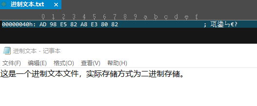

# 进制

## 目录
* [进制的定义](#进制的定义)
* [进制的本质](#进制的本质)
* [计算机中数字的形式](#计算机中数字的形式)
* [进制的运算](#进制的运算)
    * [十进制加法表](#十进制加法表)
    * [十进制乘法表](#十进制乘法表)
    * [八进制进制表](#八进制进制表)
    * [八进制加法表](#八进制加法表)
    * [八进制乘法表](#八进制乘法表)
* [自定义进制符号](#自定义进制符号)

## 进制的定义

- 十进制的定义：由十个符号组成，分别是    0  1  2  3  4  5  6  7  8  9     逢十进一

- 九进制的定义：由九个符号组成，分别是    0  1  2  3  4  5  6  7  8        逢九进一

- 十六进制的定义：由十六个符号组成，分别是 0  1  2  3  4  5  6  7  8  9  A  B  C  D  E  F

- `N`进制的定义：由`N`个符号组成，逢`N`进一

## 进制的本质
`N`进制的定义实则为由`N`个符号组成，逢`N`进位

这里的符号不一定要是 0 1  2  3  4 ....

也可以自行定义为

`R`   `T`   `Y `  `U`    `I`   `O` 等其它符号

| 符号| `R` | `T` | `Y` | `U`| `I` | `O` |  
|:--:|:--| :--:|:--|:--:|:--|:--:|
| 含义| `0` | `1`| `2`| `3` | `4`| `5` |

自定义进制的符号可以作为一种加密的手段，给解密者带来麻烦

## 计算机中的数字形式
计算机中的任何信息，如图片、视频、音乐等等，都是以二进制的形式进行存储的

二进制比较冗长，于是在用进制查看工具如`UltraEdit`中，是以十六进制来显示数据的

十六进制数与二进制数的对应关系为：一个十六进制数由`4`位二进制数表示

**二进制与十六进制的映射关系**
| `0` | `1` | `2` | `3` | `4` | `5` | `6` | `7` | `8` | `9` | `A` | `B` | `C` | `D` | `E` | `F` |    
|:--:|:--:| :--:|:--:|:--:|:--|:--:|:--:|:--:| :--:|:--|:--:|:--:|:--:|:--:|:--:|   
| `0000` | `0001` | `0010` | `0011` | `0100` | `0101` | `0110` | `0111` | `1000` | `1001` | `1010` | `1011` | `1100` | `1101` | `1110` | `1111` |     

## 进制的运算

**进制运算的本质实际就是根据进制表查表所得**

### 十进制加法表

| `1 + 1 = 2` |  |  |  |  |  |  |  |  |  | 
|:--:|:--| :--:|:--:|:--:|:--:|:--:|:--:|:--:|:--:| 
| `1 + 2 = 3` | `2 + 2 = 4` |  |  |  |  |  |  |  |  | 
| `1 + 3 = 4` | `2 + 3 = 5` |  `3 + 3 = 6` |  |  |  |  |  |  |  | 
| `1 + 4 = 5` | `2 + 4 = 6` |  `3 + 4 = 7` | `4 + 4 = 8` |  |  |  |  |  |  | 
| `1 + 5 = 6` | `2 + 5 = 7` |  `3 + 5 = 8`|  `4 + 5 = 9` |  `5 + 5 = 10` |  |  |  |  |  | 
| `1 + 6 = 7` | `2 + 6 = 8` |  `3 + 6 = 9`|  `4 + 6 = 10`|  `5 + 6 = 11`| `6 + 6 = 12` |  |  |  |  | 
| `1 + 7 = 8` | `2 + 7 = 9`|   `3 + 7 = 10`| `4 + 7 = 11` | `5 + 7 = 12`| `6 + 7 = 13`| `7 + 7 = 14` |  |  |  | 
| `1 + 8 = 9` | `2 + 8 = 10`|  `3 + 8 = 11`| `4 + 8 = 12`|  `5 + 8 = 13`| `6 + 8 = 14` | `7 + 8 = 15` |`8 + 8 = 16`  |  |  | 
| `1 + 9 = 10` |`2 + 9 = 11` | `3 + 9 = 12`| `4 + 9 = 13` | `5 + 9 = 14`| `6 + 9 = 15` | `7 + 9 = 16` | `8 + 9 = 17` |  | `9 + 9 = 18` | 

### 十进制乘法表
| `1 * 1 = 1` |  |  |  |  |  |  |  |  |  | 
|:--:|:--| :--:|:--:|:--:|:--:|:--:|:--:|:--:|:--:| 
| `1 * 2 = 2` | `2 * 2 = 4` |  |  |  |  |  |  |  |  | 
| `1 * 3 = 3` | `2 * 3 = 6` |  `3 * 3 = 9` |  |  |  |  |  |  |  | 
| `1 * 4 = 4` | `2 * 4 = 8` |  `3 * 4 = 12` | `4 * 4 = 16` |  |  |  |  |  |  | 
| `1 * 5 = 5` | `2 * 5 = 10` |  `3 * 5 = 15`|  `4 * 5 = 20` |  `5 * 5 = 25` |  |  |  |  |  | 
| `1 * 6 = 6` | `2 * 6 = 12` |  `3 * 6 = 18`|  `4 * 6 = 24`|  `5 * 6 = 30`| `6 * 6 = 36` |  |  |  |  | 
| `1 * 7 = 7` | `2 * 7 = 14`|   `3 * 7 = 21`| `4 * 7 = 28` | `5 * 7 = 35`| `6 * 7 = 42`| `7 * 7 = 49` |  |  |  |    
| `1 * 8 = 8` | `2 * 8 = 16`|  `3 * 8 = 24`| `4 * 8 = 32`|  `5 * 8 = 40`| `6 * 8 = 48` | `7 * 8 = 56` |`8 * 8 = 64`  |  |  |   
| `1 * 9 = 9` |`2 * 9 = 18` | `3 * 9 = 27`| `4 * 9 = 36` | `5 * 9 = 45`| `6 * 9 = 54` | `7 * 9 = 63` | `8 * 9 = 72` |  | `9 * 9 = 81` |   

## 八进制进制表
以下为八进制的`0~71`，注意最后一行
| `0` | `1` | `2` | `3` | `4`  | `5` | `6`  | `7`  |   
|:--:|:--| :--:|:--:|:--:|:--:|:--:|:--:|  
| `10` | `11` | `12` | `13` | `14` | `15` | `16`  | `17` | 
| `20` | `21` | `22` | `23` | `24` | `25` | `26`  | `27` |
| `30` | `31` | `32` | `33` | `34` | `35` | `36`  | `37` | 
| `40` | `41` | `42` | `43` | `44` | `45` | `46`  | `47` |
| `50` | `51` | `52` | `53` | `54` | `55` | `56`  | `57` | 
| `60` | `61` | `62` | `63` | `64` | `65` | `66`  | `67` |
| `70` | `71` | `72` | `73` | `74` | `75` | `76`  | `77` | 
| `100` | `101` | `102` | `103` | `104` | `105` | `106`  | `107` |

## 八进制加法表

| `1 + 1 = 2` |  |  |  |  |  |  | 
|:--:|:--| :--:|:--:|:--:|:--:|:--:|
| `1 + 2 = 3` | `2 + 2 = 4` |  |  |  |  |  |  
| `1 + 3 = 4` | `2 + 3 = 5` |  `3 + 3 = 6` |  |  |  |  |  
| `1 + 4 = 5` | `2 + 4 = 6` |  `3 + 4 = 7` | `4 + 4 = 10` |  |  |  |  
| `1 + 5 = 6` | `2 + 5 = 7` |  `3 + 5 = 10`|  `4 + 5 = 11` |  `5 + 5 = 12` |  |  | 
| `1 + 6 = 7` | `2 + 6 = 10` |  `3 + 6 = 11`|  `4 + 6 = 12`|  `5 + 6 = 13`| `6 + 6 = 14` |  |  
| `1 + 7 = 10` | `2 + 7 = 11`|   `3 + 7 = 12`| `4 + 7 = 13` | `5 + 7 = 14`| `6 + 7 = 15`| `7 + 7 = 16` | 

### 八进制乘法表
| `1 * 1 = 2` |  |  |  |  |  |  | 
|:--:|:--| :--:|:--:|:--:|:--:|:--:|
| `1 * 2 = 3` | `2 * 2 = 4` |  |  |  |  |  |  
| `1 * 3 = 4` | `2 * 3 = 6` |  `3 * 3 = 11` |  |  |  |  |  
| `1 * 4 = 5` | `2 * 4 = 10` |  `3 * 4 = 14` | `4 * 4 = 20` |  |  |  |  
| `1 * 5 = 6` | `2 * 5 = 12` |  `3 * 5 = 17`|  `4 * 5 = 24` |  `5 * 5 = 31` |  |  | 
| `1 * 6 = 7` | `2 * 6 = 14` |  `3 * 6 = 22`|  `4 * 6 = 30`|  `5 * 6 = 36`| `6 * 6 = 64` |  |  
| `1 * 7 = 7` | `2 * 7 = 16`|   `3 * 7 = 25`| `4 * 7 = 34` | `5 * 7 = 43`| `6 * 7 = 52`| `7 * 7 = 61` | 

### 总结
- 进制表是根据逢`N`进位的特定得来的

- 加法表是由进制表得来的

- 乘法表则是由加法表得来的（乘法可以转化为加法：例如：`3` * `4` = `3` + `3` + `3` + `3`  = `4` + `4` + `4`） 

**例子**

计算八进制的 `3` * `3` ?

- 首先将乘法转化为加法：`3` * `3` = `3` + `3` + `3` （乘法表的由来）

- 接下来查八进制加法表得到 `3` + `3` = `6`

- 继续查八进制加法表得到 `6` + `3` = `11`

- 其中 `6` + `3`也可以到八进制进制表中找到`6`，然后往后数`3`个位置得到`11`（加法表的由来）

## 自定义进制符号
使`2` + `3` = `1`成立

自定义十进制符号为：0  2  3  1  8  7  6  9  5   4

此时映射关系为
| 符号| `0`| `2` | `3` | `1` | `8` | `7`| `6`| `9`| `5`| `4`|  
|:--:|:--:| :--:|:--:| :--:|:--:|:--:| :--:|:--:|:--:|:--:| 
| 含义| `0` | `1` | `2` | `3`| `4`| `5` |`6`|`7` |  `8`| `9`| 

即 `2` + `3` ==>   `2`对应的含义为`1` , `3`对应的含义为`2` = `1` + `2` = `3` 即 `3`的符号为`1`;  