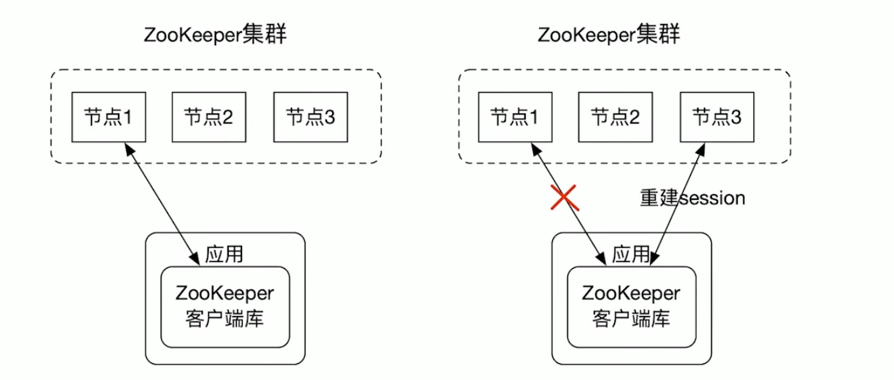

# zookeeper

## 目录

* [什么是zookeeper?](#什么是zookeeper?)
* [Zookeeper的发展历史](#Zookeeper的发展历史)
* [Zookeeper的应用场景](#Zookeeper的应用场景)
* [Zookeeper服务的使用](#Zookeeper服务的使用)
* [Zookeeper的数据模型](#Zookeeper的数据模型)
    * [data tree 示例](#data-tree-示例)
    * [data tree接口](#data-tree接口)
    * [znode 分类](#znode-分类)
* [ZooKeeper的安装](#ZooKeeper的安装)
* [启动ZooKeeper](#启动ZooKeeper)
* [关闭Zookeeper](#关闭Zookeeper)
* [重启Zookeeper](#重启Zookeeper)
* [zkCli客户端](#zkCli客户端)
* [Zookeeper的总体架构](#Zookeeper的总体架构)
    * [Session](#Session)
    * [ZooKeeper保持数据一致性](#ZooKeeper保持数据一致性)
    * [3节点quorum模式Zookeeper集群演示](#3节点quorum模式Zookeeper集群演示)
* [Zookeeper API](#Zookeeper-API)

## 什么是zookeeper?

`ZooKeeper`是一个开源的分布式协同服务系统。是用于**维护配置信息**，**命名**，**提供分布式同步和提供组服务的集中式服务**。

Zookeeper的设计目标是将那鞋复杂且容易出错的分布式协同服务封装起来，抽象出一个高效可靠的原语集，并以一系列简单的接口供给用户使用。


## Zookeeper的发展历史
最早起源于雅虎研究院的一个研究小组。在当时，研究人员发现，在雅虎内部很多软件系统都需要依赖一个系统来进行协同。但是这样的协同系统往往都存在单点问题。

所以，雅虎的开发人员就开发了一个通用的无单点问题的分布式协同服务系统。比较著名的开源项目例如：

- `Hadoop`: 使用`Zookeeper`做`Namenode`的高可用

- `HBase`: 保证集群中只有一个`master`,保存集群中的`RegionServer`列表，保存`hbase:meta`表的位置

- `Kafka`：集群成员管理，`controller`节点选举。

## Zookeeper的应用场景

- 配置管理(`configuration management`)

- `DNS`服务

- 组成员管理(`group membership`)

- 各种分布式锁

**`Zookeeper`适应于存储和协同相关的关键数据，不适用于大数据量存储。**

## Zookeeper服务的使用

- 应用使用`Zookeeper`客户端库使用`Zookeeper`服务。是一个`Client-Server`的架构。

- `Zookeeper`客户端负责和`Zookeeper`集群的交互。


## Zookeeper的数据模型
`Zookeeper`的数据模型是层次模型。层次模型常见于文件系统。层次模型和`key-value`是两种主流的数据模型。`Zookeeper`使用文件系统模型主要基于：

- 文件系统的树形结构便于表达数据之间的层次关系。

- 文件系统的树形结构便于为不同的应用分配独立的命名空间

`Zookeeper`的层次模型称作`data tree`。`Data tree`的每个节点叫作`znode`。不同于文件系统，每个节点都可以保存数据。每个节点都有一个版本(version)。版本从0开始计数。


### data tree 示例
如图所示的`data tree`中有两个子树，一个用于应用`1`（`/app1`)和另一个用于应用`2`(`/app2`)

应用`1`的子树实现另一个简单的组成员协议：每个客户端进程`pi`创建一个`znode`,`p_i`在`/app1`下，只要`/app1/p_i`存在就代表`pi`在正常运行。


### data tree接口
`Zookeeper`对外提供一个用来访问`data tree`的简化文件系统`API`：
- 使用UNIX风格的路径来定位`znode`,例如`/A/X`表示`znode A`的子节点`X`。

- `znode`的数据只支持全量写入和读取,没有像通用文件系统那样支持部分写入和读取。

- `data tree`的所有`API`都是`wait-free`的。正在执行中的`API`调用不会影响其它`API`的完成。

- `data tree`的`API`都是对文件系统的`wait-free`操作，不直接提供锁这样的分布式协同机制。但是`data tree`的`API`非常强大，可以用来实现多种分布式协同机制。

### znode 分类

一个`znode`可以使持久性，也可以是临时性的。

- 持久性的`znode(PERSISTENT)`： 这样的`znode`在创建之后即使发生`Zookeeper`集群宕机或者`client`宕机也不会丢失。

- 临时性的`znode (EPHEMERAL)`：`client`宕机或者`client`在指定的`timeout`时间内没有给`Zookeeper`集群发消息，这样的`znode`就会消失。

`znode`也可以是顺序性的。每一个顺序性的`znode`关联一个唯一的单调递增整数，这个单调递增整数是`znode`名字的后缀。如果上面两种`znode`具备顺序性，又有以下两种`znode`：
 - 持久顺序性的`znode (PERSISTENT_SEQUENTIAL)`: `znode`除了具备持久性`znode`的特点之外，`znode`的名字具备顺序性。

 - 临时顺序性的`znode (EPHEMERAL_SEQUENTIAL)`: `znode`除了具备临时性`znode`的特点之外，`znode`的名字具备顺序性。

 `ZooKeeper`主要有以上4种`znode`。

## `ZooKeeper`的安装
- `Zookeeper`唯一的依赖是`JDK 7+`,安装`jdk`
```sh
$ wget --no-cookies --no-check-certificate --header "Cookie: gpw_e24=http%3A%2F%2Fwww.oracle.com%2F; oraclelicense=accept-securebackup-cookie" "http://download.oracle.com/otn-pub/java/jdk/8u141-b15/336fa29ff2bb4ef291e347e091f7f4a7/jdk-8u141-linux-x64.tar.gz"

$ tar -zxvf jdk-8u141-linux-x64.tar.gz  # 解压
```
编辑系统配置文件，配置`jdk`环境变量
```sh
$ vim /etc/profile
# 添加至文件末尾
export JAVA_HOME=/your_java_path/jdk1.8.0_141
CLASSPATH=$JAVA_HOME/lib/
PATH=$PATH:$JAVA_HOME/bin
export PATH JAVA_HOME CLASSPATH 
```
让修改的环境变量生效
```sh
source /etc/profile
```
验证`jdk`是否生效
```sh
java -version
```
- 在[官网](https://zookeeper.apache.org/)下载,需要注意下载`bin`安装的
```sh
$ wget https://apache.website-solution.net/zookeeper/zookeeper-3.6.2/apache-zookeeper-3.6.2-bin.tar.gz
```
- 下载之后进行解压
```
$ tar -zxvf apache-zookeeper-3.6.2-bin.tar.gz
```
- 创建`conf/zoo.cfg`
```
$ cd /your-zookeeper-path/conf
$ cp zoo_sample.cfg  zoo.cfg
```
```sh
# zookeeper内部的基本单位，单位是毫秒，这个表示一个tickTime为2000毫秒，在zookeeper的其他配置中，都是基于tickTime来做换算的
tickTime=2000

#集群中的follower服务器(F)与leader服务器(L)之间 初始连接 时能容忍的最多心跳数（tickTime的数量）。
initLimit=10

#syncLimit：集群中的follower服务器(F)与leader服务器(L)之间 请求和应答 之间能容忍的最多心跳数（tickTime的数量）
syncLimit=5

# 数据存放文件夹，zookeeper运行过程中有两个数据需要存储，一个是快照数据（持久化数据）另一个是事务日志
dataDir=/tmp/zookeeper

# 客户端访问端口
clientPort=2181
```
- 配置环境变量
```sh
$ vim /etc/profile
```
```sh
export ZOOKEEPER_HOME="$your-apache-zookeeper-version-bin"
export PATH="$ZOOKEEPER_HOME/bin:$PATH"
export PATH
```
- 使修改的环境变量生效
```sh
source /etc/profile
```
- 启动服务
```sh
zkServer.sh start
```

## 启动ZooKeeper
- 使用`zkServer.sh start`启动`ZooKeeper`服务
```sh
zkServer.sh start
```
- 查看启动状态
```sh
zkServer.sh status
```
- 使用`ZooKeeper`日志是否有出错信息
```sh
zkServer.sh start-foreground
```
- 检查`ZooKeeper`数据文件
- 检查`ZooKeeper`是否在`2181`端口上监听。

## 关闭Zookeeper
```sh
zkServer.sh stop
```
## 重启Zookeeper
```sh
zkServer.sh restart
```

## zkCli客户端
打开`zkCli.sh`，输入以下命令：
```sh
zkCli.sh
help      
ls -R /
create /app1
create /app2
create /app1/p_1 1
create /app1/p_2 2
create /app1/p_3 3
ls -R /
```

## 实现一个锁
分布式锁要求如果有锁的持有者宕了，锁可以被释放。`Zookeeper`的`ephemeral`节点恰好具备这样的特性。
```sh
终端1：                                 终端2:
zkCli.sh                                  zkCli.sh
create -e /lock # -e 表示创建临时的znode
                                          create -e /lock
                                          stat -w /lock 
quit            
                                          create -e /lock
```

## 协同服务
设计一个`master-worker`的组成员管理系统，要求系统中只能有一个`master`,`master`能实时获取系统中`worker`的情况
```sh
终端1:                                   终端2:                                                                         终端3:
zkCli.sh                                   
create -e /master "m1:2223"
                                         zkCli.sh
                                         create -e /master "m2:2223"  # 创建失败，显示失败信息
                                         Node: already exists: /master
                                         stat -w /master
quit                                    
                                        WATCHER:
                                         WatchedEvent state: SyncConnected type : NodeDeleted path: /path     

                                        create -e /master "m2:2223"  # 显示成功信息
                                        Create /master    
                                        ls -w /workers      
create -e /workers/w1 "w1:2224"   
Create /worker/w1                                                                                                        
                                                                                                                        create -e /workers/w2 "w2:2224"  
                                                                                                                        Create /worker/w2                
``` 

## Zookeeper的总体架构
应用使用`Zookeeper`客户端使用`Zookeeper`服务。`Zookeeper`客户端负载和`Zookeeper`集群的交互。`Zookeeper`集群可以有两种模式:`standalone`和`quorum`模式。处于`standalone`模式的`Zookeeper`集群还有一个独立运行的`Zookeeper`节点。处于`quorum`模式的`Zookeeper`集群包含多个`Zookeeper`节点。


### Session
`ZooKeeper`客户端和`Zookeeper`集群中的某个节点创建一个`session`。客户端可以主动关闭`session`。另外如果`Zookeeper`节点没有在`session`关联的`timeout`时间内收到客户端的消息的话，`Zookeeper`节点也会关闭`session`。另外`Zookeeper`客户端如果发现连接的`Zookeeper`出错，会自动的和其它`Zookeeper`节点建立连接。


### Quorum模式
处于`Quorum`模式的`Zookeeper`集群包含多个`Zookeeper`节点。下图的`Zookeeper`集群有3个节点，其中节点1是`leader`节点，节点`2`和节点`3`是`follower`节点.`leader`节点可以处理读写请求，`follower`只可以处理读请求。`follower`在接到写请求时会把写请求转发给`leader`来处理。

Quorum模式下只能有一个`leader`节点，可以有多个`follower`节点。


### ZooKeeper保持数据一致性
- 全局可线性话(`Linearizable`)写入： 先到达`leader`的写请求会被先处理，`leader`决定写请求的执行顺序。

- 客户端`FIFO`顺序: 来自给定客户端的请求按照发送顺序执行。即先发出的请求先被处理。

#### 3节点quorum模式Zookeeper集群演示
**准备工作**   
- 配置文件
需要准备`3`个配置文件，`dataDir`和`clientPort`配置型要配置不同的值。`3`个配置文件的`server.n`部分都是一样的。在`server.1 = 127.0.0.1:3333:3334`中，`3333`是用与`quorum`通信的端口，`3334`是用于`leader`选举的端口。

还要为每个`Zookeeper`节点创建`myid`文件，`3`个节点的`myid`文件内容分别为`1`、`2`、`3`。

**启动集群**   
使用以下命令启动集群：
```sh
zkServer.sh start-foreground src/main/resources/quorum/zoo-quorum-node1.cfg
zkServer.sh start-foreground src/main/resources/quorum/zoo-quorum-node2.cfg
zkServer.sh start-foreground src/main/resources/quorum/zoo-quorum-node3.cfg
```
`start-foreground`选项表示`zkServer.sh`在前台运行，把日志直接打到`console`。

## Zookeeper API
`ZooKeeper Java`代码主要使用`org.apache.zookeeper.Zookeeper`这个类使用`ZooKeeper`服务

```java
ZooKeeper(connectString, sessionTimeout, watcher)
```
`connectString`: 使用逗号分隔的列表，每个`ZooKeeper`节点是一个`host:port`对，`host`是机器名或者`Ip`地址，`port`是`ZooKeeper`节点对客户端提供服务的端口号。客户端会任意选取`connectString`中的一个节点建立连接。

`sessionTimeout`：`session timeout`时间

`watcher`： 用于接收到来自`ZooKeeper`集群的事件。

### ZooKeeper主要的方法
- `create(path,data,flags)`: 创建一个给定路径的`znode`,并在`znode`保存`data[]`的数据，`flags`指定`znode`的类型。

- `delete(path, version)`：如果给定`path`上的`znode`的版本和给定的`version`匹配，删除`znode`。

- `exists(path, watch)`：判断给`path`上的`znode`是否存在，并在`znode`设置一个`watch`。

- `getData(path, watch)`： 返回给定`path`上的`znode`数据，并在`znode`设置一个`watch`。

- `setData(path, data, version)`：如果给定`path`上的`znode`的版本和给定的`version`匹配，设置`znode`数据。

- `getChildren(path, watch)`：返回给`path`上的`znode`的节点`znode`名字，并在`znode`设置一个`watch`。

- `sync(path)`：把客户端`session`连接节点和`leader`节点进行同步。

- 所有读取`znode`数据的`API`都可以设置一个`watch`用来监控`znode`的变化。

- 所有更新`znode`数据的`API`都有两个版本：无条件更新版本和条件更新版本。如果`version`为`-1`,更新为无条件更新。否则只有给定的`version`和`znode`当前的`version`一样，才会进行更新，这样的更新是条件更新。

- 所有的方法都有同步和异步两个版本。同步版本的方法发送请求给`ZooKeeper`并等待服务器的响应。异步版本把请求放入客户端的请求队列，然后马上返回。异步版本通过`callback`来接受来自服务端的响应。


### ZooKeeper代码异常处理
所有同步执行的`API`方法都有可能抛出以下两个异常：
- `KeeperException`：表示`ZooKeeper`服务端出错。`KeeperException`的子类`ConnectionLossException`表示客户端和当前连接的`ZooKeeper`节点断开了连接。网络分区和`ZooKeeper`节点失败都会导致这个异常出现。发生此异常的时机可能是在`ZooKeeper`节点处理客户端请求之前，也可能是在`ZooKeeper`节点处理客户端请求之后。出现`ConnectionLossException`异常之后，客户端会进行自动重新连接，但是我们必须要检查我们以前的客户端请求是否被成功执行。

- `InterruptedException`：表示方法被中断了。我们可以使用`Thread.interrupt()`来中断`API`的执行。

### 数据读取API示例-getData
有以下三个获取`znode`数据的方法：
- 1. `byte[] getData(String path, boolean watch, Stat stat)`
同步方法。如果`watch`为`true`，该`znode`的状态变化会发送给构建`ZooKeeper`是指定的`watcher`。

- 2. `void getData(String path, boolean watch, DataCallback cb,Object ctx)`
异步方法。`cb`是一个`callback`,用来接收服务端的响应。`ctx`是提供给`cb`的`context`。`watch`参数的含义和方法`1`相同。

- 3. `void getData(String path,Watcher watcher, DataCallback cb,Object ctx)`
异步方法。`watcher`用来接收该`znode`的状态变化。

### 数据写入API示例-setData
- 1. `Stat setData(String path, byte[] data, int version)`
同步版本。如果`version`是`-1`, 做无条件更新。如果`version`是非负整数，做条件更新。

- 2. `void setData(String path, byte[] data, int version, StatCallback cb, Object ctx)`。异步版本。


### watch
`watch`提供一个让客户端获取最新数据的机制。如果没有`watch`机制，客户端需要不断的轮询，`ZooKeeper`来查看是否有数据更新，这在分布式环境中是非常耗时的。客户端可以在读取数据的时候设置一个`watcher`，这样在数据更新时，客户端就会收到通知。


### 条件更新
设想用`znode/c`实现一个`counter`，使用`set`命令来实现自增`1`操作。条件更新场景：
- 1. 客户端`1`把`/c`更新到版本`1`，实现`/c`的自增`1`。

- 2. 客户端`2`把`/c`更新到版本`2`,实现`/c`的自增`2`。

- 3. 客户端`1`不知道`/c`已经被客户端`2`更新过了，还用过时的版本`1`是去更新`/c`，更新失败。如果客户端`1`使用的是无条件更新， `/c`就会更新为`2`，没有实现自增`1`。

**使用条件更新可以避免对数据基于过期的数据进行更新操作**。


## 设置CLASSPATH
使用`ZooKeeper Java`代码需要使用依赖的`Jar`包，下面的命名把`Zookeeper`依赖的`Jar`加到`CLASSPATH`环境变量：在`shell`环境中
```sh
ZOOBINDIR="<path_to_distro>bin"
. "$ZOOBINDIR" /zkEnv.sh
```
如果使用的是`ZSH`，则不能使用上面的办法，需要使用`script/executor.sh`来运行`ZooKeeper Java`代码,使用`Gradle`来编译`ZooKeeper Java`代码。   
`script/excutor.sh`中的内容为：
```sh
#！/usr/bin/env bash
. zkEnv.sh
export CLASSPATH="build/classes/java/main:$CLASSPATH"
mkdir -p data
java org.yao.watchclient.Executor "$@"
```


